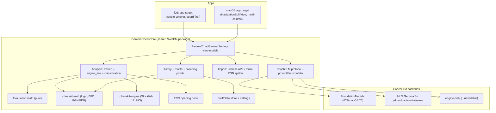
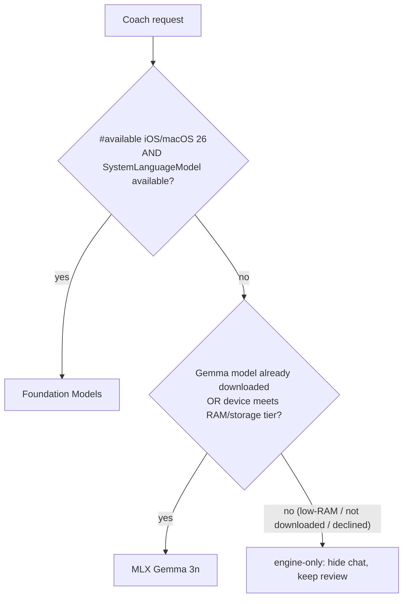

# feat: GemmaChess — native iOS + macOS chess coach with on-device LLM

## Summary

Build a native SwiftUI app for iOS 18+ and macOS that reimplements *tintins-chess-analysis* in Swift: Stockfish-grounded full-game review (mistake list, eval bar, win graph, accuracy, played/best/refutation arrows), Lichess + bulk-PGN import, cross-game history and a recurring-mistake coaching profile, and a position-aware conversational coach that runs **fully on-device**. The coach sits behind one `CoachLLM` protocol with three states — Apple Foundation Models where available, Gemma 3n (E2B/E4B) via MLX as fallback, and engine-only review where no on-device model fits.

---

## Problem Frame

The source project is a Python process (Stockfish + python-chess + FastAPI) whose AI coach shells out to the `claude` CLI. It cannot run as an iOS/macOS app: there is no Python runtime to ship, no subprocess model on iOS, and the AI depends on a cloud subscription. The user wants the same product as a native app whose AI is local and free.

The reason this is tractable — and the central design constraint — is that **the LLM does no chess reasoning**. Stockfish computes everything (best move, eval, win%, refutation, classification); the model only turns those pre-computed facts into plain-English coaching. The source prompts say so explicitly ("TRUST [Stockfish], do not recompute"). Grounded summarization from supplied facts is exactly what small on-device models (Apple Foundation Models ~3B; Gemma 3n E2B/E4B) do well, and the reasoning they are bad at is never asked of them. The work is therefore a **Swift backend rewrite** plus an LLM-abstraction layer — not a port of an AI model.

---

## Requirements

- **R1** — Full-game review reproducing the source's engine analysis: per-move win% before/after, mistake classification (inaccuracy/mistake/blunder via Lichess 5/10/15 win-drop thresholds, Elo- and speed-scaled), per-side accuracy, and engine-grounded templated comments. Deterministic and fixed-depth.
- **R2** — Interactive board: played/best/refutation arrows (gray/green/red, multi-arrow), eval bar oriented to the reviewed side, scrub-able win graph, try-a-move exploration with live refutation, show-best-move with escalating depth.
- **R3** — Game import at full parity: Lichess by username (public API, optional token), and Chess.com / arbitrary PGN via paste or multi-game file upload with uploader-handle detection.
- **R4** — Cross-game history + coaching profile: persisted game records, motif tagging (did/missed/allowed buckets + time_trouble), recent-vs-lifetime aggregation broken down by speed, weakest-phase and improving/slipping signals, identity/alias folding across platforms.
- **R5** — On-device conversational coach: position-aware chat ("why is this bad?", "what now?") and an end-of-game summary, both grounded in pre-computed engine facts, with optional profile personalization. Multi-turn chat.
- **R6** — LLM abstraction with three runtime states: Foundation Models (primary), Gemma-via-MLX (fallback, on-demand download), engine-only (no chat). Graceful degradation — engine review always works.
- **R7** — Cross-platform: one shared logic core; iOS single-column board-first UI, iPad/macOS multi-column (NavigationSplitView). iOS 18+ floor.
- **R8** — Local-first persistence: history, profile, analysis cache, settings in a per-OS app-support directory; nothing leaves the device except optional Lichess fetches and (by design) no LLM traffic at all.

---

## Key Technical Decisions

- **KTD1 — Shared Swift package + thin per-platform app targets.** A `GemmaChessCore` SwiftPM package holds all chess logic, engine, analysis, history/profile, prompt-building, and the `CoachLLM` protocol. Two app targets (iOS, macOS) hold only UI. Matches the user's "interfaces slightly different" requirement and their established SharedKit pattern.
- **KTD2 — `chesskit-app/chesskit-swift` (MIT) is the single chess-logic source of truth** (FEN/PGN/SAN/UCI, bitboard move-gen, EPD). Replaces python-chess. Multi-game PGN is not built-in → a custom splitter (see U3).
- **KTD3 — `chesskit-app/chesskit-engine` (MIT wrapper) for Stockfish 17**, async/await UCI, NNUE files bundled in-app. **This compiles Stockfish (GPLv3) into the app, making the app GPLv3-obligated** — see Risks and Open Questions; gate U5 on the license decision.
- **KTD4 — Board = `rohanrhu/ChessboardKit` (existing) + a custom SwiftUI `Canvas` arrow overlay.** No off-the-shelf SwiftUI board renders multi-colored analysis arrows; the overlay (square→point mapping in a `ZStack`) supplies gray/green/red arrows while ChessboardKit owns rendering, drag-to-move, flip, and highlights. ChessboardKit pulls a *second* logic lib (`aperechnev/ChessKit`); keep `chesskit-swift` authoritative and sync FEN at the view-model boundary.
- **KTD5 — Coach = Foundation Models first, Gemma 3n fallback, engine-only third state.** FM gated by `#available(iOS 26, *)` + `SystemLanguageModel.default.availability`. Fallback uses **`mlx-community/gemma-3n-E2B-it-4bit` (iPhone) / `gemma-3n-E4B-it-4bit` (Mac/high-RAM)** via `mlx-swift`. **Avoid the Gemma 4 MLX 4-bit quants** — their PLE layers are quantized and output is broken as of 2026-06; revisit when a PLE-aware quant ships.
- **KTD6 — Gemma is downloaded on first use, not bundled.** Resumable `HubApi` snapshot into Application Support (not Caches), excluded from iCloud backup, gated behind Wi-Fi + free-space checks; iOS needs the Increased Memory Limit entitlement. FM-capable devices never download a model.
- **KTD7 — Persistence via SwiftData** for history records, profiles, and analysis cache, plus a Codable settings file, all under a per-OS app-support dir mirroring the source's layout. (JSONL is an internal source detail, not a contract; SwiftData is the native equivalent.)
- **KTD8 — Preserve the "engine computes, model only explains" contract.** All facts the coach needs are pre-computed and embedded in the prompt; the model is never asked to calculate chess. This is what makes a 3B/E2B model viable.

---

## High-Level Technical Design

Component layering — shared core feeds two thin UI targets:



Coach backend selection (runtime, per request):



---

## Output Structure

```
GemmaChess/
  Package.swift                         # GemmaChessCore package
  Sources/GemmaChessCore/
    Evaluation/Evaluation.swift         # U2 (pure math)
    Chess/ChessLogic.swift              # U3 (chesskit-swift wrappers)
    Chess/MultiPGN.swift                # U3 (+ U12 splitter/handle detect)
    Chess/Openings.swift                # U4
    Engine/EnginePool.swift             # U5
    Engine/EngineLine.swift             # U6
    Analysis/GameAnalyzer.swift         # U7
    Analysis/ReviewSession.swift        # U8
    Analysis/AnalysisCache.swift        # U8
    History/HistoryStore.swift          # U9
    History/Motifs.swift                # U9
    History/CoachingProfile.swift       # U10
    Import/Lichess.swift                # U11
    Coach/CoachLLM.swift                # U13 (protocol + facts/prompt)
    Coach/FoundationModelsCoach.swift   # U14
    Coach/MLXGemmaCoach.swift           # U15
    Coach/ModelDownloader.swift         # U15
    Coach/CoachOrchestrator.swift       # U16
    ViewModels/*.swift                  # U18-U21
    UI/BoardView.swift                  # U17
    UI/ArrowOverlay.swift               # U17
    Settings/Settings.swift             # U21
  Resources/eco/{a,b,c,d,e}.tsv         # U4 (vendored from source)
  Resources/nnue/*.nnue                 # U5 (Stockfish eval files)
  Tests/GemmaChessCoreTests/*.swift
  Fixtures/pgns/{game1.pgn,game2.pgn,multi.pgn}
  GemmaChessiOS/                        # U22 iOS app target
  GemmaChessMac/                        # U22 macOS app target
```

---

## Implementation Units

Grouped in five phases; each unit is roughly one atomic commit. Build order is dependency-ordered — Phase A is pure and testable with no engine/UI.

### U1. Project scaffold & shared-package skeleton

- **Goal**: SwiftPM workspace with `GemmaChessCore` + iOS and macOS app targets; CI runs the package test suite.
- **Requirements**: R7
- **Dependencies**: none
- **Files**: `Package.swift`, `GemmaChessiOS/`, `GemmaChessMac/`, `.github/workflows/ci.yml`
- **Approach**: Package targets iOS 18 / macOS 15 (raise per chosen libs). App targets depend on the core. Add package deps from KTD2/4/5 as they are introduced, not all up front.
- **Test scenarios**: `Test expectation: none — scaffolding (no behavioral change).` Verify the package builds and an empty test target runs in CI.

### U2. Evaluation math (pure port of `server/core/evaluation.py`)

- **Goal**: Deterministic win%, classification, accuracy, and speed bucketing — the foundation everything else consumes.
- **Requirements**: R1
- **Dependencies**: U1
- **Files**: `Sources/GemmaChessCore/Evaluation/Evaluation.swift`, `Tests/GemmaChessCoreTests/EvaluationTests.swift`
- **Approach**: 1:1 port — `winPercent(cp)`, `winPercentFromScore(cp,mate)`, `classify(before,after,isBest,thresholds)`, `thresholdsForElo`, `thresholdsForSpeed` (per-mode factors), `moveAccuracy`, `aggregateAccuracy`, `classifySpeed`, `timeControlClock`. Keep the Lichess sigmoid constant and 5/10/15 cutoffs exact.
- **Patterns to follow**: source constants `_WIN_K`, `BLUNDER/MISTAKE/INACCURACY_DROP`, `SPEED_THRESHOLD_FACTORS`.
- **Test scenarios**:
  - cp=0 → 50%; large +cp → ~100; large −cp → ~0; clamp beyond ±1000.
  - `winPercentFromScore`: mate>0 → ~100, mate<0 → ~0, cp=None → 50.
  - `classify`: drop ≥15 blunder, ≥10 mistake, ≥5 inaccuracy, ≤2 or isBest → best, else good (boundary values exactly).
  - `thresholdsForElo`: None → 5/10/15; ~1500 → ×1.0; clamps at 0.5 and 1.4 factor.
  - `thresholdsForSpeed`: bullet ×1.15, classical ×0.8, unknown unchanged.
  - `moveAccuracy` monotonic decreasing in drop, clamped [0,100]; `aggregateAccuracy` empty → 100.
  - `classifySpeed`: <180s bullet, <480 blitz, <1500 rapid, else classical; `1/259200` → correspondence; Event-keyword fallback; `unknown`.

### U3. Chess logic + multi-game PGN (`chesskit-swift` wrappers, `multipgn.py`)

- **Goal**: One logic facade: FEN/PGN/SAN/UCI parse, legal-move dests, EPD computation, replay PV→SAN, and a multi-game PGN splitter.
- **Requirements**: R1, R3
- **Dependencies**: U1
- **Files**: `Sources/GemmaChessCore/Chess/ChessLogic.swift`, `Sources/GemmaChessCore/Chess/MultiPGN.swift`, `Tests/GemmaChessCoreTests/ChessLogicTests.swift`, `Fixtures/pgns/multi.pgn`
- **Approach**: Thin wrappers over `chesskit-swift` so the rest of the core depends on our facade, not the library directly (insulates against the dual-ChessKit split). EPD = FEN minus move/halfmove counters. Splitter mirrors source `_EVENT_BOUNDARY` regex `(?m)^(?=\[Event\b)`, validating each chunk parses; preserve original text incl. `[%clk]`. `headersOf`, `detectSelfHandle` (intersection of handles across games, with a prefer-list).
- **Patterns to follow**: `server/core/multipgn.py` split/validate/detect.
- **Test scenarios**:
  - FEN round-trip; SAN↔UCI for a sample game; legal-move dests for a mid-game FEN incl. check.
  - EPD stable across move-counter changes (same position, different clocks → same EPD).
  - `splitPGN` on `multi.pgn` returns N games, preserving clocks; a malformed chunk is dropped.
  - `detectSelfHandle`: handle present in all games wins; prefer-list breaks ties; no common handle → nil.

### U4. ECO opening lookup (`openings.py`)

- **Goal**: Engine-free opening name by deepest position match.
- **Requirements**: R1
- **Dependencies**: U3
- **Files**: `Sources/GemmaChessCore/Chess/Openings.swift`, `Resources/eco/{a,b,c,d,e}.tsv`, `Tests/GemmaChessCoreTests/OpeningsTests.swift`
- **Approach**: Vendor the source TSVs as bundle resources; lazy-load into `[EPD: (eco,name)]`; `classifyFromFens` keeps the deepest match; `classifyFromPgn` replays then delegates.
- **Test scenarios**: a known line (e.g. Italian Game) resolves to its ECO+name; deepest match wins over a shallower prefix; unknown position → nil.

### U5. Stockfish engine pool (`chesskit-engine`, `engine.py`)

- **Goal**: Async, pooled, fixed-depth, cached position analysis.
- **Requirements**: R1, R2
- **Dependencies**: U1; **license decision (Open Questions) resolved**
- **Files**: `Sources/GemmaChessCore/Engine/EnginePool.swift`, `Resources/nnue/*.nnue`, `Tests/GemmaChessCoreTests/EnginePoolTests.swift`
- **Approach**: An `actor` wrapping a small pool of `chesskit-engine` engines; `analyse(fen, depth, multipv) -> AnalysisResult` with an in-memory cache keyed `(fen, depth, multipv)` for reproducibility. Configure Threads/Hash; bundle the two NNUE files and set `EvalFile`/`EvalFileSmall`. Score is side-to-move-relative (`cp`/`mate`/`pv`).
- **Patterns to follow**: `server/core/engine.py` pool + cache shape.
- **Execution note**: Start with a failing integration test asserting a known position's best move before wiring the pool.
- **Test scenarios**:
  - Integration (device/Apple-Silicon): a known tactic returns the expected best UCI and sign of eval.
  - Cache: identical `(fen,depth,multipv)` returns the cached result without a second engine call.
  - multipv=3 returns three ordered lines; mate position yields a mate score.
  - `Covers note:` simulator GPU/arm64-sim build verified or test skipped with reason.

### U6. Single-position engine line (`lines.py`)

- **Goal**: Grounded line for one position, optionally classifying a candidate move + its refutation.
- **Requirements**: R2, R5
- **Dependencies**: U5, U3, U2
- **Files**: `Sources/GemmaChessCore/Engine/EngineLine.swift`, `Tests/GemmaChessCoreTests/EngineLineTests.swift`
- **Approach**: Port `engineLine(fen, move?, depth, multipv)` returning `best_san`, `eval`/`eval_cp`, `win_percent`, `line_san/uci`, the `lines[]` for multipv, and (when a move is given) `classification`, `win_before/after/swing`, `is_engine_best`, `better_move_san`, `refutation_line_san/uci`. `evalStr` formats `±2.34` / `#3` / `#-2`. Handle terminal positions directly.
- **Patterns to follow**: source `engine_line`, `eval_str`, `pv_to_san`.
- **Test scenarios**:
  - No-move: best line + win% for a quiet position; terminal (mate/stalemate) handled.
  - With engine-best move: `is_engine_best` true, no "better move".
  - With a blunder move: correct classification, `better_move_san` set, refutation line non-empty.
  - "Also-good" alternatives within the win-gap appear in `lines[]`.
  - `evalStr`: positive/negative cp and both mate signs.

### U7. Full-game analysis sweep (`game_analysis.py`)

- **Goal**: Walk the mainline, build `MoveReview`s, mistake list, accuracy, and the timeline; report progress.
- **Requirements**: R1
- **Dependencies**: U6, U4, U2
- **Files**: `Sources/GemmaChessCore/Analysis/GameAnalyzer.swift`, `Tests/GemmaChessCoreTests/GameAnalyzerTests.swift`, `Fixtures/pgns/game1.pgn`, `Fixtures/pgns/game2.pgn`
- **Approach**: Evaluate each position once (terminal handled without engine); `win_before` = best win% at the position, `win_after` = 100 − best win% after the reply; classify with Elo+speed thresholds; build `MoveReview` (all fields per source incl. clocks from `[%clk]`); compute per-side accuracy; build the timeline (one node per ply with win_white, classification, mistake_index). `resolvePlayer` (white/black/auto), Elo/source resolution, adaptive sweep depth. Progress via an `AsyncStream`/callback.
- **Patterns to follow**: source `analyze_game`, `MoveReview`, timeline node shape.
- **Execution note**: Characterize against the source — assert `game1.pgn` (white) and `game2.pgn` (black) reproduce the source's mistake count, classifications, and accuracy within rounding.
- **Test scenarios**:
  - `game1.pgn` as white: mistake list, per-move classifications, and accuracy match source output.
  - `game2.pgn` as black: black-perspective win% and accuracy correct; auto side-detection picks black.
  - Timeline length = plies+1; mistake_index links timeline nodes to the mistakes list.
  - A clean game → empty mistakes, accuracy ~100.
  - `[%clk]` parsed into `clock_after`/`opp_clock`; absent clocks → nil (no crash).
  - Progress stream emits monotonically to total.

### U8. ReviewSession model + analysis cache (`session.py`, `analysis_cache.py`)

- **Goal**: The review state object the UI binds to, plus a disk cache so re-opening a game is instant.
- **Requirements**: R1, R8
- **Dependencies**: U7
- **Files**: `Sources/GemmaChessCore/Analysis/ReviewSession.swift`, `Sources/GemmaChessCore/Analysis/AnalysisCache.swift`, `Tests/GemmaChessCoreTests/ReviewSessionTests.swift`, `Tests/GemmaChessCoreTests/AnalysisCacheTests.swift`
- **Approach**: `ReviewSession` (Codable/Observable): pgn, player, headers, result, speed, accuracies, allMoves, mistakes, currentIndex, exploreFen, coachAiText cache, review_elo/source/thresholds/sweep_depth, timeline. `resolveOpening`, `summarize`, `gotoMistake(index)`. Cache keyed `game_id = sha1(uci-list)[:16]`, stored under app-support; corrupt file → miss; LRU prune.
- **Test scenarios**:
  - `gotoMistake` returns the FEN-before and advances `currentIndex`; out-of-range → error/no-op.
  - `resolveOpening`: header opening wins; else ECO lookup; else empty.
  - Cache store→load round-trip equals original; corrupt JSON → nil (no throw); prune caps entry count.

### U9. History store + motif tagging (`history.py`)

- **Goal**: Persist reviewed games and tag each mistake with engine-free motifs; dedupe and fold identities.
- **Requirements**: R4, R8
- **Dependencies**: U7, U3
- **Files**: `Sources/GemmaChessCore/History/HistoryStore.swift`, `Sources/GemmaChessCore/History/Motifs.swift`, `Tests/GemmaChessCoreTests/MotifsTests.swift`, `Tests/GemmaChessCoreTests/HistoryStoreTests.swift`
- **Approach**: SwiftData records mirroring the source record fields (game_id, reviewed_side, metadata, counts, phase_loss, mistakes[+motifs]); dedupe by `(game_id, reviewed_side)` (re-analysis supersedes). Identity resolution via alias map + canonical player_id. Motif heuristics (the hard chess bit): `hung_piece`/`pawn_grab` (did), `missed_capture`/`missed_fork`/`missed_mate` (missed), `allowed_fork`/`allowed_mate`/`back_rank` (allowed), `time_trouble` (low clock). Port piece-value/attacker-defender heuristics to Swift on top of the U3 facade.
- **Patterns to follow**: `server/core/history.py` `tag_motifs`, record shape, dedupe.
- **Test scenarios**:
  - `hung_piece`: a move leaving a piece undefended/attacked tags it; a defended move does not.
  - `missed_fork` / `allowed_fork`: fixture positions tag correctly; quiet position tags nothing.
  - `back_rank`: trapped-king-behind-pawns fixture tags; otherwise not.
  - `time_trouble`: low `clock_after` tags; ample clock does not.
  - Dedupe: same `(game_id, side)` re-recorded supersedes (count stays 1); different side coexists.
  - Identity: two aliases fold to one player_id.

### U10. Coaching profile aggregation (`history.py` profile)

- **Goal**: Roll records into the recent/lifetime coaching profile and render it for prompts.
- **Requirements**: R4, R5
- **Dependencies**: U9
- **Files**: `Sources/GemmaChessCore/History/CoachingProfile.swift`, `Tests/GemmaChessCoreTests/CoachingProfileTests.swift`
- **Approach**: Aggregate per player_id: `recent` sliding window + optional `lifetime`; avg_accuracy, results W/L/D, mistake totals + per-game, top motifs, phase_loss + weakest_phase, by-speed breakdown, top openings, recent_games (last 8), improving/slipping trend. `formatProfileForPrompt` → compact text (consumed by U13).
- **Test scenarios**:
  - Over a fixture set: avg_accuracy, mistakes-per-game, and top_motifs correct.
  - `by_speed` partitions correctly; weakest_phase picks the max phase_loss.
  - Improving/slipping reflects recent-vs-earlier accuracy delta.
  - `formatProfileForPrompt` returns nil when history empty/disabled; compact text otherwise.

### U11. Game import — Lichess API + bulk PGN (`lichess.py`, `multipgn.py`)

- **Goal**: Bring games in at full parity: Lichess by handle, and Chess.com/any PGN via paste or multi-game upload.
- **Requirements**: R3
- **Dependencies**: U3 (splitter), U1
- **Files**: `Sources/GemmaChessCore/Import/Lichess.swift`, `Tests/GemmaChessCoreTests/LichessTests.swift` (uses U3 `MultiPGN` for bulk)
- **Approach**: `URLSession` async client: `fetchUserGames(username, max, rated, perf, color, sinceDays)` (newest-first), `fetchGame(idOrUrl)` (bare id or full URL incl. /white,/black). `GameSummary` struct; `LichessError` with user-facing messages (network/bad-id/rate-limit/429); optional token header. Chess.com path is the U3 splitter (the source has no Chess.com API client — import is PGN export).
- **Patterns to follow**: `server/core/lichess.py`.
- **Test scenarios** (mock URLProtocol):
  - `fetchUserGames` parses a sample NDJSON/PGN response into N `GameSummary` newest-first; `perf` filter passed through.
  - `fetchGame` accepts bare id and full URL with color suffix.
  - 429 → rate-limit `LichessError`; network error → friendly message.
  - Bulk: a multi-game upload splits and feeds analysis (covered with U3).

### U12. (folded into U11 + U3)

- **Goal**: Bulk-PGN parsing and uploader detection. *Implemented under U3 (`MultiPGN.swift`) and consumed by U11; no separate unit.* Retained as a U-ID gap per stability rule.

### U13. CoachLLM protocol + facts/prompt builder (`claude_bridge.py` minus subprocess)

- **Goal**: The provider-agnostic seam plus all prompt construction, so backends only generate text.
- **Requirements**: R5, R6, R8
- **Dependencies**: U6, U10, U8
- **Files**: `Sources/GemmaChessCore/Coach/CoachLLM.swift`, `Tests/GemmaChessCoreTests/CoachPromptTests.swift`
- **Approach**: `protocol CoachLLM { func answer(...) async throws -> String; func gameSummary(...) async throws -> String }` plus an `availability` state (`.foundationModels` / `.gemma` / `.unavailable`). Port `engineFacts(fen, move)` (best move + win%, "also good" alts, move classification + refutation), `composePrompt` (coach persona, current-vs-move facts routing, optional profile + speed context, "answer only chess, don't mention UI/URLs"), and `gameFacts` for the summary. Pure string building — fully testable.
- **Patterns to follow**: `server/claude_bridge.py` `_engine_facts`, `_compose_prompt`, `_game_facts`, `coach_summary_ai`.
- **Test scenarios**:
  - `engineFacts` for a position with alternatives lists the alts within the gap; for a blunder includes classification + refutation.
  - `composePrompt` routes "what should I do" to current-position facts and "why is this bad" to move facts.
  - Profile text included only when personalization on; speed context included when known.
  - Snapshot: composed prompt contains the persona + facts and omits UI/URL mentions.

### U14. Foundation Models backend

- **Goal**: Primary coach on iOS/macOS 26 capable devices.
- **Requirements**: R5, R6
- **Dependencies**: U13
- **Files**: `Sources/GemmaChessCore/Coach/FoundationModelsCoach.swift`, `Tests/GemmaChessCoreTests/FoundationModelsCoachTests.swift`
- **Approach**: `#available(iOS 26, macOS 26, *)`-guarded `LanguageModelSession`; instructions = coach persona, prompt = U13 output; multi-turn via retained transcript with context-overflow condensing; handle `guardrailViolation`/`unsupportedLanguageOrLocale`. Prewarm session. Optionally expose a `Tool` calling into U6 for deeper lines (off by default — facts are already embedded).
- **Patterns to follow**: Axiom `axiom-foundation-models` (availability check, async-not-blocking, overflow handling).
- **Test scenarios**:
  - Availability mapping: `.unavailable` reason → `.unavailable` state (no session created).
  - Below iOS 26 → never constructs a session (compile/runtime gate).
  - Prompt wiring passes U13 output verbatim (model output itself verified manually on device).

### U15. MLX Gemma backend + on-demand download

- **Goal**: Fallback coach on iOS 18–25 / non-AI devices via local Gemma 3n.
- **Requirements**: R5, R6, R8
- **Dependencies**: U13
- **Files**: `Sources/GemmaChessCore/Coach/MLXGemmaCoach.swift`, `Sources/GemmaChessCore/Coach/ModelDownloader.swift`, `Tests/GemmaChessCoreTests/ModelDownloaderTests.swift`
- **Approach**: `mlx-swift`/`MLXLLM` load `gemma-3n-E2B-it-4bit` (iPhone) or `E4B-it-4bit` (Mac/high-RAM) selected by a RAM tier check; streaming `generate`. `ModelDownloader` uses `HubApi.snapshot(progressHandler:)` into Application Support, resumable, `isExcludedFromBackup=true`, gated on Wi-Fi + free space; surfaces progress. iOS: Increased Memory Limit entitlement. Keep a GGUF/SwiftLlama path documented as a portability hedge (not built now). **Do not use Gemma 4 4-bit MLX quants (broken PLE).**
- **Patterns to follow**: `mlx-swift-examples` LLMEval; Application-Support caching.
- **Test scenarios**:
  - Tier selection: high-RAM → E4B id, low-RAM iPhone → E2B id, below floor → `.unavailable`.
  - Downloader state machine: not-present → downloading (progress) → ready; interrupted → resumes from partial.
  - Storage gate: insufficient free space → typed error, no partial left dangling; model dir marked excluded-from-backup.
  - (Generation output verified manually on device.)

### U16. Coach orchestrator

- **Goal**: Pick the backend per request and expose one entry point to the UI; manage chat threading and the cached summary.
- **Requirements**: R5, R6
- **Dependencies**: U14, U15
- **Files**: `Sources/GemmaChessCore/Coach/CoachOrchestrator.swift`, `Tests/GemmaChessCoreTests/CoachOrchestratorTests.swift`
- **Approach**: Resolve FM → Gemma → engine-only(`.unavailable`); expose `state` so the UI hides chat when unavailable; thread multi-turn chat; cache the end-of-game summary on the session (U8). FM-capable devices never trigger a Gemma download.
- **Test scenarios**:
  - FM available → routes to FM; FM unavailable + Gemma ready → Gemma; neither → `.unavailable` and chat suppressed.
  - Summary cached after first generation (second call returns cache).
  - Switching positions starts a fresh chat thread; follow-up reuses it.

### U17. Board view + arrow overlay

- **Goal**: Interactive board with multi-colored analysis arrows and an eval bar.
- **Requirements**: R2, R7
- **Dependencies**: U3, U8
- **Files**: `Sources/GemmaChessCore/UI/BoardView.swift`, `Sources/GemmaChessCore/UI/ArrowOverlay.swift`, `Tests/GemmaChessCoreTests/ArrowGeometryTests.swift`
- **Approach**: `ChessboardKit` for rendering/drag/flip/highlights; a `Canvas` overlay in a `ZStack` draws gray (played), green (best, thick=top), red (refutation) arrows via a square→point map honoring orientation. Eval bar oriented to the reviewed side. Keep `chesskit-swift` authoritative; convert FEN at the boundary.
- **Test scenarios**:
  - Square→point mapping correct for both orientations (a1 flips with board).
  - Arrow set renders expected count/colors for a position with played+best+refutation (logic/geometry test).
  - `Test expectation: visual rendering verified on device/preview; geometry unit-tested.`

### U18. Review screen view-model

- **Goal**: Navigation, exploration, and the verdict/win-graph state the board binds to.
- **Requirements**: R1, R2
- **Dependencies**: U8, U6, U17
- **Files**: `Sources/GemmaChessCore/ViewModels/ReviewViewModel.swift`, `Tests/GemmaChessCoreTests/ReviewViewModelTests.swift`
- **Approach**: Timeline scrubbing (←/→, click graph), jump-to-mistake, try-a-move exploration with live `engineLine` refutation and undo, show-best-move with escalating depth (14/18/22) + debounce/cancel/time-cap, verdict box assembly.
- **Test scenarios**:
  - Step/scrub updates current node and FEN; jump-to-mistake sets `currentIndex`.
  - Try-a-move enters explore state; undo restores the game line; deeper exploration nests.
  - Show-best-move escalates depth and cancels on position change.
  - Verdict reflects classification/swing/better-move/refutation for the selected mistake.

### U19. Games panel + import UI

- **Goal**: My-games / Lichess / paste-upload tabs with background batch progress.
- **Requirements**: R3, R4
- **Dependencies**: U9, U11, U18
- **Files**: `Sources/GemmaChessCore/ViewModels/GamesViewModel.swift`, `Tests/GemmaChessCoreTests/GamesViewModelTests.swift`
- **Approach**: My-games from history (newest-first), Lichess lookup (handle + perf filter, "set as my account"), paste/upload PGN → split → sequential background analysis with "Game k of N" progress; open board immediately while analysis fills in.
- **Test scenarios**:
  - History list newest-first; selecting opens a cached session without re-analysis.
  - Bulk upload reports k-of-N progress and files each under My games.
  - Lichess lookup populates the list; errors surface a friendly message.

### U20. Chat / coach panel UI

- **Goal**: Position-aware chat + end-of-game summary with graceful unavailable state.
- **Requirements**: R5, R6
- **Dependencies**: U16, U18
- **Files**: `Sources/GemmaChessCore/ViewModels/ChatViewModel.swift`, `Tests/GemmaChessCoreTests/ChatViewModelTests.swift`
- **Approach**: Send current FEN + move-in-question to the orchestrator, stream the reply, optional profile personalization toggle, multi-turn memory; when orchestrator state is `.unavailable`, hide chat and show "engine review only" (+ an optional "download coach model" affordance on capable devices).
- **Test scenarios**:
  - "Why is this bad?" sends move facts; "what now?" sends current-position facts.
  - `.unavailable` → chat hidden, review intact; capable-but-not-downloaded → offers download.
  - Follow-up reuses the thread; personalization toggle controls profile injection.

### U21. Settings

- **Goal**: Username/aliases, Lichess token, Elo, profile windows, personalization toggle, model/engine prefs — with source precedence.
- **Requirements**: R4, R8
- **Dependencies**: U10, U16
- **Files**: `Sources/GemmaChessCore/Settings/Settings.swift`, `Sources/GemmaChessCore/ViewModels/SettingsViewModel.swift`, `Tests/GemmaChessCoreTests/SettingsTests.swift`
- **Approach**: Codable settings file under app-support; precedence settings > defaults (no env layer on-device); applied live. Identity composition (canonical username + aliases). Coach model tier / "use on-device model" preferences.
- **Test scenarios**:
  - Precedence: saved value overrides default; identity composes canonical + aliases.
  - Toggling personalization flips profile injection in the chat path.
  - Invalid/missing settings file → defaults (no crash).

### U22. App shells (iOS single-column / macOS split-view)

- **Goal**: Wire the shared view-models into the two divergent UIs.
- **Requirements**: R7
- **Dependencies**: U17–U21
- **Files**: `GemmaChessiOS/GemmaChessApp.swift`, `GemmaChessMac/GemmaChessApp.swift`
- **Approach**: iOS — board-first single column; mistakes/games/chat in sheets or a tab bar; capped engine depth for battery/RAM. macOS — `NavigationSplitView` (games sidebar + board + mistakes/chat), deeper engine settings, E4B model tier. iOS-26-specific UI polish (Liquid Glass) consult `axiom-swiftui-26-ref` at implementation time.
- **Test scenarios**: `Test expectation: none — composition of tested view-models; verify launch + a full review flow per platform manually.`

---

## Scope Boundaries

In scope: full feature parity with the source (review, import, history/profile, on-device coach) across iOS + macOS.

### Deferred to Follow-Up Work
- GGUF/llama.cpp (`SwiftLlama`/`LocalLLMClient`) backend as a portability hedge — `CoachLLM` leaves room for it; not built now.
- macOS optionally shelling out to the `claude` CLI for higher-quality coaching (parity with source's cloud path) — out of the on-device goal; revisit only if requested.
- App Store metadata/screenshots/IAP; iCloud sync of history across devices.

### Not in scope (source non-features)
- A Chess.com API client (source imports Chess.com via PGN export, not an API) — covered by bulk-PGN, not a new integration.
- The FastAPI web board / browser frontend / MCP server — replaced by in-process native calls.

---

## Risks & Dependencies

- **GPLv3 (Stockfish) — highest.** `chesskit-engine` compiles GPLv3 Stockfish into the app, obligating the whole app to GPLv3 (source offer). The source project dodges this by running Stockfish as a separate binary, which iOS does not allow. *Mitigation*: decide license posture before U5 (ship GPLv3 + offer source, or accept the obligation for a closed app, or evaluate an alternative engine). See Open Questions.
- **Memory pressure on iOS.** Stockfish + a resident Gemma model can exceed the jetsam limit on ≤6 GB devices. *Mitigation*: Increased-Memory entitlement; E2B-only on iPhone; engine-only state on low-RAM devices; never load FM and Gemma together (FM is OS-managed).
- **Gemma 4 MLX quant broken.** Use `gemma-3n-E2B/E4B-it-4bit`; track for a PLE-aware Gemma 4 quant before switching.
- **Dual ChessKit libraries.** ChessboardKit pulls `aperechnev/ChessKit` while analysis uses `chesskit-app/chesskit-swift`. *Mitigation*: facade in U3, sync FEN at the view-model boundary; if divergence bites, fall back to a custom `LazyVGrid` board (see Alternatives).
- **Multi-game PGN not built into chesskit-swift.** Custom splitter (U3) — low risk, source regex is simple.
- **On-device coach quality < Claude.** Accept: outputs are engine-grounded, so they are weaker prose but not wrong. Engine review stands alone if the user dislikes the local coach.
- **Apple-Silicon/simulator for MLX + Stockfish.** MLX needs Apple-Silicon (slow/absent in simulator); validate engine arm64-sim slice early (U5).

---

## Alternatives Considered

- **Custom `LazyVGrid` + `Canvas` board instead of ChessboardKit.** Keeps one logic library end-to-end and gives full arrow control. Rejected as the default per the user's "existing UI" choice, but it is the fallback if the dual-ChessKit split or ChessboardKit's annotation gap causes friction.
- **Bundle Gemma in the app.** Rejected per the user's download-on-first-use choice (app-size, and FM-capable devices never need it).
- **llama.cpp/GGUF as the primary local model.** More portable but slower than MLX on Apple Silicon; kept as a deferred hedge, not the primary.
- **Cloud LLM (keep Claude/API).** Rejected — defeats the on-device, no-subscription goal; FM/Gemma fit because the task is grounded summarization, not reasoning.

---

## Open Questions

- **License posture (blocking U5).** Are you willing to ship under GPLv3 (or otherwise satisfy Stockfish's source-offer obligation) for an App Store app? If not, we need an alternative engine strategy before engine work starts. Everything except U5/U6/U7 can proceed regardless.
- **Foundation Models as a hard dependency tier?** Confirm we treat FM purely as a bonus (Gemma is the real workhorse at iOS 18+), which the plan assumes.

---

## Phased Delivery

- **Phase A (U1–U4)** — pure, testable foundations (no engine/UI). Highest-confidence first bricks.
- **Phase B (U5–U8)** — engine + analysis; gated on the license decision.
- **Phase C (U9–U11)** — history, profile, import.
- **Phase D (U13–U16)** — on-device coach (FM + Gemma + orchestrator).
- **Phase E (U17–U22)** — UI and the two app shells.

---

## Sources & Research

- Source project: `Chess-analysis-mcp/tintins-chess-analysis` (architecture, data shapes, flows mapped module-by-module).
- Stockfish: `chesskit-app/chesskit-engine` (MIT wrapper, Stockfish 17, GPLv3 propagation).
- Chess logic: `chesskit-app/chesskit-swift` (MIT, v0.17, FEN/PGN/SAN/UCI, bitboards).
- Board UI: `rohanrhu/ChessboardKit` (MIT, iOS 17+/macOS 14+) + custom arrow overlay.
- Local LLM: `ml-explore/mlx-swift` + `mlx-swift-examples`; weights `mlx-community/gemma-3n-E2B-it-4bit` (~4.46 GB) / `E4B-it-4bit` (~7 GB); avoid Gemma 4 4-bit (broken PLE). Hedge: `SwiftLlama` / `LocalLLMClient` (GGUF).
- Foundation Models: iOS/macOS 26, `SystemLanguageModel.availability` gating; Axiom `axiom-foundation-models`.
