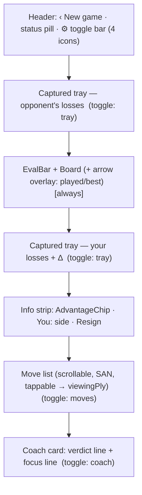
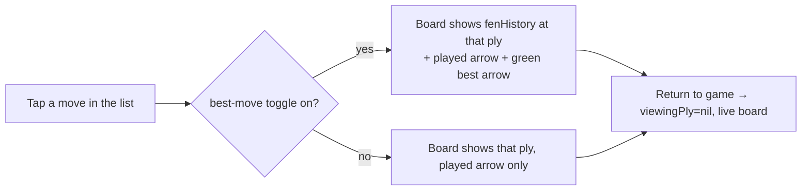

# feat: Play-mode UI/UX enhancements

## Summary

A focused UI/UX pass on Play mode: coordinate labels rendered inside the board edges with proper contrast, a small captured-material tray (piece icons + material delta), a full scrollable move list, on-demand best-move board graphics (live hint + retrospective "what was better"), independent show/hide toggles for the four optional surfaces, and a restructured coach card (verdict line + focus line) that replaces the current wall of text. All within the existing board-is-content / Liquid-Glass-is-floating-layer architecture, reusing engine facts already exposed by `EngineLine`/`EnginePool`.

---

## Problem Frame

Play mode works but the screen is under-used and a few surfaces read poorly. From on-device testing: coordinate labels sit awkwardly and are low-contrast; there's no sense of captured material or game history; the only engine signal on the board is the played/selected highlight (no "what should I have done"); and the coach output is an unstructured paragraph (a "wall of text") that's hard to scan mid-game. The user also wants control — each added surface should be independently hideable so the board can be as clean or as information-rich as they like.

The engine already computes everything needed (best move, eval, win%, move classification, refutation) via `EngineLine.evaluate` and `EnginePool`; this work is presentation + light view-model state, not new analysis.

---

## Requirements

- **R1** — Coordinate labels render *inside* the board's edge squares (files a–h along the bottom row, ranks 1–8 up the left column), high-contrast against both square colors, orientation-aware.
- **R2** — A compact captured-material tray shows each side's captured pieces as small piece icons plus the net material delta (e.g. "+3"), updating as the game progresses.
- **R3** — A full, scrollable move list in standard SAN, two-column (White/Black) by move number, reflecting the game so far.
- **R4** — Best-move board graphics, on demand: (a) **live hint** — the engine's best move for the current position when it's the user's turn; (b) **retrospective** — when reviewing a past ply, the move played plus the engine's best move at that ply.
- **R5** — Four independent show/hide toggles: best-move graphics, captured tray, move list, coach panel. Each can be toggled without affecting the others; preferences persist across launches.
- **R6** — Coach panel restructured into an always-shown card: a **verdict line** (the move's classification, color-coded, with the better move when relevant) and a separate **focus line** (the coach's short "what to focus on" note) — no raw paragraph dump.
- **R7** — Layout stays space-efficient and fits on iPhone without crowding; board remains the visual anchor; Liquid Glass stays on the floating layer (trays/lists/cards/toggles), the board stays content.

---

## Key Technical Decisions

- **KTD1 — Display preferences live in one observable, persisted via `@AppStorage`.** A small `PlayDisplaySettings` (or fields on `PlayViewModel`) holds the four bools; backed by `@AppStorage` so toggles persist. Defaults: coach ON, captured tray ON, move list ON, **best-move graphics OFF** (opt-in, since live hints can feel like cheating and add clutter).
- **KTD2 — SAN + position history are accumulated at move time, not re-derived.** `PlayViewModel` already knows `fromFEN` + `uci` for every move; it appends to parallel `sanMoves: [String]` and `fenHistory: [String]` as moves are made (via `ChessLogic.san(fromUCI:inFEN:)`). Avoids replaying the whole game for the move list / retrospective.
- **KTD3 — A "viewing cursor" decouples what's shown from the live game.** `viewingPly: Int?` (nil = live). When set (by tapping a move-list row), the board renders `fenHistory[viewingPly]` with played + best arrows; a "Return to game" affordance clears it. Tapping is read-only — it never mutates the live game. This is what makes retrospective best-move graphics clean in a live game (the board has already advanced).
- **KTD4 — Best-move arrows reuse the existing arrow overlay + engine line.** `ChessBoardView` already draws `[BoardArrow]` (gray played, green best). Live hint and retrospective both compute the best UCI via `EngineLine.evaluate`/`EnginePool` (cached per FEN) and pass green arrows; gated by the best-move toggle.
- **KTD5 — Captured material is derived from a FEN diff, pure and testable.** Compare the piece multiset of the shown FEN against the standard start; the missing pieces of each color are what the *other* side captured. Material delta uses standard values (1/3/3/5/9). Lives in a pure helper so it's unit-tested without the engine.
- **KTD6 — Coordinates move into the board cells, replacing the current corner labels.** Keep the existing orientation-aware file/rank math in `BoardGeometry`; raise contrast (use the opposite square color at higher opacity, semibold) and inset within the edge cells. Always on (not one of the four toggles) since it's an inherent board improvement.
- **KTD7 — Glass discipline preserved.** Trays, move list, coach card, and the toggle bar are floating-layer (`gemmaGlass`/`gemmaGlassPill`); the board and its overlays remain content. No glass-on-glass.

---

## High-Level Technical Design

Play screen regions and how the four toggles gate them (board + eval bar always present):

Viewing-cursor interaction for retrospective best-move:

---

## Implementation Units

### U1. Display-preference toggles + toggle bar

- **Goal**: Four independent, persisted show/hide toggles and a compact glass toggle bar in the header.
- **Requirements**: R5
- **Dependencies**: none
- **Files**: `Sources/GemmaChessCore/ViewModels/PlayDisplaySettings.swift` (or add to `PlayViewModel`), `Sources/GemmaChessCore/UI/PlayView.swift`, `Tests/GemmaChessCoreTests/PlayDisplaySettingsTests.swift`
- **Approach**: An observable with `showBestMove`, `showCaptured`, `showMoveList`, `showCoach`, each backed by `@AppStorage`. A small toolbar of four glass icon buttons (e.g. `arrow.up.forward`/`scope`, `xmark.bin`/captured, `list.bullet`, `bubble.left`) toggling each; active state visibly distinct (accent tint). Defaults per KTD1.
- **Patterns to follow**: `GemmaTheme.gemmaGlassPill`, existing header in `PlayView`.
- **Test scenarios**: defaults are coach/captured/moves ON and best-move OFF; toggling one leaves the other three unchanged; values round-trip through persistence (set → re-read).

### U2. In-board coordinate labels with contrast

- **Goal**: Files/ranks rendered inside the board's edge cells, legible on both square colors, orientation-aware.
- **Requirements**: R1
- **Dependencies**: none
- **Files**: `Sources/GemmaChessCore/UI/ChessBoardView.swift`, `Tests/GemmaChessCoreTests/BoardGeometryTests.swift`
- **Approach**: Replace the current corner labels: draw the file letter in the bottom-row cells (bottom-trailing inset) and the rank number in the left-column cells (top-leading inset), colored with the *opposite* square color at higher opacity, semibold, ~0.20×square. Keep the existing orientation mapping. Pure geometry stays in `BoardGeometry`.
- **Patterns to follow**: existing `coordinateLabel` in `ChessBoardView`, `BoardGeometry.square(file:rank:)`.
- **Test scenarios**: `BoardGeometry.square(file:rank:)` and the orientation mapping return correct squares for both orientations (a1 at bottom-left when white-at-bottom, flips when black). (Visual contrast verified on device — annotate as such.)

### U3. Captured-material model + tray

- **Goal**: Compute captured pieces + material delta from a FEN; render two small trays (one per side) with piece icons and the net delta.
- **Requirements**: R2
- **Dependencies**: none (model); U7 for placement
- **Files**: `Sources/GemmaChessCore/Chess/CapturedMaterial.swift`, `Sources/GemmaChessCore/UI/CapturedTrayView.swift`, `Tests/GemmaChessCoreTests/CapturedMaterialTests.swift`
- **Approach**: Pure helper diffs the FEN's piece multiset against the standard start → captured-by-white, captured-by-black, and signed material delta (values 1/3/3/5/9). `CapturedTrayView` renders the captured pieces as small `BoardPiece` icons (grouped/sorted by value) plus "+N" on the side that's ahead. Tray reflects the *shown* FEN (live or viewing).
- **Patterns to follow**: `BoardPiece` (Pieces.xcassets), `GemmaTheme` glass.
- **Test scenarios**: start position → no captures, delta 0; after a known capture sequence (e.g. white takes a knight, black takes a pawn) the multisets and delta are correct; promotion edge case (a promoted queen doesn't read as a "captured" pawn from the diff — document the limitation or account for it); symmetric trades net to the right delta.

### U4. Move list (SAN, scrollable, tappable)

- **Goal**: Maintain a SAN move list and render it as a full scrollable two-column (move-number / White / Black) list; tapping a ply sets the viewing cursor.
- **Requirements**: R3, R4 (retrospective entry point)
- **Dependencies**: U6state (viewing cursor — see U6), U1 (toggle)
- **Files**: `Sources/GemmaChessCore/ViewModels/PlayViewModel.swift` (accumulate `sanMoves`), `Sources/GemmaChessCore/UI/MoveListView.swift`, `Tests/GemmaChessCoreTests/PlayMoveListTests.swift`
- **Approach**: Append SAN at move time via `ChessLogic.san(fromUCI:inFEN:)` using the known `fromFEN` (KTD2) — no full replay. `MoveListView` groups plies into numbered rows, highlights the current/viewing ply, scrolls to the latest; rows are tappable → `vm.viewTo(ply:)`. Gated by `showMoveList`.
- **Patterns to follow**: `ScrollViewReader` auto-scroll in the coach panel; `gemmaGlass` card.
- **Test scenarios**: a 4-ply game produces the expected SAN pairs in order; an odd number of plies leaves the last row's black cell empty; the live ply is marked current; tapping a row reports the right ply index.

### U5. Best-move board graphics (live + retrospective)

- **Goal**: Draw the engine's best-move arrow on demand — live (current position, user's turn) and retrospective (a viewed past ply), gated by the toggle.
- **Requirements**: R4, R5
- **Dependencies**: U1 (toggle), U6 (viewing cursor), reuses `EngineLine`/`EnginePool`
- **Files**: `Sources/GemmaChessCore/ViewModels/PlayViewModel.swift`, `Sources/GemmaChessCore/UI/PlayView.swift`, `Tests/GemmaChessCoreTests/PlayBestMoveTests.swift`
- **Approach**: A computed `boardArrows: [BoardArrow]` for the shown position: played move (gray) when viewing a past ply; best move (green, thick) when `showBestMove` is on. Best UCI comes from `EngineLine.evaluate(fen:depth:)` / `EnginePool` for the shown FEN, cached per FEN (`[fen: bestUCI]`) so re-renders don't re-analyse. Live hint: when at the live position and it's the user's turn, the best arrow points from the current position. Retrospective: when `viewingPly` is set, show played + best for that ply.
- **Patterns to follow**: `ReviewViewModel.boardArrows`, `BoardArrow(uci:color:thick:)`, `ChessBoardView` arrow overlay.
- **Test scenarios**: toggle off → no best arrow regardless of viewing/live; toggle on at live user-turn → a green best arrow is produced for the current FEN; viewing a past ply with toggle on → both a gray played arrow and a green best arrow; arrow cache returns the same arrow for a repeated FEN without a second analysis (assert via injected/mock engine or call count).

### U6. Viewing cursor (browse past positions in-play)

- **Goal**: Let the board show a historical position without mutating the live game, with a clear return path.
- **Requirements**: R4
- **Dependencies**: KTD2 history
- **Files**: `Sources/GemmaChessCore/ViewModels/PlayViewModel.swift`, `Sources/GemmaChessCore/UI/PlayView.swift`, `Tests/GemmaChessCoreTests/PlayViewingCursorTests.swift`
- **Approach**: Accumulate `fenHistory: [String]` (position after each ply, plus the start). Add `viewingPly: Int?`; `displayFEN` returns `fenHistory[viewingPly] ?? fen`. `viewTo(ply:)` sets it; `returnToLive()` clears it. While viewing, tap-to-move is disabled and a "Return to game" pill shows. A new move (only possible at live) implicitly returns to live first.
- **Patterns to follow**: `ReviewViewModel` timeline navigation.
- **Test scenarios**: viewing a past ply changes `displayFEN` but not `fen`/`moves`; `returnToLive` restores the live FEN; tap-to-move is a no-op while viewing; making a move requires being live (or auto-returns) and appends correctly.

### U7. Coach card redesign (verdict + focus line)

- **Goal**: Replace the paragraph dump with a structured, always-shown card: a color-coded verdict line and a separate focus line.
- **Requirements**: R6, R5 (coach toggle)
- **Dependencies**: U1 (toggle)
- **Files**: `Sources/GemmaChessCore/ViewModels/PlayViewModel.swift` (split coach output into structured fields), `Sources/GemmaChessCore/UI/PlayView.swift` (coach card), `Tests/GemmaChessCoreTests/PlayCoachCardTests.swift`
- **Approach**: Stop appending free-form `coachNotes`; instead hold the latest `lastVerdict` (classification + better move, from the engine report) and `lastCoachNote` (the model's short focus sentence). The card shows a verdict line — colored chip by classification (best/good→accent, inaccuracy→gold, mistake/blunder→red/orange) + "best was X" when relevant — and below it the focus line (rendered via `asCoachMarkdown`). Keep it concise; no scrolling wall. Gated by `showCoach`.
- **Patterns to follow**: `AdvantageChip` styling, `asCoachMarkdown`, existing classification → color usage.
- **Test scenarios**: a blunder move yields a red verdict line naming the better move; an engine-best move yields an accent "best" verdict and no "better was"; the focus line shows the coach note when available and a graceful placeholder when the coach is `.unavailable`; markdown in the focus line renders (no literal asterisks).

### U8. Play layout integration

- **Goal**: Assemble the new surfaces into a coherent, space-efficient Play screen that fits iPhone.
- **Requirements**: R7
- **Dependencies**: U1–U7
- **Files**: `Sources/GemmaChessCore/UI/PlayView.swift`
- **Approach**: Compose top captured tray → eval bar + board (with arrow overlay) → bottom captured tray → info strip → move list → coach card, each conditionally shown by its toggle, with the toggle bar in the header. When everything is on, the move list and coach share the lower area (move list compact-height, coach fills remainder); when surfaces are hidden, the board grows. Verify no clipping at the smallest supported iPhone height.
- **Patterns to follow**: current `PlayView` body, eval-bar-as-leading-overlay (board-height match).
- **Test scenarios**: `Test expectation: none — composition of tested view-models; verify on device/simulator that each toggle shows/hides its surface and the board reflows without clipping.`

---

## Scope Boundaries

In scope: the seven units above, Play mode only.

### Deferred to Follow-Up Work
- Applying the same captured-tray / move-list treatment to **Review** mode (it already has a timeline + win graph; unify later).
- Animated piece movement and arrow transitions.
- Board/piece theme options.
- Exporting the game (PGN share) from the move list.

### Not in scope
- Any change to engine analysis, the coach model, or the Review pipeline.
- Coordinate labels as a *toggle* (they're an always-on board improvement, per KTD6).

---

## Risks & Dependencies

- **Vertical space on small iPhones.** With all four surfaces on, the screen could crowd. *Mitigation*: toggles let users trim; move list gets a capped/compact height while coach fills remainder; verify on the shortest supported device (U8).
- **Best-move analysis cost while browsing.** Tapping many plies could trigger many analyses. *Mitigation*: per-FEN cache (KTD4); reuse the live eval depth (12); analyses are already serialized on `EnginePool`.
- **Promotion in captured-material diff.** A promoted pawn changes piece counts; a naïve diff could misreport. *Mitigation*: account for promotions or document the minor display caveat (U3 test).
- **Coach output shape.** Splitting into verdict + focus assumes the engine report gives the verdict and the model gives a short note; if the model returns long text, the focus line must stay bounded (truncate/scroll within the card).

---

## Open Questions

- **Toggle-bar affordance**: a row of four icon buttons vs. a single "⚙ / eye" menu that expands. Default: inline icon row (fastest access); revisit if the header gets crowded. (Deferred to implementation — purely presentational.)
- **Captured tray placement**: above/below the board (flanking) vs. a single combined strip. Default: two thin trays flanking the board vertically; can collapse to one strip if space is tight.
