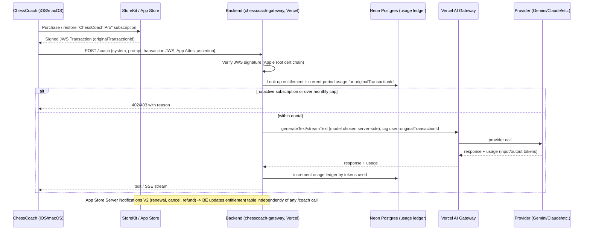

# feat: Paid tier with developer-hosted, metered AI coaching

**Type:** feat
**Depth:** Deep
**Target repo:** ChessCoach (this repo) for client changes; a **new, separate, private repo** for the backend (see KTD-1)

---

## Summary

ChessCoach ships two coaching paths today: on-device (Foundation Models/Gemma, free, always available) and BYOK Gemini (`Sources/GemmaChessCore/Coach/GeminiCoach.swift`, free, the user's own API key). This plan adds a third: a **developer-hosted, metered coach** — the app calls a backend proxy instead of any AI provider directly, the backend calls whichever provider/model is cheapest or best via Vercel AI Gateway, and access is gated by a $/month App Store subscription with a token cap. Users who don't subscribe keep everything that exists today, unchanged.

---

## Problem Frame

The on-device coach's explanations are weak, and BYOK Gemini requires every user to obtain and manage their own API key — a real barrier for non-technical users. The developer wants to offer a "just works" paid tier using his own provider account, but an API key embedded in an App Store binary is trivially extractable (`strings`/decompilation) and gives no way to meter usage or stop abuse. This plan defines the backend and client work to do this safely and provider-agnostically.

---

## Requirements

- **R1**: A backend endpoint, not the app, holds the real provider API key(s).
- **R2**: The backend can route to any Vercel AI Gateway-supported provider/model, changeable without an app update (cost/quality tuning is a server-side lever, not hardcoded to Gemini).
- **R3**: Only users with an active, verified App Store subscription can get a response from the backend.
- **R4**: Per-user token usage is tracked precisely enough to enforce a monthly cap and to answer support/billing questions ("how many tokens has this user used this period").
- **R5**: The existing on-device and BYOK-Gemini paths are unaffected — this is additive, selected through the existing `CoachLLM` protocol seam.
- **R6**: The client-side code that talks to the backend ships inside the GPLv3 App Store binary and must be open source, same as every other file in this repo (no exception for "paid" code) — only the backend server and the developer's provider key(s) stay private.
- **R7**: Basic abuse protection on the backend endpoint beyond "requires a valid subscription," since the endpoint URL is knowable from the (open source) client.

---

## Key Technical Decisions

### KTD-1: Backend lives in a new, separate, private repository — not this one

**Decision**: Create a new repo (e.g. `chesscoach-gateway`) for the Vercel backend. Do not add `/api` or a Vercel project into this repo.

**Rationale**: GPLv3 (R6) obligates the *client* code that ships in the app binary, not a server that never ships to any user's device — a backend is not a "distributed" copy of the program under GPLv3 and has no disclosure obligation. Keeping it in a separate, private repo makes that boundary unambiguous (no risk of someone reading business logic — pricing, abuse thresholds, provider cost tradeoffs — out of the public ChessCoach repo) and avoids mixing a Node/TypeScript Vercel project into a Swift package.

**Alternative considered**: A private subdirectory in this repo excluded from the public mirror. Rejected — fragile (one bad `git filter` mistake leaks it publicly), and conflates two very different toolchains/release cycles.

### KTD-2: One App Store listing, not a separate "paid app"

**Decision**: ChessCoach stays a single app. The managed/metered coach is sold as an **in-app subscription** inside the existing app, not a second App Store binary. The base app (on-device + BYOK) stays free and open source exactly as today; subscribing unlocks the developer-hosted backend as an additional, higher-quality `CoachLLM` option.

**Rationale**: The user's framing ("a paid version... uploaded to app store") suggests a separate build, but Apple's own model — and simpler engineering — favors one listing with an unlockable in-app purchase: one bundle ID, one set of App Store Connect metadata, one binary to maintain, and existing free users get a natural upgrade path instead of needing to discover and install a different app. This is the single biggest assumption in this plan — flagged here rather than silently baked in. If a genuinely separate paid app/bundle ID is wanted instead, KTD-2 and Unit 7's build-config work change; everything else (backend, ledger, App Attest) is unaffected.

### KTD-3: Provider/model choice lives entirely server-side, behind a stable client contract

**Decision**: The client sends `{system, prompt}` (the same shape `CoachLLM.generate`/`stream` already produce) to one backend endpoint and gets back `{text}` or an SSE stream of cumulative text. The backend decides which Gateway model slug (`google/gemini-2.5-flash-lite`, `anthropic/claude-haiku-4.5`, etc.) to call, and can change or A/B this without a client release.

**Rationale**: Directly satisfies R2. The client becomes provider-agnostic — it never parses a Gemini-shaped or Anthropic-shaped response, only plain text — so `ManagedCoach` (Unit 5) has zero provider-specific code, unlike `GeminiCoach` which necessarily knows Gemini's REST wire format.

### KTD-4: Usage ledger — Neon Postgres, not Gateway logs alone

**Decision**: Store per-user, per-billing-period token totals in a Postgres table (Neon — already available via this environment's MCP tooling), written from the AI SDK response's `usage` field after every call. Enforce the monthly cap by checking this table before calling the model. Still tag every Gateway call with the user's App Store `originalTransactionId` for the Gateway's own per-user dashboards/audit logs as a secondary, human-facing view.

**Rationale**: The Gateway's dashboard is for observability/budget alerts, not a synchronous "has this user got quota left" check a request handler can call inline (see Vercel AI Gateway skill: "no programmatic metrics API" for pre-flight budget checks). A cap enforced only by Gateway-side rate limits would be coarse (RPM/concurrency/daily-token knobs) and wouldn't cleanly map to "$8 = up to N million tokens this billing month" or give the developer a queryable number for support replies. A small ledger table (`user_id`, `period_start`, `input_tokens`, `output_tokens`, `updated_at`) is cheap and precise.

**Alternative considered**: Vercel KV (Redis) for the ledger. Rejected in favor of Postgres/Neon since it's already available to this developer and a relational table suits "sum this billing period" queries and later support/reporting needs better than a key-value store.

### KTD-5: Identity — StoreKit transaction identity only, no accounts

> **Superseded by KTD-8**: the identifier is now RevenueCat's `app_user_id`, not the App Store `originalTransactionId` directly. The "no accounts" conclusion below still holds — only the identifier source changed.

**Decision**: Use the `originalTransactionId` (or an app-generated `appAccountToken` set at purchase time, per StoreKit 2) as the user identifier everywhere — the ledger's primary key, the Gateway's `user` tag. No email/password, no Sign in with Apple.

**Rationale**: There's no account system today and building one is a much larger, separable scope. StoreKit already gives a stable per-purchase identifier; App Store Server Notifications V2 tell the backend about renewals/cancellations/refunds keyed on that same identifier, which is exactly what quota enforcement and subscription-lapse handling need.

**Consequence, stated plainly**: a subscription is tied to the App Store account that purchased it, not to a portable "ChessCoach account" — restoring purchases on a new device carries the entitlement, but there's no cross-platform (e.g., web) identity. Acceptable for a mobile-only app; revisit if a web/desktop-without-app-purchase surface is ever added.

### KTD-7: The iOS and macOS apps are separate App Store Connect app records — the subscription must be configured on both, or scoped to one platform

**Decision**: `project.yml` registers **two distinct bundle IDs** — `com.cordoc.gemmachess` (iOS) and `com.cordoc.gemmachess.mac` (macOS) — which are two separate app records in App Store Connect, not one cross-platform app. A subscription product created under one does not automatically entitle the other. This plan assumes the subscription ships **iOS-first**: the product is configured under the iOS app record only, and `SubscriptionStore`/`ManagedCoach` (Units 5-6) are built and tested against iOS. Extending to macOS is either (a) configuring the same subscription group under the Mac app record too and validating both `originalTransactionId` namespaces server-side, or (b) migrating both targets to a single app record with Universal Purchase — a bigger, separate App Store Connect change outside this plan's scope.

**Rationale**: Discovered by reading this repo's `project.yml` during planning, not assumed — this is exactly the kind of "silently baked in" decision the confidence pass exists to catch. Scoping to iOS-first keeps Units 5-7 concretely buildable against one, real App Store Connect configuration instead of a hypothetical cross-platform one; the backend (Units 1-4) is unaffected either way since it only cares about a validated JWS transaction, not which platform it came from.

### KTD-6: App Attest as defense-in-depth, not the primary gate

**Decision**: The primary gate is subscription validation (KTD-5 identity + a verified, current entitlement). App Attest is added as a second header the backend checks, to reject requests not coming from a genuine app binary — but a missing/failed App Attest assertion degrades to "log and allow" rather than hard-blocking, since Apple's own guidance treats it as best-effort (attestation calls to Apple's servers can transiently fail) and it must never be why a paying subscriber can't get a response.

**Rationale**: Directly satisfies R7 while keeping the paid feature's reliability independent of a secondary security layer's uptime.

### KTD-8: Subscription management + entitlement source of truth moves to RevenueCat (supersedes parts of KTD-5, U2, U6)

**Decision**: The developer chose RevenueCat for subscription management and the paywall UI, made after U1-U4 were already built and shipped against raw StoreKit. This changes the entitlement verification path materially:

- **Identity**: RevenueCat's `app_user_id` replaces the App Store `originalTransactionId` as the identity used everywhere (ledger primary key, Gateway `user` tag). RevenueCat can generate and persist an anonymous `app_user_id` client-side, so no accounts are still needed — KTD-5's "no accounts" conclusion stands, only the identifier source changes.
- **Entitlement verification**: instead of the backend verifying a StoreKit JWS transaction itself (U2's original approach), it calls RevenueCat's REST API (`GET /v1/subscribers/{app_user_id}`, `Authorization: Bearer <secret key>`) to check whether the relevant entitlement is active, and/or trusts RevenueCat's webhook events (authenticated via a shared `Authorization` header value configured in the RevenueCat dashboard, not a JWS chain). RevenueCat has already done the JWS/receipt verification against Apple internally — the backend no longer needs `@apple/app-store-server-library` for this.
- **Client purchase flow + paywall**: the iOS/macOS `Purchases` SDK (RevenueCat) plus `RevenueCatUI`'s paywall component replace the plan's original custom StoreKit 2 purchase UI (U6's original scope) — a paywall is now configured in the RevenueCat dashboard, not built here.

**Rationale**: RevenueCat is a mature, widely-used layer specifically for this problem (cross-platform entitlement state, webhook-driven lifecycle events, hosted paywalls with no-code configuration/A-B testing) — building and maintaining hand-rolled JWS verification and a custom paywall is strictly more work for no corresponding benefit once the developer has a RevenueCat account. This is a genuine scope reduction for the client (U6) and a rework, not an expansion, for the backend (U2's JWS verification code is replaced rather than kept alongside RevenueCat).

**Consequence for already-shipped work**: U2's `lib/appStoreAuth.ts` (JWS chain verification) and its App Store Server API refresh path are removed and replaced with a RevenueCat entitlement client. U3's `periodFromTransaction` (which read billing-period bounds off a StoreKit transaction's `purchaseDate`/`expiresDate`) is replaced with the equivalent read off RevenueCat's entitlement info. U4 (App Attest) and U1 (Gateway proxy, provider-agnostic model selection) are unaffected — App Attest and the Gateway call don't care which subscription platform sits upstream of the identity string they're given.

---

## High-Level Technical Design



```mermaid
flowchart LR
    subgraph App["ChessCoach app (this repo, GPLv3)"]
        CO[CoachOrchestrator] --> GC[GeminiCoach BYOK]
        CO --> FM[FoundationModelsCoach]
        CO --> MC[ManagedCoach NEW]
    end
    MC -- "system+prompt over HTTPS" --> EP[/coach endpoint]
    subgraph BE["chesscoach-gateway (new, private repo)"]
        EP --> Auth[StoreKit JWS + App Attest check]
        Auth --> Ledger[Neon usage ledger]
        Ledger --> GW[Vercel AI Gateway call]
    end
    GW --> Providers[(Any Gateway provider/model)]
```

---

## Scope Boundaries

**In scope**: backend proxy + usage ledger + StoreKit subscription purchase/validation + `ManagedCoach` client backend + Coach Settings UI updates to show subscription state + build/distribution config for the in-app purchase.

**Out of scope / Deferred to Follow-Up Work**:
- A customer-facing usage dashboard inside the app (v1 just enforces the cap and shows a simple "X of Y tokens used this month" line — a full history/graph view is later work)
- Multiple subscription tiers (the $8/mo plan is the only one this plan implements; a tier system is a straightforward extension of the ledger's cap-per-user model but isn't built now)
- Web or non-Apple-platform access to the managed backend (no identity mechanism for it under KTD-5)
- Promotional/free-trial token grants (can reuse the ledger schema later; not designed now)
- A full account system (explicitly rejected in KTD-5 for this pass)

---

## Dependencies / Prerequisites

- A Vercel account/team with AI Gateway enabled (already connected — `CORDOC-LLC`) and a Neon Postgres database provisioned (Neon MCP tooling already available in this environment).
- An App Store Connect subscription product configured (product ID, price, billing period) before Unit 6 can be tested end-to-end — this is a manual App Store Connect step, not code.
- Apple's App Store Server API requires a signing key generated in App Store Connect (Users and Access → Keys → In-App Purchase) for the backend to call `getAllSubscriptionStatuses`/receive Server Notifications V2.

---

## Risk Analysis & Mitigation

| Risk | Mitigation |
|---|---|
| Subscriber loses access due to a false-negative entitlement check (Apple outage, clock skew in JWS validation) | Cache last-known-good entitlement in the ledger with a grace window (e.g., 24-48h) before hard-blocking on a validation failure |
| A user's device is jailbroken/repackaged to bypass App Attest and hit the endpoint without a genuine app | Accept as a known limitation (KTD-6) — bounded by the fact that a valid subscription is still required, so the worst case is a paying subscriber's own quota being used from a modified client, not free unlimited access |
| Ledger and Apple's subscription state drift apart (e.g., a refund the backend hasn't heard about yet) | App Store Server Notifications V2 webhook updates entitlement state independently of request-time checks; entitlement is re-verified periodically, not just cached forever |
| Runaway cost from a bug that bypasses the quota check | Keep Vercel AI Gateway's own dashboard budget alerts (Gateway skill: monthly threshold + hard limit) as a second, provider-side backstop independent of the ledger |
| Provider outage for the chosen model | Use Gateway's `providerOptions.gateway.models` fallback list (KTD-3) so a single provider's downtime doesn't take down the paid tier |
| macOS users can't subscribe because the product is only configured under the iOS app record (KTD-7) | Ship iOS-first deliberately (KTD-7); if Mac support matters at launch, configure the same subscription group under the Mac app record as a small addition to Unit 7, not a re-architecture |

---

## Implementation Units

### U1. Backend project scaffold + `/coach` endpoint (chesscoach-gateway repo)

**Goal**: Stand up the new private repo with a Vercel Function that accepts `{system, prompt, stream}` and returns text/SSE, calling Vercel AI Gateway with a server-chosen model.

**Requirements**: R1, R2, R3 (structurally — auth added in U2/U4)

**Dependencies**: none (first unit)

**Files** (new repo, illustrative — repo-relative to `chesscoach-gateway`):
- `api/coach.ts` — the endpoint handler
- `lib/modelSelection.ts` — server-side model/provider choice (single source of truth for R2)
- `lib/gateway.ts` — thin wrapper around `generateText`/`streamText` with `providerOptions.gateway`

**Approach**: Use the `ai` package's plain `"provider/model"` string routing (no `gateway()` wrapper needed unless `providerOptions.gateway` is used for `order`/`models`/`user`/`tags`, which it is per KTD-3/KTD-4). Model selection reads from an environment variable or small config object so switching providers is a redeploy, not a code change to callers.

**Test scenarios**:
- Happy path: valid request returns generated text matching a mocked Gateway response
- Streaming: `stream: true` returns cumulative SSE chunks matching `CoachLLM.stream`'s "cumulative text" contract
- Provider fallback: primary model failure (mocked) falls over to the configured fallback model
- Error path: malformed request body returns 400 with a clear message

**Verification**: A local `curl` against the deployed endpoint with a valid test payload returns coaching text; switching the configured model env var changes which provider is called without a redeploy of the calling client.

---

### U2. ~~StoreKit transaction verification~~ RevenueCat entitlement check middleware (superseded by KTD-8)

> This unit shipped against raw StoreKit JWS verification, then was reworked after KTD-8 (RevenueCat adopted for subscription management). `lib/appStoreAuth.ts` and its App Store Server API path were replaced with a RevenueCat entitlement client; see the commit history in chesscoach-gateway for both versions. Original text preserved below for the historical record.

**Goal**: The backend verifies a StoreKit 2 JWS transaction sent by the client and confirms an active subscription before allowing a `/coach` call.

**Requirements**: R3, R5 (KTD-5 identity)

**Dependencies**: U1

**Files**:
- `lib/appStoreAuth.ts` — JWS verification (Apple root certificate chain) + App Store Server API client for `getAllSubscriptionStatuses`
- `api/appStoreNotifications.ts` — App Store Server Notifications V2 webhook receiver

**Approach**: Verify the transaction's JWS signature locally (no network round-trip needed for signature verification itself); call the App Store Server API only when the ledger's cached entitlement is stale (per the grace-window mitigation). The notifications webhook updates entitlement state on renewal/cancel/refund independent of request-time checks.

**Execution note**: Test-first for the JWS verification function — this is a security boundary the request path won't work at all without, and its correctness is fully unit-testable against Apple's published sample signed payloads.

**Test scenarios**:
- Happy path: a valid, current JWS transaction for an active subscription passes
- Expired/cancelled subscription: valid signature but lapsed entitlement is rejected
- Tampered payload: signature verification fails and the request is rejected before any Gateway call
- Notification handling: a mocked "DID_CANCEL" notification updates the stored entitlement so a subsequent request is rejected even with a previously-valid cached JWS

**Verification**: A request with a real sandbox subscription transaction succeeds; the same request after a simulated cancellation notification is rejected.

---

### U3. Usage ledger (Neon Postgres) + quota enforcement

**Goal**: Track per-user token usage per billing period and reject requests once the monthly cap is hit.

**Requirements**: R4

**Dependencies**: U1, U2 (needs the verified user identity to key the ledger)

**Files**:
- `lib/ledger.ts` — read current-period usage, increment after a call, compute period boundaries from the subscription's renewal date
- A migration/schema file for the usage table (`user_id`, `period_start`, `period_end`, `input_tokens`, `output_tokens`, `updated_at`)

**Approach**: Billing period boundaries come from the subscription's actual renewal date (from the App Store Server API), not a calendar month, so the cap resets when the user is actually charged. Increment the ledger from the Gateway response's `usage` field (`promptTokenCount`/`candidatesTokenCount`-equivalent per the AI SDK's unified `usage` shape) immediately after a successful call — including on a request that gets cut short — not just on full success, so partial-then-abandoned streams still count.

**Test scenarios**:
- Happy path: usage accumulates correctly across multiple calls within a period
- Cap boundary: a request that would push usage over the configured cap is rejected with a 402 and a clear "quota exceeded" reason, distinct from the 403 "not subscribed" case
- Period rollover: usage resets when the subscription's renewal date passes
- Concurrent requests: two simultaneous calls from the same user don't double-count or race past the cap (atomic increment, not read-then-write)

**Verification**: Manually driving requests past the configured cap returns 402; a query against the ledger table shows the expected token totals for a support-style lookup.

---

### U4. App Attest verification

**Goal**: Reject requests whose App Attest assertion doesn't verify, as a secondary abuse gate.

**Requirements**: R7 (KTD-6)

**Dependencies**: U1

**Files**:
- `lib/appAttest.ts` — key attestation (once per install) + per-request assertion verification against Apple's servers

**Approach**: Per KTD-6, a missing or failing App Attest check is logged but does not block the request — only a failed StoreKit entitlement check (U2) blocks. This unit is purely additive telemetry/defense-in-depth until there's evidence of real abuse patterns worth hard-blocking on.

**Test scenarios**:
- Happy path: a valid assertion from a registered key passes silently
- Missing assertion: request proceeds (per the soft-fail decision) but is flagged in logs
- Invalid/tampered assertion: same soft-fail behavior, logged distinctly from "missing"

**Verification**: Requests without any App Attest header still succeed (assuming valid subscription), confirming the soft-fail behavior; a log/metric shows the flagged count.

---

### U5. `ManagedCoach` — the new `CoachLLM` client backend

**Goal**: A new backend in this repo implementing `CoachLLM` (`Sources/GemmaChessCore/Coach/CoachLLM.swift`) that calls the `/coach` endpoint instead of any AI provider directly.

**Requirements**: R5, R6 (this file ships in the GPLv3 binary)

**Dependencies**: U1 (needs a real endpoint shape to integrate against, though it can be built against a stub earlier)

**Files**:
- `Sources/GemmaChessCore/Coach/ManagedCoach.swift` — the new backend
- `Sources/GemmaChessCore/Coach/ManagedCoachEntitlement.swift` — reads current StoreKit subscription state, attaches the JWS transaction to requests
- `Tests/GemmaChessCoreTests/ManagedCoachTests.swift`

**Patterns to follow**: Mirror `GeminiCoach.swift`'s shape closely (injectable `URLSession`/`baseURL` for testability, same `MockURLProtocol`-style test harness already used by `GeminiCoachTests.swift` and `LichessTests.swift` — but give it its own private mock protocol class per the cross-suite race lesson already learned in this repo). `availability` reports `.unavailable` when there's no active subscription (mirrors how `GeminiCoach.availability` reports `.unavailable` with no key) — same transparent-fallback pattern, no new `CoachAvailability` UI branches needed beyond a new case for "managed."

**Technical design** (directional): `ManagedCoach.generate`/`stream` build the request body as `{system, prompt}`, attach the current JWS transaction (obtained via `Transaction.currentEntitlements` at call time, not cached at init — entitlement can change between calls) and an App Attest assertion header, and parse the response as plain text (no provider-specific JSON to decode, per KTD-3) or accumulate SSE chunks the same way `GeminiCoach.stream` already does.

**Test scenarios**:
- Happy path: a valid subscription state produces a successful `CoachReply`
- No subscription: `availability` reports `.unavailable` with a clear reason, `generate`/`stream` throw `CoachError` without attempting a network call
- Backend 402 (quota exceeded): surfaces as a distinct, user-legible `CoachError` message (not the generic "couldn't reach" message)
- Backend 403 (subscription check failed server-side): distinct error from the quota case
- Streaming: cumulative-text contract matches `CoachLLM.stream`'s documented behavior

**Verification**: Unit tests pass against the mock protocol; a manual run against the real deployed `/coach` endpoint (sandbox subscription) produces a coaching response indistinguishable in shape from `GeminiCoach`'s.

---

### U6. ~~StoreKit 2 subscription purchase flow~~ RevenueCat purchase/paywall integration (superseded by KTD-8)

> Per KTD-8: the purchase flow and paywall UI are now RevenueCat's `Purchases`/`RevenueCatUI` SDKs, configured against a paywall built in the RevenueCat dashboard, not hand-built StoreKit 2 UI. `CoachOrchestrator` wiring (making `ManagedCoach` top-priority when subscribed) is unchanged in spirit — only what "subscribed" reads from changes (RevenueCat's `CustomerInfo`, not raw `Transaction`/`Product`).

**Goal**: Let the user buy/restore the subscription in-app, and make `ManagedCoach` the top-priority backend when subscribed (ahead of BYOK Gemini and Foundation Models).

**Requirements**: R5

**Dependencies**: U5

**Files**:
- `Sources/GemmaChessCore/Coach/SubscriptionStore.swift` — StoreKit 2 `Product`/`Transaction` listener, current entitlement state
- `Sources/GemmaChessCore/Coach/CoachOrchestrator.swift` — extend default `backends` to `[ManagedCoach(), GeminiCoach(), FoundationModelsCoach()]`
- `Sources/GemmaChessCore/UI/CoachSettingsView.swift` — purchase/restore/manage-subscription UI
- `Tests/GemmaChessCoreTests/SubscriptionStoreTests.swift`

**Approach**: `ManagedCoach` first in the priority list, same "reports `.unavailable` so the next backend takes over" pattern already established — no orchestrator logic changes needed beyond the list order, consistent with how `GeminiCoach` was added ahead of `FoundationModelsCoach` in the prior pass.

**Test scenarios**:
- Happy path: completing a StoreKit sandbox purchase makes `SubscriptionStore`'s entitlement state active
- Restore: a prior purchase is recovered via `AppStore.sync()`/`Transaction.currentEntitlements` on a fresh install
- Expiry/cancellation: entitlement state reflects a lapsed subscription (StoreKit's own transaction updates listener)
- Orchestrator priority: with an active subscription, `CoachOrchestrator.active` resolves to `ManagedCoach`; without one, it falls through to `GeminiCoach` (if a BYOK key is set) or `FoundationModelsCoach`

**Verification**: A sandbox-account purchase flow completes and the coach card visibly upgrades (existing `coachLabel`/`coachAvailability` UI already threads through a label per backend); cancelling in Settings and re-checking reverts to the prior backend.

---

### U7. Distribution config + entitlement/GPL documentation

**Goal**: Make the free/open-source posture and the in-app-purchase-unlocked managed coach coexist cleanly in the same App Store listing and the same public repo, and document the GPL boundary explicitly.

**Requirements**: R6 (documentation), KTD-2

**Dependencies**: U6

**Files**:
- `project.yml` — register the new subscription product ID/StoreKit configuration file reference
- `NOTICE.md` / `README.md` — a short section: "the managed coach backend is a separate, private service; only the client code that talks to it ships here, under the same GPLv3 terms as everything else"

**Approach**: No new Xcode target or bundle ID (per KTD-2) — this is App Store Connect configuration (the subscription product) plus a StoreKit configuration file for local sandbox testing, not a build-system change.

**Test expectation**: none — this unit is documentation and App Store Connect/StoreKit config, not application behavior.

**Verification**: A fresh reader of `NOTICE.md` can correctly state which parts of the system are open source and which aren't, without needing to ask.

---

## Open Questions (deferred to implementation)

- Exact monthly token cap for the $8 tier — depends on real per-request token counts once `ManagedCoach` is live; the ledger (U3) is built to support changing the cap without a schema change, so this doesn't block building it.
- Whether to expose the chosen model/provider name to the user at all, or keep it fully invisible (KTD-3 makes it invisible by default — revisit if users start asking "which AI is this").
- Grace-window duration for entitlement-check failures (mitigation table) — start conservative (24h) and tune from real Apple-outage incidents rather than guessing now.
- Whether macOS needs the subscription at launch or can follow later (KTD-7) — confirm before Unit 7 so the App Store Connect subscription group is configured for the right app record(s) from the start.

---

## Sources & Research

- [Vercel AI Gateway docs](https://vercel.com/docs/ai-gateway) — per-user tracking (`user` tag), rate limits, budget alerts, audit logs, provider fallback (`providerOptions.gateway.models`)
- [Apple: Establishing your app's integrity (App Attest)](https://developer.apple.com/documentation/devicecheck/establishing-your-app-s-integrity) — attestation is best-effort, backend calls to Apple can transiently fail (informs KTD-6's soft-fail decision)
- [App Store Server API / StoreKit 2 server-side validation overview (Adapty)](https://adapty.io/blog/validating-iap-with-app-store-server-api/) and [(Medium/Ronald Mannak)](https://medium.com/@ronaldmannak/how-to-validate-ios-and-macos-in-app-purchases-using-storekit-2-and-server-side-swift-98626641d3ea) — JWS-signed transactions, no receipt parsing needed, App Store Server Notifications V2 for renewal/cancel/refund events
