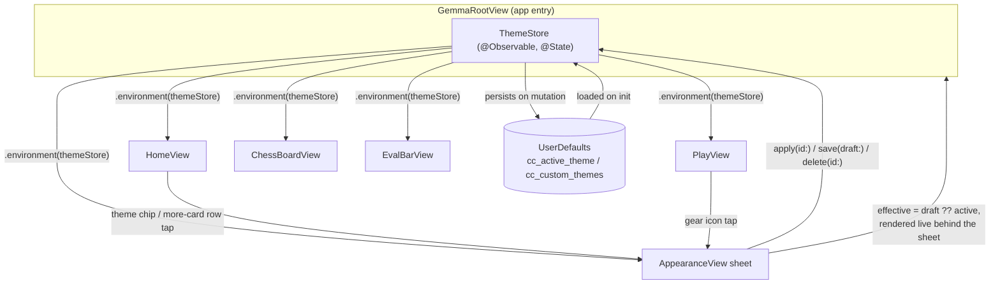

# feat: Living Themes — user-editable theme system

## Summary

Replace ChessCoach's single hardcoded palette (`GemmaTheme`) with a `Theme` model:
4 built-in presets, a `ThemeStore` that persists user edits and custom themes
on-device, and a new Appearance sheet where users pick a preset, tweak any of
7 color tokens + a type-personality (display font), and save their own theme.
Every screen repaints from the active theme instead of static constants.

Scope, per user confirmation:
- **Fonts**: no new bundled assets. Map each of the 4 type personalities
  (elegant/modern/bold/clean) to the nearest built-in system font rather than
  bundling Playfair Display / Instrument Serif / Bebas Neue / Hanken Grotesk.
- **Home hero**: build the full new hero from the design reference — deco
  rule, breathing emblem badge, theme-name sub-label, theme chip — not just a
  recolor of today's simpler hero.

---

## Problem Frame

Today `Sources/GemmaChessCore/UI/GemmaTheme.swift` is a `public enum` of
`static let` colors. Every screen references `GemmaTheme.accent`,
`GemmaTheme.boardLight`, etc. directly. There is no way for a user to change
the app's look, and no seam for "this color is user-editable" vs. "this is a
fixed system color" (e.g., `.orange`/`.red` for mistake/blunder classification,
which stay fixed).

The design handoff (an HTML prototype + README, supplied by the user) fully
specifies the target: a `Theme` value type, 4 presets, and an Appearance sheet
with a picker grid and a live editor. The HTML is a high-fidelity reference
for colors/spacing/interactions, not code to port — this plan recreates it in
SwiftUI following the codebase's existing `@Observable`/`UserDefaults`
patterns (`SavedGameStore`, `PlayDisplaySettings`).

---

## Requirements

- **R1**: A `Theme` model carries 7 editable color tokens (accent, accent2, bg,
  surface, text, boardLight, boardDark), a `kind` (preset/custom), and a `type`
  personality (elegant/modern/bold/clean) that selects a display font.
- **R2**: 4 built-in presets ship with the exact hex values from the design
  handoff: Gambit, Daylight, Night Market, Study.
- **R3**: The active theme persists across launches and drives every screen's
  colors — no screen may reference the old static `GemmaTheme` palette after
  this work lands.
- **R4**: Users can create a new custom theme, edit any theme (editing a preset
  forks a custom copy, editing a custom theme edits in place), and delete a
  custom theme (falling back to the Gambit preset if the deleted theme was
  active).
- **R5**: An Appearance sheet, reachable from Home's theme chip, Home's "more"
  card, and Play's gear icon, presents a 2-column picker grid and a live
  color/font editor.
- **R6**: Home's hero gains the design handoff's new elements (deco rule,
  breathing emblem, theme-name sub-label, theme chip) rendered from theme
  tokens.
- **R7**: Derived visual values (background gradient, `onAccent` contrast text,
  muted/faint text, card style) are computed from the 7 stored tokens, never
  stored themselves.
- **R8**: Persistence follows the existing on-device-only, `UserDefaults`-JSON
  pattern (mirrors `PlayDisplaySettings`), under the design handoff's own key
  names (`cc_custom_themes`, `cc_active_theme`) so behavior matches the
  prototype 1:1.

## Scope Boundaries

**In scope**: `Theme` model, `ThemeStore`, Appearance sheet (picker + editor),
full retheme of Home, Play, the board, eval bar, captured tray, move list,
puzzles, and settings screens; the new Home hero elements.

**Out of scope / non-goals**:
- Bundling the 4 named display fonts as app assets — system-font fallback per
  personality only (see Summary).
- iCloud/cross-device sync of custom themes — on-device only, matching
  `SavedGameStore`.
- Sharing/exporting a custom theme to another user.
- Any change to game logic, engine behavior, or coach behavior — this is a
  presentation-layer change only.

### Deferred to Follow-Up Work
- Bundling licensed display fonts for pixel-exact typography, if the system-font
  fallback proves visually unsatisfying after this ships.
- A "reset to preset defaults" action distinct from delete (not in the design
  handoff).

---

## Key Technical Decisions

**KTD1 — Theme injection: `@Environment`, not per-view init params.**
`ThemeStore` is created once at `GemmaRootView` (`@State private var
themeStore = ThemeStore()`) and injected via `.environment(themeStore)`
(the `@Observable` environment pattern, iOS 17+/macOS 14+ — already the
project's minimum per `PlayDisplaySettings`/`PuzzleViewModel` being
`@Observable`). Every view reads `@Environment(ThemeStore.self) private var
themeStore` and uses `themeStore.active`. Rejected alternative: threading a
`Theme` value through every view's `init` — correct but a much larger diff
across ~10 files for no behavioral benefit, since every one of those views is
already inside the same navigation tree rooted at `GemmaRootView`.

**KTD2 — `MoveVerdict.color(for:)` takes a `Theme` parameter.**
This one call site is a `static func` living in `PlayViewModel.swift`
(non-view code), so it cannot read `@Environment`. It gains a `theme: Theme`
parameter; the two view call sites (Best Moves card, Coach card) pass
`themeStore.active`. `.orange`/`.red` for mistake/blunder stay fixed system
colors — the design handoff only ties `accent`/`accent2` to the theme.

**KTD3 — `GemmaTheme.swift` keeps its non-palette helpers, loses its palette.**
`gemmaGlass()`/`gemmaGlassPill()`/`PressableStyle`/`asCoachMarkdown` are shape
and interaction helpers unrelated to color — they stay in `GemmaTheme.swift`
unchanged. The `public static let accent/gold/boardLight/...` constants and
`Background` struct are removed; `Background` becomes `Theme.BackgroundView`
(a computed radial gradient over the theme's `bg`, per R7). `gemmaChrome()`
gains a `theme: Theme` parameter.

**KTD4 — Preset colors and swatch palettes are Swift literals, not a bundled
JSON/plist asset.** The design handoff's tables are small and fixed (4 presets
× 7 tokens; 7 swatch rows × 6 colors). Hardcoding them as Swift array/struct
literals in `Theme.swift` matches `PuzzleDownloadStore`-adjacent conventions
of small fixed catalogs living in code, and keeps them type-checked and
diffable in review — no asset pipeline needed for ~70 hex values.

**KTD5 — System-font mapping per type personality** (per user decision):
`elegant` → `.serif` design with heavier weight (nearest to Playfair Display's
high-contrast serif display feel), `modern` → `.serif` at regular weight
(Instrument Serif is a lighter serif), `bold` → `.system` condensed/black
weight + uppercase (mirrors Bebas Neue's all-caps condensed look — SwiftUI has
no built-in condensed family, so uppercase transform + heavy weight
approximates it), `clean` → `.rounded` design (nearest system match to Hanken
Grotesk's geometric grotesk warmth). Exact `Font` construction is an
implementation-time detail (see U2's Approach); the mapping table itself is a
planning-time decision so every consumer (wordmark, sheet title, section
labels) uses the same lookup.

---

## High-Level Technical Design

```mermaid
stateDiagram-v2
    [*] --> Picker: sheet opens
    Picker --> Picker: tap a card → apply(id:), stays open
    Picker --> Editor: tap "Create a new theme" → newDraft(from: active)
    Picker --> Editor: tap pencil on a card → editDraft(id:) (forks if preset)
    Editor --> Editor: edit color/name/type → mutates draft, live repaint
    Editor --> Picker: Save → upsert into customs, active = draft.id
    Editor --> Picker: Cancel → discard draft
    Editor --> Picker: Delete (custom only) → remove; active falls back to gambit if it was active
    Picker --> [*]: Done
```





---

## Output Structure

```
Sources/GemmaChessCore/
  Theme/
    Theme.swift            # Theme model, Kind, TypePersonality, presets, swatch palettes, derived values
    ThemeStore.swift        # @Observable store, UserDefaults persistence, CRUD API
  UI/
    AppearanceView.swift    # new — the Appearance sheet (picker + editor modes)
    GemmaTheme.swift         # trimmed — glass/press/markdown helpers only, palette removed
    RootView.swift           # modified — theme chip, hero rebuild, sheet entry points
    PlayView.swift            # modified — gear → sheet, tokenized colors
    ChessBoardView.swift       # modified — board/piece colors parameterized from Theme
    EvalBarView.swift           # modified — inset ring token
    CapturedTrayView.swift       # modified
    MoveListView.swift            # modified
    PuzzlesView.swift              # modified
    SettingsView.swift              # modified — "Appearance & themes" row (if not already routed via Home)
    CoachSettingsView.swift          # modified — palette references only
  ViewModels/
    PlayViewModel.swift               # modified — MoveVerdict.color(for:theme:)
```

---

## Implementation Units

### U1. `Theme` model + presets + derived values

**Goal**: Introduce the `Theme` value type, the 4 hardcoded presets, the
swatch-palette catalog, and the derived-value computations (background
gradient, `onAccent`, muted/faint text, card style), with no consumers wired
up yet.

**Requirements**: R1, R2, R7, R8 (partial — model only)

**Dependencies**: none

**Files**:
- Create `Sources/GemmaChessCore/Theme/Theme.swift`
- Create `Tests/GemmaChessCoreTests/ThemeTests.swift`

**Approach**:
- `Theme: Codable, Identifiable, Equatable, Sendable` with `id: String`,
  `name: String`, `kind: Kind`, `type: TypePersonality`, and the 7 color
  tokens stored as hex strings (`accent`, `accent2`, `bg`, `surface`, `text`,
  `boardLight`, `boardDark`), per the design handoff's exact struct shape.
- `Color(hex:)` failable init (check whether one already exists in the
  codebase before adding — grep for `Color(hex`; if absent, add as a small
  `Color` extension in `Theme.swift`) plus one computed `Color` accessor per
  token (`accentColor`, `accent2Color`, etc.).
- 4 static presets (`Theme.gambit`, `.daylight`, `.night`, `.study`) with the
  exact hex values from the design handoff's Preset themes table; a
  `Theme.presets: [Theme]` array in that order.
- `TypePersonality: String, Codable, CaseIterable` with `elegant/modern/bold/clean`;
  a computed `var displayFont: Font` (or a `Font`-returning static func) per
  KTD5's mapping, plus `letterSpacing`/`uppercased` flags matching the design
  handoff's Type personalities table (elegant 0.5px/none, modern 0/none, bold
  2px/uppercase, clean 0.3px/none).
- Swatch palette catalog: a `static let swatches: [String: [String]]` or a
  small enum keyed by token name, holding the 6 curated hex values per
  editable token from the design handoff's Swatch palettes table.
- Derived values as computed properties/functions on `Theme` (not stored):
  `var onAccentColor: Color` (relative-luminance threshold 0.6 per the
  handoff's formula), `var mutedTextColor: Color` (`text` @55%), `var
  faintTextColor: Color` (`text` @38%), `var backgroundGradient:
  RadialGradient` (accent2 @16% → clear, mirroring the existing
  `GemmaTheme.Background`'s radial gradient shape but keyed off this theme),
  a `cardBackground`/`cardBorder` pair matching `surface`@84%/`accent2`@22%.
- `Kind: String, Codable { case preset, custom }`.

**Patterns to follow**: `Sources/GemmaChessCore/UI/GemmaTheme.swift`'s
existing `Background` struct for the gradient shape; `SavedGame`'s `Codable`
struct style (plain stored properties, explicit memberwise `init`) for
`Theme`'s shape.

**Test scenarios**:
- Happy path: each of the 4 presets decodes to the exact hex values from the
  design handoff table (one test per preset, asserting all 7 token strings).
- Happy path: `onAccentColor` returns the dark text color for a light accent
  (e.g., `daylight`'s `#5b8c6e`... verify against the luminance formula with a
  known light and a known dark accent) and the light text color for a dark
  accent.
- Edge case: `Color(hex:)` with a malformed hex string (wrong length, invalid
  characters) does not crash — returns nil or a documented fallback.
- Edge case: `TypePersonality.allCases` has exactly 4 cases and each maps to a
  distinct `displayFont`.
- Happy path: `Theme` round-trips through `JSONEncoder`/`JSONDecoder` losslessly
  (encode a custom theme, decode, assert `Equatable` equality).

**Verification**: `ThemeTests` passes; the 4 presets' hex values match the
design handoff table exactly (copy-checked, not approximated).

---

### U2. `ThemeStore` — persistence + CRUD

**Goal**: The `@Observable` store holding presets, customs, and the active
theme, with `UserDefaults` persistence and the apply/create/edit/save/delete
API from the design handoff.

**Requirements**: R3, R4, R8

**Dependencies**: U1

**Files**:
- Create `Sources/GemmaChessCore/Theme/ThemeStore.swift`
- Create `Tests/GemmaChessCoreTests/ThemeStoreTests.swift`

**Approach**:
- `@MainActor @Observable public final class ThemeStore`, constructed with an
  injectable `defaults: UserDefaults = .standard` (mirrors
  `PlayDisplaySettings.init(defaults:)` exactly, for testability with a
  scratch suite).
- Stored: `public private(set) var customs: [Theme]`, `public private(set) var
  activeID: String`, `public var draft: Theme?`, `public var editingID:
  String?`.
- `public var presets: [Theme] { Theme.presets }` (not persisted — always the
  4 hardcoded values).
- `public var active: Theme` — looks up `activeID` in `customs` first, then
  `presets`, falling back to `Theme.gambit` if neither matches (handles a
  deleted-but-still-active or corrupted-defaults case per R4's fallback rule).
- `public var effective: Theme { draft ?? active }` — what every screen should
  actually render (R5's "app behind the sheet renders the draft live").
- Persistence keys **exactly** `cc_custom_themes` (JSON-encoded `[Theme]`) and
  `cc_active_theme` (raw `String`), per R8 — load in `init`, write on every
  mutating call. Guard decode with `try?`, defaulting to `[]`/`"gambit"` on
  failure — never crash on bad stored data (mirrors `SavedGameStore.loadAll`'s
  "corrupt files are skipped" behavior).
- API: `apply(id:)` sets `activeID` + persists; `newDraft(from theme: Theme)`
  sets `draft = theme` with a fresh `id`/name per the handoff ("My Theme" name,
  `kind: .custom`, `id: "c<counter or uuid>"` — since `Date()`/`Date.now()`
  aren't available in some execution contexts per this repo's other
  UUID-based IDs, prefer `UUID().uuidString`-derived ids over timestamp
  strings); `editDraft(id:)` looks up the theme and, if it's a preset, forks a
  copy named `"<name> copy"` with a new id and `kind: .custom` before
  assigning to `draft` (if it's already custom, assigns directly — edit in
  place); `save(_ draft: Theme)` upserts into `customs`, sets `active =
  draft.id`, persists, clears `draft`; `cancelEdit()` clears `draft` without
  persisting; `delete(id:)` removes from `customs`, and if `id == activeID`,
  falls back to `apply(id: "gambit")`.

**Patterns to follow**: `PlayDisplaySettings.swift`'s `@Observable` +
injectable-`UserDefaults` + `didSet`-persists shape; `SavedGameStore`'s
"never crash on corrupt/missing data" discipline.

**Test scenarios**:
- Happy path: `apply(id:)` a preset sets `active` to that preset and persists
  `activeID` across a fresh `ThemeStore` instance pointed at the same
  `UserDefaults` suite.
- Happy path: `newDraft(from:)` → mutate a color → `save(_:)` upserts into
  `customs`, sets `active` to the new custom theme, and `customs` persists
  across a fresh store instance.
- Happy path: `editDraft(id:)` on a preset id produces a `draft` with `kind ==
  .custom`, a new `id` distinct from the preset's, and a name ending in
  " copy" — the original preset is untouched in `presets`.
- Happy path: `editDraft(id:)` on an existing custom id produces a `draft`
  with the *same* `id` as the target custom theme (in-place edit).
- Edge case: `delete(id:)` on the currently-active custom theme falls back to
  `activeID == "gambit"`.
- Edge case: `delete(id:)` on a non-active custom theme leaves `activeID`
  unchanged.
- Edge case: constructing `ThemeStore` against a `UserDefaults` suite with
  malformed JSON under `cc_custom_themes` does not crash — `customs` is empty.
- Edge case: constructing `ThemeStore` against an empty/fresh `UserDefaults`
  suite defaults `active` to `Theme.gambit`.
- Integration: `effective` returns `draft` while a draft is in progress and
  falls back to `active` once `save`/`cancelEdit` clears it.

**Verification**: `ThemeStoreTests` passes; a store reconstructed from the
same `UserDefaults` suite after `save`/`apply`/`delete` reflects the prior
instance's final state exactly.

---

### U3. Wire `ThemeStore` into the app root; retire the static `GemmaTheme` palette

**Goal**: Inject `ThemeStore` at `GemmaRootView`, update `gemmaChrome()`/the
background to read from it, and remove the static palette constants from
`GemmaTheme.swift` so every remaining reference becomes a compile error the
next units fix screen-by-screen.

**Requirements**: R3, R7 (background gradient), KTD1, KTD3

**Dependencies**: U1, U2

**Files**:
- Modify `Sources/GemmaChessCore/UI/RootView.swift`
- Modify `Sources/GemmaChessCore/UI/GemmaTheme.swift`

**Approach**:
- `GemmaRootView` gains `@State private var themeStore = ThemeStore()` and
  `.environment(themeStore)` applied at the `NavigationStack`/root modifier
  chain (same place `.gemmaChrome()` is already applied).
- `gemmaChrome()` gains a `theme: Theme` parameter (defaulting is not
  meaningful here — every call site now has a theme available) and uses
  `theme.backgroundGradient`/`theme.bg` in place of `GemmaTheme.Background()`
  and `.tint(GemmaTheme.accent)` becomes `.tint(theme.accentColor)`.
- Remove `GemmaTheme.accent`, `.gold`, `.boardLight`, `.boardDark`,
  `.pieceWhite`, `.pieceBlack`, `.accentGradient`, and the `Background`
  struct. Keep `gemmaGlass()`/`gemmaGlassPill()`/`PressableStyle`/
  `asCoachMarkdown`/`GemmaGlass` untouched.
- This unit is expected to leave the package **not compiling** until U4-U8
  land — that's intentional (removing the palette is the forcing function
  that guarantees no call site is missed per R3's "no screen may reference
  the old palette" requirement). Execution note below governs how to sequence
  this safely.

**Execution note**: Do this unit's removal step *last* within its own commit,
after every other unit's screen-level replacement is drafted, OR keep the old
`GemmaTheme` constants present-but-deprecated through U4-U8 and delete them in
a final cleanup pass at the end of U8. Either sequencing is acceptable; the
plan does not mandate a broken intermediate commit. State which approach was
taken in the unit's own commit message.

**Patterns to follow**: existing `.gemmaChrome()` call site in
`GemmaRootView.body`; `@Observable` environment injection is new to this
codebase (existing state like `review`/`play`/`puzzles` are passed as
explicit `vm:` params, not environment) — this is a deliberate deviation
per KTD1, since those view models are route-specific while the theme is
truly global.

**Test scenarios**:
- Test expectation: none — this unit is pure wiring with no independently
  testable logic; correctness is verified by the full package building green
  after U8, and by U1/U2's own unit tests covering the underlying logic.

**Verification**: `GemmaRootView` builds and injects `themeStore`;
`GemmaTheme.swift` retains only glass/press/markdown helpers.

---

### U4. Retheme the board + supporting board UI

**Goal**: `ChessBoardView`, `EvalBarView`, `CapturedTrayView`, `MoveListView`
read colors from the active `Theme` instead of `GemmaTheme`.

**Requirements**: R3, R6 (piece black-rim tie-in)

**Dependencies**: U3

**Files**:
- Modify `Sources/GemmaChessCore/UI/ChessBoardView.swift`
- Modify `Sources/GemmaChessCore/UI/EvalBarView.swift`
- Modify `Sources/GemmaChessCore/UI/CapturedTrayView.swift`
- Modify `Sources/GemmaChessCore/UI/MoveListView.swift`
- Modify `Tests/GemmaChessCoreTests/` (existing board/eval-bar tests, if any
  assert on color values — update to the new API; grep first)

**Approach**:
- `ChessBoardView` gains theme inputs (either via `@Environment(ThemeStore.self)`
  read internally, or explicit `boardLight`/`boardDark`/`pieceBlackRim: Color`
  init params — prefer explicit params here since `ChessBoardView` is reused
  in non-themed-yet contexts like the Appearance sheet's live preview and mini
  theme cards, where it needs to render a *draft* theme, not necessarily
  `themeStore.active`). Piece fills stay fixed (`#f4eee0`/`#181310` per the
  design handoff — "piece fills fixed" is explicit) but the black-piece rim
  color (currently likely a fixed stroke, verify at implementation time)
  becomes `theme.accent2Color` per the design handoff's "piece black-rim =
  accent2" rule.
- `EvalBarView` gains an optional theme-driven inset ring color
  (`accent2`@40%) around its existing black/white fill — fill colors stay
  fixed per the design handoff (`pieceW`/`pieceB` sections are literally
  black/white, only the ring is themed).
- `CapturedTrayView`/`MoveListView`: replace their (currently small, per the
  earlier grep: 1 and 4 references respectively) `GemmaTheme.*` uses with the
  equivalent `Theme` token, read via `@Environment(ThemeStore.self)`.

**Patterns to follow**: current `ChessBoardView.swift` lines ~177-179, 245-247,
375 (the exact `GemmaTheme.*` call sites found during planning) as the
before-state to replace.

**Test scenarios**:
- Test expectation: none for pure color plumbing, UNLESS existing tests assert
  literal `GemmaTheme` color values — if found during implementation, update
  those assertions to construct an explicit `Theme` fixture and assert against
  its tokens instead of the old constants.
- Happy path (if `BoardAttacks`/check-glow or similar visual-logic tests
  exist and reference color): verify they still compile and pass against a
  `Theme` fixture.

**Verification**: board renders correctly with each of the 4 presets applied
(spot-check via simulator or an existing preview provider) — light/dark
squares, last-move highlight, and the black-piece rim all repaint.

---

### U5. Retheme Play mode + rebuild the Home hero

**Goal**: `PlayView.swift`'s header/eval row/cards/opening row/coach card and
`RootView.swift`'s `HomeView` (existing hero + new deco rule / breathing
emblem / theme chip / sub-label) read from the active theme.

**Requirements**: R3, R6, KTD2

**Dependencies**: U3, U4 (Play embeds the board/eval bar)

**Files**:
- Modify `Sources/GemmaChessCore/UI/PlayView.swift`
- Modify `Sources/GemmaChessCore/UI/RootView.swift`
- Modify `Sources/GemmaChessCore/ViewModels/PlayViewModel.swift`

**Approach**:
- `PlayView`: replace all 17 `GemmaTheme.*` references (header chevron/status/
  hint icons, verdict chip bg/text via `onAccentColor`, Best Moves rank/SAN/eval
  text opacities, Coach card gradient/icon/emphasis color) with
  `themeStore.active.*` reads via `@Environment(ThemeStore.self)`.
- Add a gear-icon entry point on `PlayView`'s header bar (the header already
  has a gear per an earlier session's `settingsToolbarItem` — verify whether
  that gear should now open the Appearance sheet directly vs. `SettingsView`,
  since `SettingsView` will itself gain an "Appearance & themes" row in U6;
  the design handoff specifies Play's gear opens Appearance directly — resolve
  by having Play's header gear present the Appearance sheet, and Settings'
  gear continue to `SettingsView`, whose new row also opens Appearance).
- `PlayViewModel.MoveVerdict.color(for:)` gains a `theme: Theme` parameter per
  KTD2; both view call sites pass `themeStore.active`.
- `RootView.swift`'s `HomeView`:
  - Theme chip (top-right pill): 3 overlapping 13×13 circles (accent, accent2,
    boardDark, each ringed `surface`), active theme name, chevron — opens the
    Appearance sheet. Replaces or sits alongside the existing gear-icon overlay
    button (resolve at implementation time whether both are needed or the
    theme chip subsumes the gear; the design handoff shows only the theme chip
    on Home, with Settings reached via the "more" card, so the existing
    top-trailing gear button likely becomes the theme chip instead of an
    addition).
  - Deco rule: two 50×1px gradient lines + a small `◆` glyph, `accent2`@90%,
    placed above the wordmark.
  - Emblem: crown SF Symbol in a 90×90 rounded badge, `surface`@80% bg,
    `accent`@45% border, glow via `.shadow(color: accent@34%, radius: 40)` +
    an inset highlight; a `withAnimation(.easeInOut(duration: 5).repeatForever
    (autoreverses: true))`-driven scale (1→1.04) + opacity (.85→1) "breathing"
    loop, mirroring `ChessBoardView`'s existing `kingPulse` breathing-animation
    pattern (`@State private var emblemBreath = false` + `.onAppear`).
  - Wordmark "ChessCoach": theme's `displayFont`, `text` color, tracking/case
    per the personality's letter-spacing/uppercase flags (KTD5).
  - Sub-label: active theme name, uppercase, `accent2`, small tracked caption
    under the wordmark.
  - "Play a game" button: bg `accent`, label color `onAccentColor` (contrast-
    picked, not a fixed white/black).
  - "more" card's "Appearance & themes" row (new) — palette icon in `accent2`,
    opens the Appearance sheet; placed above "My Games" per the design
    handoff.

**Patterns to follow**: `ChessBoardView`'s existing `@State private var
kingPulse` + `.onAppear` `repeatForever` animation (from the earlier
check-glow feature) as the template for the emblem's breathing animation;
`PlayView.swift`'s existing `header` `.gemmaGlass()` bar restructuring (an
earlier session's work) as the template for a cohesive, single-background
header.

**Test scenarios**:
- Test expectation: none for pure SwiftUI color/layout wiring — no unit-testable
  logic beyond what U1/U2 already cover, other than `MoveVerdict.color(for:theme:)`.
- Happy path: `MoveVerdict.color(for: "best", theme: .gambit)` returns
  `Theme.gambit.accentColor`; `color(for: "mistake", theme: .gambit)` returns
  `.orange` regardless of theme (fixed system color, per KTD2).
- Edge case: `MoveVerdict.color(for:theme:)` with an unrecognized classification
  string falls back to the theme's accent color (mirrors today's default case).

**Verification**: Home and Play visually repaint end-to-end when the active
theme changes (verified by applying each of the 4 presets from the Appearance
sheet built in U6/U7 and confirming both screens update); emblem breathing
animation runs; theme chip shows the correct active theme's 3 dot colors.

---

### U6. Appearance sheet — picker mode

**Goal**: `AppearanceView.swift`, a new `.sheet` presenting the picker grid:
2-column theme cards, apply-on-tap, edit/delete affordances, "Create a new
theme" entry.

**Requirements**: R4, R5

**Dependencies**: U1, U2, U4 (mini-board preview reuses `ChessBoardView`'s
explicit-color-param mode)

**Files**:
- Create `Sources/GemmaChessCore/UI/AppearanceView.swift`
- Create `Tests/GemmaChessCoreTests/AppearanceViewModelTests.swift` (if picker
  interaction logic is extracted into a small testable helper — see Approach)

**Approach**:
- `AppearanceView: View` takes `@Environment(ThemeStore.self) private var
  themeStore` and `@State private var mode: .picker | .editor` (or derives
  mode from `themeStore.draft != nil`, matching `ThemeStore`'s own state
  rather than duplicating it — prefer this, since the design handoff's editor
  entry points (`newDraft`/`editDraft`) already set `draft` on the store).
- Sheet chrome: `.presentationDetents([.fraction(0.82)])`, `.presentationCornerRadius(28)`,
  dim scrim per system sheet defaults (no custom scrim needed — SwiftUI sheets
  already dim the presenter).
- Picker grid: `LazyVGrid` with 2 columns, one card per `themeStore.presets +
  themeStore.customs`. Each card: top band filled `theme.bg`, a small 2×2 mini
  board (reuse `ChessBoardView` or a lightweight 4-square `Grid` if
  `ChessBoardView` is too heavy for a 44×44 preview — decide at implementation
  time based on `ChessBoardView`'s actual render cost), two corner dots
  (`accent`/`accent2`), a check badge when `theme.id == themeStore.activeID`;
  footer with name/type label, pencil (`editDraft`), trash (`delete`, custom
  only, with a confirmation per the app's existing `confirmationDialog`
  pattern in `SettingsView`'s "Clear all saved games" flow).
- Tapping a card (not its pencil/trash) calls `themeStore.apply(id:)` and
  keeps the sheet open (per R4/the design handoff: "Sheet stays open").
- "Create a new theme" button (dashed border) calls `themeStore.newDraft(from:
  themeStore.active)`.
- Header: "Cancel" only visible in editor mode (irrelevant here since this
  unit builds picker mode only — carried into U7), centered title
  "Appearance", trailing "Done" dismisses the sheet.

**Patterns to follow**: `SettingsView.swift`'s `confirmationDialog` usage for
delete confirmations; `PuzzlesView.swift`'s grid-of-cards layout (if it uses
`LazyVGrid`) as a starting shape.

**Test scenarios**:
- Test expectation: none for the SwiftUI view body itself (no unit-testable
  logic — covered by `ThemeStoreTests`' apply/delete/newDraft coverage).
- Integration (manual/visual, noted since SwiftUI view bodies aren't unit
  tested elsewhere in this codebase either): tapping a non-active card applies
  it and the check badge moves; tapping trash on the active custom theme
  deletes it and the picker's active state falls back to Gambit.

**Verification**: sheet opens from Home's theme chip / "more" card row and
Play's gear; picker grid renders all 4 presets + any customs; apply/delete/
create all work end-to-end against a live `ThemeStore`.

---

### U7. Appearance sheet — editor mode

**Goal**: The live color/font editor: preview box, name field, type-personality
segmented control, 7 color rows (native `ColorPicker` + curated swatches),
save/cancel/delete.

**Requirements**: R1, R4, R5, R7 (live preview uses derived values)

**Dependencies**: U6

**Files**:
- Modify `Sources/GemmaChessCore/UI/AppearanceView.swift`

**Approach**:
- Editor mode renders when `themeStore.draft != nil`. Header: "Cancel" (calls
  `themeStore.cancelEdit()`) · title "New theme"/"Edit theme" (based on
  whether `draft.id` already exists in `customs`) · "Save" (calls
  `themeStore.save(themeStore.draft!)`).
- Live preview box: background = `draft.backgroundGradient` over `draft.bg`,
  a mini 8×8 board rendered from `draft`'s board/piece-rim colors (reusing
  `ChessBoardView`'s explicit-param mode from U4), a "Play a game" pill in
  `draft.accentColor`/`draft.onAccentColor`, and "HIGHLIGHT · HINTS" text in
  `draft.accent2Color` — everything reads `themeStore.draft` directly so edits
  are live with no extra plumbing.
- Name field: `TextField` bound to `themeStore.draft?.name` (via a computed
  `Binding` since `draft` is `Theme?` — a small custom `Binding` unwrapping
  helper, or bind through a non-optional computed property on `ThemeStore`
  that force-unwraps only while in editor mode, matching how the design
  handoff guarantees `draft` is non-nil in editor mode).
- Type personality: 4-segment `Picker(.segmented)`-style custom control (native
  `.pickerStyle(.segmented)` may not give the exact active/inactive border
  styling from the design handoff — use a custom `HStack` of tappable segments
  if the native control can't be styled to match, following whatever pattern
  `PlayContainerView`'s existing segmented pickers in this codebase already
  use, e.g. the intent picker in `BoardScannerView.intentSection`).
- Color rows: 7 rows (accent, accent2, bg, surface, text, boardLight,
  boardDark), each a native `ColorPicker("", selection: <binding>)` sized to
  the design handoff's 42×30 well, a label, and 6 tappable swatch chips from
  `Theme.swatches[token]` — tapping a swatch sets that token's binding
  directly (same binding the `ColorPicker` uses, so both stay in sync).
- Delete button: only shown when editing an *existing* custom theme (i.e.
  `themeStore.draft.id` is present in `themeStore.customs` already, not a
  fresh `newDraft`) — calls `themeStore.delete(id:)` then `cancelEdit()` /
  dismiss back to picker.

**Patterns to follow**: `SettingsView.swift`'s `TextField`/`Stepper` rows for
form-field styling; `CoachSettingsView.swift`'s `SecureField`+`Button("Save")`
pattern for the save/discard interaction shape (adapted to a full-screen
editor rather than a form row).

**Test scenarios**:
- Test expectation: none for the view body directly (SwiftUI views aren't
  unit-tested elsewhere in this codebase) — behavior is covered by
  `ThemeStoreTests`' `newDraft`/`editDraft`/`save`/`delete` scenarios (U2),
  which this view is a thin binding layer over.
- If a `Binding`-unwrapping helper or any other non-trivial logic is extracted
  from the view (e.g., a computed "is this an existing custom theme" check
  used to show/hide Delete), add a focused unit test for that helper in
  `ThemeStoreTests.swift` rather than leaving it untested inside the view.

**Verification**: editing a preset forks a custom copy on Save (original
preset unchanged in the picker grid); editing an existing custom theme updates
it in place; Delete removes the theme and returns to the picker; every color
edit visibly repaints the preview box and (per KTD1/`effective`) the screen
behind the sheet, live, with no Save required to preview.

---

### U8. Retheme remaining screens + final palette cleanup

**Goal**: `SettingsView`, `CoachSettingsView`, `PuzzlesView` pick up theme
tokens; confirm no `GemmaTheme.accent`/`.gold`/etc. references remain anywhere
in `Sources/`; add the "Appearance & themes" row to `SettingsView` if U5 did
not already route it there.

**Requirements**: R3 (completion), R5 (Settings entry point)

**Dependencies**: U3, U5, U6, U7

**Files**:
- Modify `Sources/GemmaChessCore/UI/SettingsView.swift`
- Modify `Sources/GemmaChessCore/UI/CoachSettingsView.swift`
- Modify `Sources/GemmaChessCore/UI/PuzzlesView.swift`
- Modify `Sources/GemmaChessCore/UI/GemmaTheme.swift` (final cleanup, if U3
  chose the "deprecate through U4-U8" sequencing)

**Approach**:
- Replace the remaining `GemmaTheme.*` references (3 in `SettingsView`, 2 in
  `CoachSettingsView`, 6 in `PuzzlesView`) with `themeStore.active.*` reads.
- `SettingsView` gains (or confirms, if U5 already added it via the "more"
  card discussion) an "Appearance & themes" `NavigationLink`/sheet-presenting
  row, palette icon in `accent2`, opening `AppearanceView`.
- Run `grep -rn "GemmaTheme\.\(accent\|gold\|boardLight\|boardDark\|pieceWhite\|pieceBlack\|accentGradient\|Background\)" Sources/`
  and confirm zero results — this is the concrete completion signal for R3.
- If U3 deferred the constant removal, delete it now.

**Patterns to follow**: whatever binding/row style U6/U7 established for
`AppearanceView`'s own rows, reused here for consistency.

**Test scenarios**:
- Test expectation: none — pure color-token substitution, no new logic.

**Verification**: the grep above returns zero matches; `swift build` and the
full test suite (`swift test`) pass; `SettingsView` opens the Appearance sheet
via its new row.

---

## Sources & Research

- Design handoff: uploaded `design_handoff_theming/README.md` (this plan's
  origin) and the accompanying interactive HTML prototypes
  (`ChessCoach Themes.dc.html`, `ChessCoach Themes — showcase.dc.html`) — the
  visual/interaction source of truth, referenced throughout this plan's Design
  Tokens and Screens sections.
- Local codebase patterns read during planning: `GemmaTheme.swift`,
  `RootView.swift`, `PlayView.swift`, `ChessBoardView.swift`,
  `EvalBarView.swift`, `PlayDisplaySettings.swift`, `SavedGame.swift`
  (`SavedGameStore`), `PlayViewModel.swift`'s `MoveVerdict`.
- No external research was run — local patterns for both persistence
  (`PlayDisplaySettings`) and the visual language (`GemmaTheme`/`gemmaGlass`)
  are strong and directly reusable; this is a presentation-layer feature with
  no security, payments, or migration risk.
