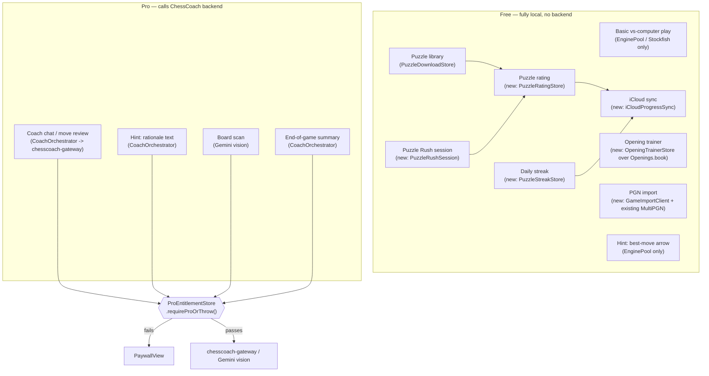

# feat: Free-tier feature expansion (Puzzle Rush, opening trainer, PGN import, rating, streaks)

**Type:** feat
**Depth:** Deep
**Target repo:** ChessCoach (this repo)

---

## Summary

Competitor research (Chess.com, Dr. Wolf, Chessable, Magnus Trainer, ChessKid, Lichess) surfaced a consistent pattern: users are angriest when apps paywall the exact thing that proves the product works, and happiest when local/no-cost content is generous. This plan adds four new local, no-backend-cost feature areas — Puzzle Rush (timed puzzle mode), an opening trainer, PGN import (manual + account-linked from Chess.com/Lichess), and a puzzle-rating + streak system with optional iCloud sync — and simplifies the app's gating model to a single, easy-to-reason-about rule: **anything that calls ChessCoach's backend (coach LLM explanations, board-scan vision) is Pro-only; everything else is free.**

This replaces the exploratory "daily allowance" framing from initial discussion. There is no usage metering, no per-day counters, and no partial free taste of coaching — free users get full local gameplay, full puzzle content (including Puzzle Rush and the opening trainer), full PGN import, and iCloud-synced progress; Pro is purely "the AI coach talks to you" and "scan a photo of a board."

---

## Problem Frame

ChessCoach today gates almost nothing explicitly: `BuildChannel.requiresProEntitlement` is only `true` in App Store production, and even there it's an all-or-nothing switch checked ad hoc by coach-facing UI. There is no puzzle rush mode, no opening trainer, no PGN import, no rating system, and no streak tracking. Meanwhile, hints (`PlayViewModel.requestHint`) silently mix a free part (the best-move square/arrow, pure local Stockfish via `EnginePool`) with a Pro part (the rationale text, a `CoachOrchestrator`/backend call) with no gating at all today.

This plan (a) builds the four missing feature areas competitors are praised for, entirely on-device with no new backend, and (b) introduces one clear, uniform gating primitive so every current and future backend-calling surface (coach chat, hint rationale, board scan) checks the same thing, instead of ad hoc checks scattered per screen.

Explicitly out of scope: multiplayer, live matchmaking, tournaments, any new server/cloud sync service. The only persistence beyond local disk is the user's own iCloud via `NSUbiquitousKeyValueStore`.

---

## Requirements

- **R1**: A Puzzle Rush / timed puzzle mode, built on the existing local puzzle packs (`PuzzleModels.swift`, `PuzzleDownloadStore.swift`) — free, no backend calls.
- **R2**: An opening trainer / repertoire builder, built on the existing local ECO book (`Openings.swift`) — free, no backend calls.
- **R3**: PGN import — manual paste/file, plus account-linked fetch from Chess.com's and Lichess's public read APIs (both free, third-party, no ChessCoach backend involved) — free.
- **R4**: A puzzle-only rating system (Glicko/Elo-lite, scored against each puzzle's known Lichess difficulty rating) — free, purely local computation. Explicitly not a claim about overall playing strength — no opponent pool exists to support that.
- **R5**: Daily puzzle streak tracking (consecutive days with at least one puzzle solved) — free, local.
- **R6**: iCloud sync (via `NSUbiquitousKeyValueStore`) of puzzle progress, rating, and streak state, so it carries across the user's own devices — free (no new cost to ChessCoach; this is the user's own iCloud, not a ChessCoach-run service).
- **R7**: A single, uniform Pro-gating primitive that anything calling `CoachOrchestrator` (coach chat, hint rationale, end-of-game summary) or the board-scan vision path must check before making the network call, replacing today's scattered/incomplete checks.
- **R8**: No daily allowances, usage counters, or metered "free taste" of coaching — Pro features are fully unavailable to free users (paywall shown), not rationed.

---

## Scope Boundaries

### Non-goals (this plan)
- Multiplayer, friend challenges, live matchmaking, tournaments.
- Any new backend service or cloud database. `chesscoach-gateway` (the existing coach-LLM proxy, see `docs/plans/2026-07-08-001-feat-paid-tier-metering-backend-plan.md`) is unchanged by this plan except that more call sites now check the entitlement before reaching it.
- A synthetic "vs-engine strength" rating — only puzzle rating is in scope (see R4).
- Advanced lesson/course content (flagged in original research as lower priority; no existing pattern to build on).

### Deferred to Follow-Up Work
- CloudKit private database migration, if puzzle/streak state ever outgrows `NSUbiquitousKeyValueStore`'s ~1MB total / 1MB-per-key limits.
- Chess.com/Lichess OAuth-based private-game import (this plan covers only each platform's public game history endpoints, which cover public/rated games).

---

## Key Technical Decisions

### KTD-1: Gating primitive — one `ProGate` check, called at every backend-call site

**Decision**: Introduce a single free function, `ProEntitlementStore.requireProOrThrow()` (or equivalent), called at the top of every code path that calls `CoachOrchestrator` or the board-scan vision client. On failure it throws a typed error the calling view catches to present `PaywallView`. `BuildChannel.requiresProEntitlement` continues to control whether this check is even active per distribution channel (local/TestFlight dev builds bypass it, exactly as today) — this plan adds the check itself, it does not change `BuildChannel`'s existing dev/test bypass semantics.

**Rationale**: Today the entitlement is checked inconsistently (some coach-facing UI checks it, hint rationale does not appear to). A single call site removes the risk of a future feature quietly shipping an unpaywalled backend call. This directly satisfies R7/R8 — the gate is binary (allowed / show paywall), no counting state to maintain.

**Alternative considered**: A property wrapper or view modifier (`.requiresPro { ... }`) around SwiftUI actions. Rejected for this pass — the codebase's coach call sites are split between `PlayViewModel` (non-view state) and views, so a plain throwing function composes more uniformly across both; a view modifier can be layered on top later without changing this decision.

### KTD-2: Puzzle Rush is a new mode over existing puzzle data, not a new content pipeline

**Decision**: Puzzle Rush reuses `PuzzleDownloadStore`/`PuzzleModels` as-is (no new pack format). It adds a `PuzzleRushSession` that pulls unsolved puzzles across themes (round-robin or difficulty-ascending, TBD at implementation time), tracks a timer and running streak-within-session, and ends the session on first wrong answer or timer expiry — mirroring Chess.com/Lichess's Puzzle Rush shape.

**Rationale**: All puzzle content is already local and free (per `PuzzleModels.swift`'s own header comment: "Puzzles are a free feature: no entitlement, no token cost"). Puzzle Rush is a UI/session-logic feature over that same free data, not new paid content — consistent with the "everything local is free" gating rule this plan adopts.

### KTD-3: Opening trainer drills against the existing ECO book with local spaced-repetition state

**Decision**: The opening trainer lets a user pick a named opening/line from the existing `Openings.book` (already keyed by position), practice playing it against a simple "which move continues this line" drill, and tracks per-line familiarity locally (a simple leveled spaced-repetition counter: correct → level up and delay next review; wrong → level down). No new opening dataset — repertoire lines are the existing ~3.7k ECO entries, filterable/searchable by name/ECO code.

**Rationale**: `Openings.swift` already has a deterministic, engine-free position→name book. Building a repertoire "trainer" mode on it is additive UI + a small new local persistence type, not a new content system — keeps this unit's scope tight and consistent with the "no new backend" constraint.

### KTD-4: PGN import — Chess.com and Lichess public APIs called directly from the client

**Decision**: Add a `GameImportClient` that (a) accepts a pasted/uploaded PGN and hands it to the existing `MultiPGN.splitPGN`/`headers` for parsing (no new code needed there), and (b) given a Chess.com or Lichess username, fetches that account's public game archive over HTTPS directly from the client (Chess.com's `api.chess.com/pub/player/{username}/games/{YYYY}/{MM}`, Lichess's `lichess.org/api/games/user/{username}`), converts the response to PGN text, and feeds it through the same `MultiPGN` path. Imported games land in the existing `HistoryStore`/`SavedGame` pipeline for analysis.

**Rationale**: Both platforms' game-archive endpoints are public, unauthenticated, rate-limit-friendly reads — no API key, no ChessCoach backend involved, consistent with "doesn't call our backend = free." `MultiPGN` already does the hard part (splitting multi-game exports, detecting the uploader's handle) — this plan is mostly a new network client plus wiring into existing analysis, not new parsing logic.

**Alternative considered**: Routing the fetch through `chesscoach-gateway` as a proxy (to hide the client from rate limits or add caching). Rejected — adds backend surface and a "free feature depends on our backend being up" fragility for zero benefit, since both APIs are stable public reads intended for exactly this kind of client use.

### KTD-5: Puzzle rating — a local Elo-lite score updated per puzzle attempt

**Decision**: Maintain a single local `puzzleRating` (starting value TBD at implementation, e.g. 1200) updated after each puzzle attempt using a simplified Elo expected-score formula against the puzzle's own `rating` field (already present in `Puzzle.rating` per `PuzzleModels.swift`): correct → rating moves up proportional to `1 - expected`; wrong → moves down proportional to `expected`, scaled by a fixed K-factor. This mirrors Lichess's own puzzle-rating approach (which is Glicko-2, but a plain Elo-lite is a reasonable, much simpler local approximation) without claiming general playing-strength.

**Rationale**: R4 explicitly scopes this to puzzle-solving skill, not overall strength — there's no opponent pool to support a real playing-strength Elo. A single scalar with a well-understood update rule is easy to test deterministically (unlike a fuller Glicko-2 implementation, which adds a ratings-deviation dimension this plan doesn't need).

### KTD-6: iCloud sync via `NSUbiquitousKeyValueStore`, additive to existing local stores

**Decision**: Add a thin `iCloudProgressSync` wrapper around `NSUbiquitousKeyValueStore.default` that mirrors: solved-puzzle IDs per theme (today in `PuzzleProgressStore`, backed by `UserDefaults`), puzzle rating (KTD-5), and streak state (R5). On foreground/`didChangeExternallyNotification`, merge remote KV state into local `UserDefaults`-backed stores (last-write-wins per key, since these are simple counters/sets, not documents needing conflict resolution). This is additive — `PuzzleProgressStore`'s existing `UserDefaults` API is unchanged; the sync wrapper writes through to both `UserDefaults` (source of truth for reads) and `NSUbiquitousKeyValueStore` (sync transport) on every update.

**Rationale**: Matches the user's explicit constraint (iCloud only, no custom backend) and the confirmed choice of `NSUbiquitousKeyValueStore` over CloudKit — this data is small (a rating scalar, a streak counter/date, and per-theme solved-ID sets well under the 1MB total limit) and the KV store's "just works" sync model needs no schema or container setup, unlike CloudKit.

**Alternative considered**: CloudKit private database. Rejected for this pass per the confirmed decision — more setup for no benefit at this data size; revisit if solved-ID sets grow unexpectedly large (see Deferred to Follow-Up Work).

---

## High-Level Technical Design

---

## Implementation Units

### U1. Uniform Pro-gating primitive

**Goal**: Introduce one throwing check used at every backend-calling call site (coach chat, hint rationale, board scan, end-of-game summary), replacing today's inconsistent per-screen checks.

**Requirements**: R7, R8

**Dependencies**: None

**Files**:
- Modify: `Sources/GemmaChessCore/Coach/ProEntitlementStore.swift` (add `requireProOrThrow()`)
- Modify: `Sources/GemmaChessCore/ViewModels/PlayViewModel.swift` (gate `requestHint`'s rationale branch, gate coach chat entry points)
- Modify: `Sources/GemmaChessCore/UI/BoardScannerView.swift` (gate the vision call)
- Modify: `Sources/GemmaChessCore/Coach/CoachOrchestrator.swift` (or its call sites — wherever is cleanest to intercept `answer`/`answerStream`/`gameSummary`)
- Test: `Tests/GemmaChessCoreTests/ProEntitlementStoreTests.swift` (new)

**Approach**: `requireProOrThrow()` checks `BuildChannel.current.requiresProEntitlement` first (dev/test channels bypass, unchanged from today) and, when active, checks `ProEntitlementStore.shared.isProActive`; throws a small `ProRequiredError` otherwise. Call sites catch this specific error type and trigger `PaywallView` presentation (each screen already owns its own sheet/paywall presentation state, per existing `PaywallView` usage — this unit adds the trigger, not new presentation plumbing where it already exists).

**Patterns to follow**: `ProEntitlementStore.swift`'s existing header comment already states the client-side-only nature of this check; `BuildChannel.swift`'s `requiresProEntitlement` gating logic.

**Test scenarios**:
- App Store channel, `isProActive == false`, call `requireProOrThrow()` → throws.
- App Store channel, `isProActive == true` → does not throw.
- Local/TestFlight channel, `isProActive == false` → does not throw (existing dev bypass preserved).
- `requestHint()` on a non-Pro App Store build: best-move arrow still appears; rationale branch is skipped/shows paywall prompt instead of silently failing.
- Board scan on a non-Pro App Store build: paywall shown before any network call fires (verify no vision request is made — e.g. via a test double confirming zero invocations).

**Verification**: Every existing call site into `CoachOrchestrator` and board-scan vision is covered by a passing test demonstrating the gate fires; no backend call happens when `isProActive` is false on a gated channel.

---

### U2. Puzzle Rush mode

**Goal**: A timed puzzle session over existing puzzle packs — free, no backend.

**Requirements**: R1

**Dependencies**: None

**Files**:
- Create: `Sources/GemmaChessCore/Puzzles/PuzzleRushSession.swift`
- Create: `Sources/GemmaChessCore/UI/PuzzleRushView.swift`
- Modify: `Sources/GemmaChessCore/UI/PuzzlesView.swift` (entry point into Rush mode)
- Modify: `Sources/GemmaChessCore/ViewModels/PuzzleViewModel.swift` (or a new `PuzzleRushViewModel` if state shape diverges enough)
- Test: `Tests/GemmaChessCoreTests/PuzzleRushSessionTests.swift`

**Approach**: `PuzzleRushSession` holds a queue of puzzles (pulled across downloaded themes, difficulty-ascending), a running correct-count, a countdown timer, and ends the session on first incorrect answer or timer expiry. Reuses `PuzzleProgressStore`-style solved tracking so Rush doesn't replay puzzles already solved outside Rush mode in the same session run (exact reuse boundary is an implementation-time call — see Deferred Notes).

**Patterns to follow**: `PuzzleViewModel.swift`'s existing puzzle-solving state machine (attempt/solved/failed transitions); `PuzzleProgressStore.swift`'s solved-ID tracking.

**Test scenarios**:
- Correct answer within time → advances to next puzzle, running count increments.
- Wrong answer → session ends immediately, final score recorded.
- Timer reaching zero mid-puzzle → session ends, final score recorded.
- Empty/no downloaded puzzle packs → Rush mode shows a clear "download puzzles first" state rather than crashing or showing an empty session.
- Session restart after ending → starts fresh (no stale state carried from the prior run).

**Verification**: A full Rush session can be driven start-to-finish in a test (mocked timer) exercising correct path, wrong-answer termination, and timer-expiry termination.

---

### U3. Opening trainer

**Goal**: Practice mode over the existing ECO book with local spaced-repetition-style familiarity tracking.

**Requirements**: R2

**Dependencies**: None

**Files**:
- Create: `Sources/GemmaChessCore/Openings/OpeningTrainerStore.swift`
- Create: `Sources/GemmaChessCore/ViewModels/OpeningTrainerViewModel.swift`
- Create: `Sources/GemmaChessCore/UI/OpeningTrainerView.swift`
- Modify: `Sources/GemmaChessCore/Chess/Openings.swift` (expose a way to enumerate/search `book` entries by name/ECO if not already public)
- Test: `Tests/GemmaChessCoreTests/OpeningTrainerStoreTests.swift`

**Approach**: User picks an opening line (search/browse over `Openings.book`'s entries); the trainer replays the line move-by-move, prompting the user to play the next move; correct moves advance familiarity level (longer review delay), incorrect moves reset it. `OpeningTrainerStore` persists per-line familiarity level + next-review-date locally (`UserDefaults` or a small JSON file, matching `PuzzleProgressStore`'s pattern).

**Patterns to follow**: `Openings.swift`'s existing book structure and position-key lookup; `PuzzleProgressStore.swift`'s flat local-persistence style.

**Test scenarios**:
- Correct move played → familiarity level increases, next-review-date pushed out.
- Incorrect move played → familiarity level resets/decreases, correct continuation shown.
- Line with only one move remaining, correct move played → line marked fully learned.
- Searching/filtering the opening book by partial name → returns expected matches (e.g. "Sicilian" matches multiple ECO entries).
- Persisted familiarity state survives a fresh `OpeningTrainerStore` instance reading the same backing storage (round-trip test, mirroring `PuzzleProgressStoreTests`' existing style).

**Verification**: A drill can be completed end-to-end for at least one real ECO line from the vendored dataset, with familiarity state changing as expected and surviving a store reload.

---

### U4. PGN import — manual + account-linked (Chess.com, Lichess)

**Goal**: Import games via pasted/uploaded PGN or by fetching a public account's game history, feeding the existing analysis pipeline.

**Requirements**: R3

**Dependencies**: None

**Files**:
- Create: `Sources/GemmaChessCore/Import/GameImportClient.swift`
- Create: `Sources/GemmaChessCore/UI/GameImportView.swift`
- Modify: `Sources/GemmaChessCore/History/HistoryStore.swift` (or wherever imported games are handed off — reuse existing `GameRecord`/analysis intake, not a new pipeline)
- Test: `Tests/GemmaChessCoreTests/GameImportClientTests.swift`

**Approach**: `GameImportClient` exposes `importPastedPGN(_:)` (delegates straight to `MultiPGN.splitPGN`) and `importAccount(platform:username:)` (fetches Chess.com's monthly archive JSON or Lichess's NDJSON/PGN game-history endpoint, converts to PGN text where needed, then delegates to the same `MultiPGN` path). Network errors (invalid username, rate limit, no games found) surface as typed errors the UI shows inline, not silent failures.

**Patterns to follow**: `MultiPGN.swift`'s existing split/header/self-handle-detection logic (reused as-is, not modified); existing `URLSession`-based network client style already used for board-scan vision (`BoardScannerView.swift`) for request/error-handling conventions.

**Test scenarios**:
- Pasted multi-game PGN text → splits into individual games via existing `MultiPGN.splitPGN`, each importable.
- Valid Chess.com username with games → games fetched and converted to importable PGN.
- Valid Lichess username with games → games fetched and converted to importable PGN.
- Username with zero public games → clear empty-state message, not an error.
- Invalid/nonexistent username → typed error surfaced to the UI (e.g. "user not found"), distinct from a network-failure error.
- Network failure (offline, timeout) during account fetch → typed error, retry affordance, no crash.
- Self-handle detection on an imported multi-game batch reuses `MultiPGN.detectSelfHandle` correctly when the fetched username is passed as the `prefer` hint.

**Verification**: Both platforms' public archive/history endpoints can be fetched and converted into games that pass through the existing `MultiPGN`/`HistoryStore` intake unmodified; failure modes (bad username, empty history, network error) each produce a distinct, user-visible outcome.

---

### U5. Puzzle rating (Elo-lite)

**Goal**: A local puzzle-solving rating updated after each puzzle attempt, displayed in the puzzle UI.

**Requirements**: R4

**Dependencies**: None (reads `Puzzle.rating` from existing `PuzzleModels.swift`)

**Files**:
- Create: `Sources/GemmaChessCore/Puzzles/PuzzleRatingStore.swift`
- Modify: `Sources/GemmaChessCore/ViewModels/PuzzleViewModel.swift` (call rating update on each attempt)
- Modify: `Sources/GemmaChessCore/UI/PuzzlesView.swift` (display current rating)
- Test: `Tests/GemmaChessCoreTests/PuzzleRatingStoreTests.swift`

**Approach**: `PuzzleRatingStore` holds a single persisted `Int` rating (default starting value TBD, e.g. 1200) and an `update(afterAttempt:puzzleRating:correct:)` function implementing the Elo expected-score formula (`expected = 1 / (1 + 10^((puzzleRating - userRating)/400))`) with a fixed K-factor, clamped to a sane floor (e.g. never below 400) so early wrong answers on hard puzzles don't produce nonsensical negative-trending values.

**Patterns to follow**: `PuzzleProgressStore.swift`'s flat `UserDefaults`-backed persistence style (same file/module, same simplicity level).

**Test scenarios**:
- Correct answer on a puzzle rated above current rating → rating increases by more than a correct answer on a lower-rated puzzle would.
- Wrong answer on a puzzle rated below current rating → rating decreases by more than a wrong answer on a higher-rated puzzle would.
- Repeated correct answers on similarly-rated puzzles → rating trends upward, converging (not diverging unboundedly).
- Rating never drops below the defined floor regardless of a losing streak.
- Fresh install (no persisted rating) → starts at the defined default value.

**Verification**: The update formula matches the expected-score math for a handful of hand-computed cases (documented in the test file), and persisted rating survives a store reload.

---

### U6. Daily puzzle streak tracking

**Goal**: Track consecutive days with at least one puzzle solved.

**Requirements**: R5

**Dependencies**: None

**Files**:
- Create: `Sources/GemmaChessCore/Puzzles/PuzzleStreakStore.swift`
- Modify: `Sources/GemmaChessCore/UI/PuzzlesView.swift` (display current streak)
- Test: `Tests/GemmaChessCoreTests/PuzzleStreakStoreTests.swift`

**Approach**: Persist `lastSolvedDate` and `currentStreak` (both `UserDefaults`-backed). On a solve: if `lastSolvedDate` is today, no-op; if yesterday, increment streak and update date; if older than yesterday (or absent), reset streak to 1 and update date. Calendar/day-boundary logic must use the device's calendar consistently (not raw `Date` subtraction) to avoid timezone-crossing-midnight bugs.

**Patterns to follow**: `PuzzleProgressStore.swift`'s persistence style; inject `Calendar`/`Date` for testability rather than reading `Date()`/`Calendar.current` directly inside the store (mirrors how other stores in this codebase accept injectable dependencies for testing, per `PuzzleProgressStore`'s injectable `UserDefaults` parameter).

**Test scenarios**:
- First-ever solve → streak becomes 1.
- Solve on the day after a previous solve → streak increments.
- Second solve on the same day → streak unchanged (no double-count).
- Solve after a missed day (gap ≥ 2 days) → streak resets to 1.
- Solve exactly at a day boundary in a non-UTC timezone → uses device calendar day, not UTC day, to determine "same day."

**Verification**: All five scenarios pass with an injected fixed `Calendar`/date sequence (no reliance on wall-clock time in tests).

---

### U7. iCloud sync for progress, rating, and streak

**Goal**: Mirror puzzle progress, rating, and streak state to the user's iCloud so it carries across their devices.

**Requirements**: R6

**Dependencies**: U5 (rating), U6 (streak) — needs their persisted key shapes to mirror

**Files**:
- Create: `Sources/GemmaChessCore/Sync/iCloudProgressSync.swift`
- Modify: `Sources/GemmaChessCore/Puzzles/PuzzleProgressStore.swift` (write-through to iCloud on update)
- Modify: `Sources/GemmaChessCore/Puzzles/PuzzleRatingStore.swift` (write-through)
- Modify: `Sources/GemmaChessCore/Puzzles/PuzzleStreakStore.swift` (write-through)
- Test: `Tests/GemmaChessCoreTests/iCloudProgressSyncTests.swift`

**Approach**: `iCloudProgressSync` wraps `NSUbiquitousKeyValueStore.default`: a `write(key:value:)` that sets both `UserDefaults` (read source of truth) and the KV store, and a `NSUbiquitousKeyValueStore.didChangeExternallyNotification` observer that merges incoming remote values into `UserDefaults` (last-write-wins per key — no per-key timestamp needed since these are scalar/set values, not documents). `synchronize()` called opportunistically (app foreground), not depended upon for correctness since the OS syncs independently.

**Patterns to follow**: Existing store's dependency-injection style (pass the KV store instance rather than always reaching for `.default`, mirroring `PuzzleProgressStore`'s injectable `UserDefaults` parameter) so tests use an in-memory double instead of real iCloud.

**Test scenarios**:
- Local update to rating/streak/solved-IDs → corresponding key is written to the injected KV store double.
- Simulated remote change notification with a newer solved-ID set → local `UserDefaults` is updated to include the union (solved-ID sets merge as a union, not last-write-wins, since losing a solved-ID would incorrectly re-surface an already-solved puzzle).
- Simulated remote change notification with a rating/streak value → local value is overwritten (last-write-wins is correct here, these are scalars not sets).
- iCloud unavailable (KV store returns no data, e.g. user not signed into iCloud) → local-only operation continues unaffected, no crash or error surfaced.

**Verification**: All four scenarios pass using an injected KV-store test double (no dependency on a real iCloud account in CI).

---

## System-Wide Impact

- **`PuzzlesView`** gains three new pieces of UI (Rush entry point, rating display, streak display) — worth a single pass to keep the screen from feeling cluttered, but no new navigation destinations beyond what's listed per-unit.
- **Home screen** likely needs new entry points for Puzzle Rush, Opening Trainer, and Game Import — not detailed as a separate unit since it's routine navigation wiring, but flag it during implementation so it isn't missed.
- **`chesscoach-gateway`** (separate repo) is unaffected — no new endpoints, no schema changes. This plan only changes which client call sites check the entitlement before reaching it (U1).
- **Settings/data management** (`SettingsView`) should get a way to see/reset the new local stores (rating, streak, opening-trainer familiarity), consistent with the existing "Reset puzzle progress" action in `PuzzleProgressStore.resetAll`.

---

## Open Questions (deferred to implementation)

- Puzzle Rush's puzzle-selection order (round-robin across themes vs. difficulty-ascending vs. matching current puzzle rating) — implementation-time tuning call, doesn't change the session state machine in U2.
- Exact starting puzzle rating default and K-factor for U5 — pick reasonable values, document them in the store's header comment, easy to retune later since it's a single local scalar with no external dependents.
- Whether Puzzle Rush should exclude puzzles already solved via `PuzzleProgressStore` outside of Rush sessions, or treat Rush as its own pool — implementation-time UX call.

---

## Sources & Research

- Prior competitor research (this session): Chess.com, Dr. Wolf, Chessable, Magnus Trainer, ChessKid, Lichess — praise/complaint patterns and free/paid splits, used to motivate R1-R6 and the "local = free" gating principle.
- Repo research (this session): `PuzzleModels.swift`, `PuzzleProgressStore.swift`, `PuzzleDownloadStore.swift`, `PuzzleViewModel.swift`, `Openings.swift`, `MultiPGN.swift`, `HistoryStore.swift`, `CoachOrchestrator.swift`, `ProEntitlementStore.swift`, `BuildChannel.swift`, `PlayViewModel.swift` (`requestHint`), `PaywallView.swift` — confirmed existing gating is inconsistent (U1's motivation), confirmed puzzles/openings/PGN-splitting are already fully local (KTD-2/3/4's basis), confirmed hints mix a free engine part and a Pro rationale part.
- `docs/plans/2026-07-08-001-feat-paid-tier-metering-backend-plan.md` — origin of `chesscoach-gateway`, `ProEntitlementStore`, and `BuildChannel`'s existing entitlement plumbing this plan builds on rather than replaces.
