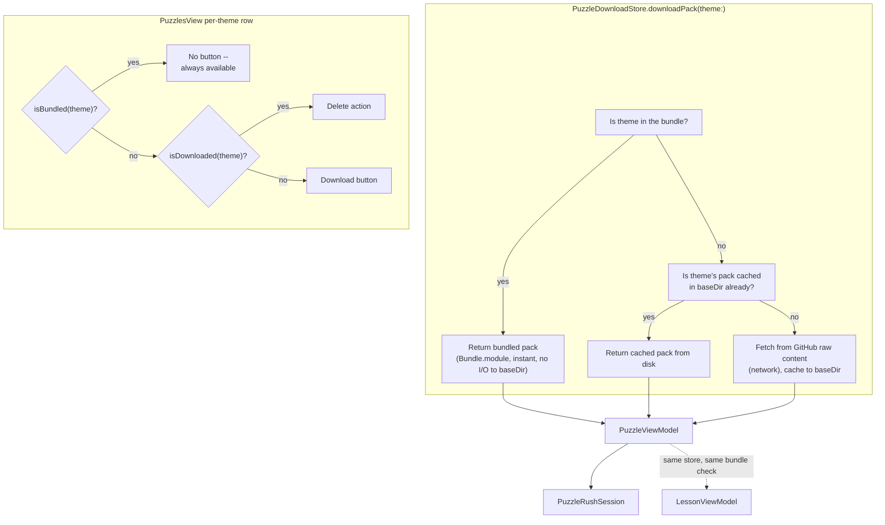
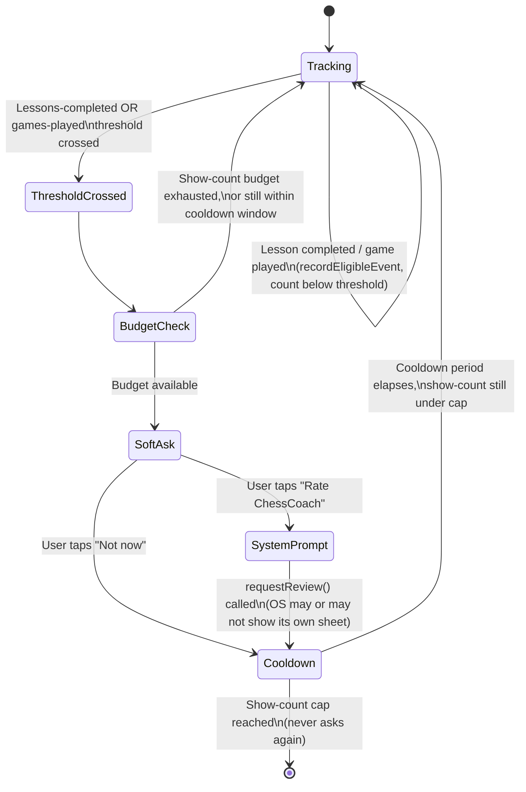

# feat: Bundle curated puzzle packs; download-and-delete for extra themes; review prompt; Lessons Ask

**Type:** feat
**Depth:** Deep

---

## Summary

Puzzles, Puzzle Rush, and Lessons all currently need a network call the first time a theme is used, because `PuzzleDownloadStore` fetches every theme pack on demand from GitHub. That design was sized for "the full 1.1GB Lichess database," but the 20 curated packs ChessCoach actually ships (`PuzzleData/packs/*.json`) total only 836KB — small enough to bundle directly into the app binary, the same way the vendored ECO opening book already is. This plan bundles those 20 packs so they work with zero network dependency, while keeping the existing download mechanism for **additional** theme categories beyond the current 20 (research below proposes 20 candidates), adding a per-theme delete action so users can reclaim space from anything they downloaded.

Curating the actual new theme packs (re-running `scripts/curate-puzzles.py` against the full database and uploading the results) is a real, separate data-processing step the user runs — this plan updates the client to correctly support "bundled + downloadable-and-deletable" themes side by side, and proposes which new themes to curate, but does not perform the curation itself.

**Extended scope (added in this update, U4-U7):** three more additions in service of the same underlying goal -- maximize how useful the app is to a user who's already engaged, so they have a reason to keep using it and to leave a review. Lessons gains the ability to surface additional lessons mapped to newly-downloaded "extra" theme categories, not just the 20 bundled ones (U4). A native App Store review-prompt flow asks engaged users (a few lessons completed, or a few games played) to rate the app, with our own soft-ask messaging explaining that ratings motivate continued development, ahead of the real system prompt (U5, U6). Lessons' practice session gains a Pro-gated "Ask the coach" button, mirroring Opening Trainer's existing Coach panel (U7). U1-U3 (the original bundle/download/delete scope) are unchanged by this update.

---

## Problem Frame

`PuzzleDownloadStore.downloadPack(theme:)` is the single code path every free feature (Puzzles, Puzzle Rush, Lessons) uses to get a theme's puzzles — it always checks the on-disk cache, then falls back to a network fetch. For the 20 shipped themes, that first fetch is unnecessary: the data already lives in the repo and is small enough to ship in the binary. Bundling it removes a real "why do I need internet for this free thing" surprise (this session's own trigger) without touching the mechanism that already correctly serves genuinely-optional extra content.

---

## Requirements

- **R1**: The 20 currently-curated puzzle packs (and `catalog.json`) are bundled into the `GemmaChessCore` Swift package as resources, resolvable via `Bundle.module` with zero network call.
- **R2**: `PuzzleDownloadStore` checks the bundle first for any theme; only themes NOT in the bundle fall through to the existing disk-cache-then-network path.
- **R3**: `PuzzleRushSession.loadPuzzlePool` and `LessonViewModel.start()` transparently include bundled packs (no behavior change required in their callers — both already go through `PuzzleDownloadStore`).
- **R4**: The client can distinguish "bundled" (always available, never deletable) themes from "downloaded" (deletable) themes, so `PuzzlesView` shows the right per-theme affordance: nothing extra for bundled, a Download button for not-yet-downloaded extras, a Delete action for downloaded extras.
- **R5**: Deleting a downloaded (non-bundled) theme's pack removes its cached file from disk; a subsequent use re-downloads it. Bundled themes have no delete action at all.
- **R6**: Research proposes a candidate list of new theme categories for the user to curate next (see Sources & Research) — the plan does not run the curation script or upload new packs.
- **R7**: The Lessons list can show lessons mapped to non-bundled "extra" theme categories (not just the 20 bundled ones); a lesson whose theme isn't downloaded yet shows a locked/download state rather than silently failing when the user taps into it.
- **R8**: After a user shows real engagement (a few lessons completed, or a few games played), the app shows a soft, custom ask ("ratings help us keep building and adding new features") before triggering Apple's native App Store review prompt if the user agrees. This never fires more than a small, locally-tracked number of times regardless of how much the user does afterward.
- **R9**: Lessons' practice session gains a Pro-gated "Ask" action so the user can ask the coach a free-form question about the current lesson/puzzle, reusing the same `CoachOrchestrator` + `ProEntitlementStore.requireProOrThrow()` gate used everywhere else backend-calling features exist.

---

## Scope Boundaries

### Non-goals (this plan)
- Actually running `scripts/curate-puzzles.py` against the full `lichess_db_puzzle.csv` or uploading new pack files/an updated `catalog.json` to the GitHub host `PuzzleDownloadStore` reads from.
- Changing the content of the existing 20 bundled themes.
- Any change to the puzzle-solving mechanics themselves (`PuzzleViewModel`, `LessonViewModel`, `PuzzleRushSession`'s move validation).
- A custom in-app rating UI that bypasses Apple's own review sheet (R8 uses the real system prompt; App Store guidelines prohibit steering users toward only-positive in-app review flows).
- Free-form coach chat history/multi-turn threading in Lessons (R9) beyond what Opening Trainer's Coach panel already does (one question in, one answer out — no session continuity needed for parity).

### Deferred to Follow-Up Work
- Curating the ~20 candidate new theme categories below (user-executed: download the full database, run the curation script, upload results).
- Re-bundling additional themes into the binary later, if any of the newly-curated extras turn out to be popular enough to warrant it (a judgment call for after real usage data exists).
- Writing lesson explanation text for every one of the 21 candidate new themes — U4 adds entries only for themes where the concept can be explained without needing the curated puzzle data to already exist; expanding this list further is ordinary content work, not a new architectural need.

---

## Key Technical Decisions

### KTD-1: Bundle via `.copy(...)` resources, mirroring the existing ECO book pattern

**Decision**: Copy `PuzzleData/packs/*.json` and a bundled `catalog.json` into `Sources/GemmaChessCore/Resources/puzzles/`, and add `.copy("Resources/puzzles")` to `Package.swift`'s existing `resources:` array (alongside `.copy("Resources/eco")`, `.copy("Resources/nnue")`, `.copy("Resources/licenses")`).

**Rationale**: `Openings.swift` already vendors a larger dataset (~3.7k ECO lines) this exact way, resolved via `Bundle.module.url(forResource:withExtension:subdirectory:)`. Reusing the identical mechanism means no new resource-loading pattern to introduce or test from scratch — `PuzzleDownloadStore`'s bundle lookup can follow `Openings.loadAll()`'s existing `Bundle.module` call shape.

### KTD-2: `PuzzleDownloadStore` gains a bundle-first check; the disk-cache/network path is otherwise unchanged

**Decision**: `loadLocalPack(theme:baseDir:)` and `downloadPack(theme:...)` both check a new `bundledPack(theme:)` lookup before touching disk or network. `isDownloaded(theme:)` returns `true` for bundled themes (so UI treats them as "available", not as needing a download button). A parallel `isBundled(theme:)` is added for UI code that needs to distinguish "always available, no delete" from "downloaded, deletable."

**Rationale**: Every call site (`PuzzleViewModel`, `PuzzleRushSession`, `LessonViewModel`) already goes through these two entry points — adding the bundle check here means R3 (transparent inclusion in Puzzle Rush's pool and Lessons) falls out for free, with no changes needed in those three files' own logic.

### KTD-3: The bundled catalog and the live/downloadable catalog are merged client-side, not maintained as one file

**Decision**: Ship a small bundled `catalog.json` listing only the 20 bundled themes (`isBundled: true` per entry, or simply: bundled themes are implicitly every theme found in the bundle). The live catalog fetched from GitHub (`PuzzleDownloadStore.fetchCatalog`) continues to list every theme, bundled and downloadable alike — `PuzzlesView` merges "is this theme's id present in the bundle" with the fetched catalog entry to decide which affordance to show, rather than requiring the remote `catalog.json` to carry a new bundled flag.

**Rationale**: Keeps the "which themes are bundled" fact entirely client-side (derivable from what's actually compiled into this binary version), so an older app version never mis-reports a theme as bundled when it isn't, and the remote catalog format doesn't need a coordinated schema change between client and host repo.

**Alternative considered**: Add an `isBundled` field to the remote `catalog.json` itself. Rejected — that would make "which themes are bundled" a property of server data instead of a property of the installed binary, which is backwards (an old app version bundling only 20 themes must never trust a newer catalog claiming a 21st theme is bundled when it isn't in that binary).

### KTD-4: Delete removes the on-disk cache file only; bundled packs have no delete path at all

**Decision**: A new `PuzzleDownloadStore.deletePack(theme:baseDir:)` removes only `<baseDir>/<theme>.json` from disk. It is never called for a theme where `isBundled(theme:) == true` — the UI simply doesn't render a delete affordance for bundled rows, and the method itself is a documented no-op safeguard if ever called on a bundled theme's id (bundled data isn't in `baseDir` in the first place, so there's nothing on disk to remove).

**Rationale**: Matches the existing `PuzzleProgressStore.resetAll()`/`OpeningTrainerStore.resetAll()` style of a plain, direct storage-clearing function — no new abstraction needed. Bundled packs physically can't be deleted (they're compiled into the binary), so "no delete action" is simply true, not a permission check.

### KTD-5: A lesson's theme doesn't need to be bundled or already downloaded — the existing store already handles the gap

**Decision**: `Lesson.theme` (already a plain `String` in `LessonCatalog.swift`) can reference any theme id, bundled or not, curated-and-downloadable or not-yet-curated. `LessonsView` derives a lesson's availability from `PuzzleDownloadStore.isBundled(theme:)` / `isDownloaded(theme:)` (both already added in U2) rather than needing a new "is this lesson unlocked" concept — a lesson is immediately usable if its theme is bundled or already downloaded, otherwise it shows a Download affordance before "Start practice," reusing `PuzzleDownloadStore.downloadPack(theme:)` the same way `LessonViewModel.start()` already does.

**Rationale**: U1-U3 already built everything this needs (bundle-first lookup, `isBundled`, on-demand download, `LessonViewModel.start()`'s existing `isLoadingPack`/`loadError` states for a download-in-progress or download-failure UI). R7 is therefore additive data (new `Lesson` entries in `LessonCatalog`) plus one small UI branch in `LessonsView`'s lesson row — not a new store-layer concept.

**Consequence, stated plainly**: a new-theme lesson added now will show a Download action that fails with a "couldn't download" error until the user actually curates and uploads that theme's pack (per this plan's existing deferred curation step) — this is honest and matches the plan's own non-goal (curation is user-executed, out of scope here), not a bug to fix in this pass.

### KTD-6: The review prompt is a soft custom ask, then the real system sheet — never a fake/custom review UI

**Decision**: Use SwiftUI's native `@Environment(\.requestReview) private var requestReview` action (backed by `SKStoreReviewController` under the hood, no new package dependency) as the only mechanism that actually asks for a review. Before calling it, show a small custom sheet/alert with our own copy — framed around "ratings help us keep building ChessCoach and shipping new features" — with two choices: an affirmative that calls `requestReview()`, and a "Not now" that just dismisses. A new `ReviewPromptStore` (`UserDefaults`-backed, mirroring every other local store in this codebase) tracks: whether the soft-ask has been shown, how many times, and the date it was last shown, so it triggers at most a handful of times ever, with a long cooldown between asks.

**Rationale**: Apple's App Store Review Guidelines prohibit incentivizing or gating features behind a review, and the system sheet itself cannot be customized or forced to appear (`SKStoreReviewController`/`requestReview()` may silently no-op if the OS has already shown it enough times that year) — so the only thing genuinely ours to build is the pre-ask messaging and the trigger conditions, never a fake star-rating UI. Tracking our own show-count/cooldown independently of the OS's own silent rate-limit means the app doesn't nag an engaged user who already said "not now," even though the OS *might* still be willing to show its own sheet again.

**Alternative considered**: Skip the custom soft-ask and call `requestReview()` directly once the trigger condition is met. Rejected per the user's explicit ask for review-motivating messaging — `requestReview()`'s system sheet has no customizable text at all, so a custom pre-ask is the only place that message can live.

### KTD-7: Review-prompt trigger conditions are checked from two existing event points, not a new observer system

**Decision**: `ReviewPromptStore.recordEligibleEvent()` is called from the two places engagement is already recorded locally: `LessonProgressStore.recordAttempt(...)` when `isComplete == true` (a lesson finished), and `PlayViewModel`'s existing call to `PlayStatsStore.record(_:)` (a game finished). Each call checks a simple threshold (e.g., N lessons completed OR N games played — exact N is an implementation-time tuning call) and, if crossed and the cooldown/show-count budget allows, surfaces the soft-ask sheet at that screen.

**Rationale**: Both of these call sites already exist and already represent genuine "the user just accomplished something" moments — the natural place to ask, per Apple's own guidance to prompt after a positive experience, not on app launch or mid-task. No new cross-cutting event/observer system is needed; each call site owns showing its own sheet, mirroring how `BoardScannerView`/`OpeningTrainerViewModel` already each own their local `showPaywall` state rather than centralizing paywall presentation.

### KTD-8: Lessons' Ask button is CoachOrchestrator's free-form path only — no canned "why this puzzle" caching

**Decision**: `LessonViewModel` gains a single `askQuestion(_ text: String) async` (mirroring `OpeningTrainerViewModel.askQuestion(_:)` exactly: `CoachOrchestrator.answer(question:fen:playerSide:)`, catching `ProRequiredError` into a `showPaywall` flag). Unlike Opening Trainer's Coach panel, there is no canned "why is this the book move" question here, and therefore no `OpeningExplanationCache`-style caching seam — every lesson puzzle's position is unique (not a shared, repeatable opening line), so there's no cross-user cacheable question to optimize for.

**Rationale**: Directly reuses the already-shipped, already-tested gating pattern (U1 of the free-tier expansion plan) rather than inventing a new one. The absence of caching is a deliberate scope match to what's actually cacheable (per that same plan's KTD-1 rationale on `OpeningExplanationCache`) — puzzles are per-attempt-unique positions, not a small shared set of named lines, so a cache would almost never hit.

---

## High-Level Technical Design

**Review-prompt trigger flow (U5/U6):**

---

## Implementation Units

### U1. Bundle the 20 curated packs as Swift package resources

**Goal**: Copy the existing curated packs into the package's resources and wire them into `Package.swift` so `Bundle.module` can resolve them.

**Requirements**: R1

**Dependencies**: None

**Files**:
- Create: `Sources/GemmaChessCore/Resources/puzzles/catalog.json` (copy of the 20-theme catalog)
- Create: `Sources/GemmaChessCore/Resources/puzzles/<theme>.json` (one per bundled theme, copied from `PuzzleData/packs/`)
- Modify: `Package.swift` (add `.copy("Resources/puzzles")` to the existing `resources:` array)

**Approach**: A straight copy of the 20 existing files — no format change. `catalog.json` here is the bundled-themes catalog (KTD-3), used only to enumerate which theme ids are bundled; it does not need to match the live remote catalog's schema beyond theme id, count, and size, since `PuzzlesView` will merge it with the fetched catalog for display details.

**Patterns to follow**: `Package.swift`'s existing `.copy("Resources/eco")` entry and `Openings.swift`'s `Bundle.module.url(forResource:withExtension:subdirectory:)` lookup style.

**Test scenarios**:
- `Test expectation: none -- this unit is a resource-bundling/build-config change with no new logic; U2's tests verify the bundled data is actually reachable and correct.`

**Verification**: The package builds with the new resources present; `Bundle.module.url(forResource: "fork", withExtension: "json", subdirectory: "puzzles")` resolves to a non-nil URL in a quick manual check (or U2's tests, which exercise this directly).

---

### U2. `PuzzleDownloadStore`: bundle-first lookup, `isBundled`, and `deletePack`

**Goal**: Add bundle-aware reads and theme deletion to the store every puzzle-consuming feature already goes through.

**Requirements**: R2, R4, R5

**Dependencies**: U1

**Files**:
- Modify: `Sources/GemmaChessCore/Puzzles/PuzzleDownloadStore.swift`
- Test: `Tests/GemmaChessCoreTests/PuzzleDownloadStoreTests.swift`

**Approach**: Add `bundledThemes: Set<String>` (loaded once from the bundled `catalog.json`, mirroring `Openings.book`'s lazy-static pattern) and `bundledPack(theme:) -> PuzzlePack?` (reads from `Bundle.module`). Update `loadLocalPack`/`downloadPack` to check `bundledPack(theme:)` first. Add `public static func isBundled(theme:) -> Bool` and `public static func deletePack(theme:baseDir:)` (removes the on-disk cache file only, per KTD-4 — a no-op if the theme is bundled or nothing is cached).

**Patterns to follow**: `Openings.swift`'s lazy `static let book` initialization; this file's own existing `checkOK`/`packPath` private helpers.

**Test scenarios**:
- A bundled theme's pack loads via `downloadPack(theme:)` with no network call and without requiring anything in `baseDir` (inject a `URLSession` double that fails/asserts if hit, to prove the network path is never reached for a bundled theme).
- `isBundled(theme:)` returns `true` for a known bundled theme id, `false` for an unknown/downloadable-only theme id.
- `isDownloaded(theme:)` returns `true` for a bundled theme even with an empty `baseDir` (no cache file needed).
- A non-bundled theme still follows the existing cache-then-network path unchanged (regression check against current behavior).
- `deletePack(theme:baseDir:)` removes a cached (non-bundled) theme's file from disk; a subsequent `isDownloaded(theme:)` call for that theme returns `false`.
- `deletePack(theme:baseDir:)` called on a bundled theme's id is a safe no-op (bundled data is still reachable afterward via `downloadPack`).

**Verification**: All puzzle-consuming call sites (`PuzzleViewModel`, `PuzzleRushSession`, `LessonViewModel`) get bundled packs with zero network access, verified via this unit's own tests against the store directly (no changes needed in those consumer files themselves, confirming R3).

---

### U3. `PuzzlesView`: per-theme bundled/download/delete affordance

**Goal**: Show the correct row state per theme — no button for bundled, Download for not-yet-downloaded extras, Delete for downloaded extras — and wire the delete action.

**Requirements**: R4, R5

**Dependencies**: U2

**Files**:
- Modify: `Sources/GemmaChessCore/UI/PuzzlesView.swift`
- Modify: `Sources/GemmaChessCore/ViewModels/PuzzleViewModel.swift` (expose a `deleteDownloadedPack(theme:)` action if the view needs it routed through the view model rather than calling `PuzzleDownloadStore` directly, consistent with how `downloadAndStart` already routes through the view model)

**Approach**: `themeRow`'s trailing content switches three ways per KTD-2/KTD-4: `vm.isBundled(theme.theme)` -> no trailing control; else `vm.isDownloaded(theme.theme)` -> a destructive Delete affordance (a confirmation dialog, matching `SettingsView`'s existing destructive-action pattern) instead of today's plain checkmark; else -> today's existing Download button, unchanged.

**Patterns to follow**: `SettingsView.swift`'s `confirmationDialog` + destructive `Button(role: .destructive)` pattern for the delete confirmation; `PuzzlesView.swift`'s existing `themeRow` structure (this unit extends it, not rewrites it).

**Test scenarios**:
- `Test expectation: none -- this unit is UI composition over U2's already-tested store logic; no new business logic is introduced here.`

**Verification**: Manually exercising the Puzzles theme list shows the three distinct row states correctly for a bundled theme, a not-yet-downloaded extra theme, and a downloaded extra theme; deleting a downloaded theme's row reverts it to the Download state.

---

### U4. Lessons: surface lessons for non-bundled "extra" theme categories

**Goal**: Let the Lessons list include lessons whose theme isn't one of the 20 bundled ones, showing a download affordance until that theme is available.

**Requirements**: R7

**Dependencies**: U2 (needs `isBundled`/`isDownloaded`)

**Files**:
- Modify: `Sources/GemmaChessCore/Lessons/LessonCatalog.swift` (add a new stage with lesson entries for a subset of the researched candidate themes — e.g. `promotion`, `enPassant`, `castling`, `quietMove`, `defensiveMove` — where the concept is explainable without needing the curated data to exist yet)
- Modify: `Sources/GemmaChessCore/UI/LessonsView.swift` (lesson row shows a Download affordance when the theme isn't yet available; explanation screen's "Start practice" is disabled/replaced with "Download to unlock" in that state)
- Test: `Tests/GemmaChessCoreTests/LessonProgressStoreTests.swift` (extend with a catalog-integrity check for the new entries)

**Approach**: `lessonRow` (or a new small view) checks `PuzzleDownloadStore.isBundled(theme:) || PuzzleDownloadStore.isDownloaded(theme:)` (both already exist post-U2) to decide whether to show the normal row or a locked/download row. Tapping "Download" on a locked lesson calls `PuzzleDownloadStore.downloadPack(theme:)` directly (the same call `LessonViewModel.start()` already makes) and, on success, unlocks the row in place; on failure, surfaces the existing `PuzzleError.message` inline rather than a crash.

**Patterns to follow**: `PuzzlesView.swift`'s existing `themeRow` download-state handling (built in U3); `LessonCatalog.swift`'s existing per-stage/per-lesson literal structure (this unit extends it with one more stage, not a new schema).

**Test scenarios**:
- A lesson whose theme is bundled or already downloaded shows the normal (unlocked) row.
- A lesson whose theme is neither bundled nor downloaded shows a locked/Download row instead of the normal one.
- Every new lesson entry added in this unit references a real, well-formed theme id (extends the existing catalog-integrity test pattern from U1 of the Lessons feature plan, not a new test shape).
- A failed download attempt (network error) for a not-yet-curated theme surfaces a clear inline message, not a crash — since these theme ids don't exist on the remote host yet until the user curates them (an expected, honest failure mode per KTD-5).

**Verification**: The Lessons list correctly distinguishes unlocked vs. locked rows for a mix of bundled, downloaded, and not-yet-available themes; tapping Download on a locked row that resolves successfully unlocks it without navigating away from the list.

---

### U5. `ReviewPromptStore`: local tracking of the review-prompt trigger/cooldown state

**Goal**: A small local store tracking engagement counters and show-count/cooldown state for the review prompt, independent of any UI.

**Requirements**: R8

**Dependencies**: None

**Files**:
- Create: `Sources/GemmaChessCore/ReviewPrompt/ReviewPromptStore.swift`
- Test: `Tests/GemmaChessCoreTests/ReviewPromptStoreTests.swift`

**Approach**: `UserDefaults`-backed (mirrors `PuzzleStreakStore`'s injectable-date style for testability). Tracks `lessonsCompletedCount`, `gamesPlayedCount` (or simply reads `LessonProgressStore`/`PlayStatsStore`'s own totals directly rather than duplicating counters — an implementation-time call), `timesShown: Int`, and `lastShownDate: Date?`. Exposes `shouldPrompt(now:) -> Bool` (true once a threshold is crossed AND `timesShown` is under a small cap AND enough time has passed since `lastShownDate`) and `recordShown(now:)`. Injectable `Date`/`Calendar` per this codebase's established testability pattern (`PuzzleStreakStore`, `OpeningTrainerStore`).

**Patterns to follow**: `PuzzleStreakStore.swift`'s injectable-date, `UserDefaults`-backed style; `PuzzleRatingStore.swift`'s flat scalar persistence for the show-count/last-shown fields.

**Test scenarios**:
- Below both thresholds (lessons completed and games played) → `shouldPrompt` is false.
- Crossing either threshold (lessons-completed-only, or games-played-only) → `shouldPrompt` is true.
- `shouldPrompt` is false immediately after `recordShown()`, even with thresholds crossed (cooldown just started).
- `shouldPrompt` becomes true again once the cooldown period has elapsed (using an injected date past the cooldown window).
- `shouldPrompt` is permanently false once `timesShown` reaches the cap, regardless of how much cooldown has elapsed.
- Fresh install (no persisted state) → `shouldPrompt` is false (thresholds not yet met).

**Verification**: The full trigger/cooldown/cap state machine (see the High-Level Technical Design diagram) is exercised end-to-end by this unit's tests using an injected clock — no real-time waiting.

---

### U6. Review-prompt soft-ask UI, wired to lesson-completion and game-finish events

**Goal**: The custom pre-ask sheet, plus wiring it to fire from the two existing engagement events.

**Requirements**: R8

**Dependencies**: U5

**Files**:
- Create: `Sources/GemmaChessCore/UI/ReviewPromptView.swift`
- Modify: `Sources/GemmaChessCore/UI/LessonsView.swift` (trigger check after a lesson completes)
- Modify: `Sources/GemmaChessCore/ViewModels/PlayViewModel.swift` or `Sources/GemmaChessCore/UI/PlayView.swift` (trigger check after `PlayStatsStore.record(_:)`)

**Approach**: `ReviewPromptView` is a small sheet: a headline plus body text explicitly stating that ratings motivate continued development and new features, an affirmative button calling `@Environment(\.requestReview) private var requestReview` then `ReviewPromptStore.recordShown()`, and a "Not now" button that just calls `recordShown()` without requesting a review. Each of the two trigger points checks `ReviewPromptStore.shouldPrompt()` at its existing completion moment and presents this sheet if true — no new cross-cutting coordinator, per KTD-7.

**Patterns to follow**: `BoardScannerView`/`OpeningTrainerViewModel`'s existing local `showPaywall`-sheet-per-screen pattern (same shape, different trigger); `LessonPracticeView`'s existing `completeCard` as the natural place to check after a lesson finishes.

**Test scenarios**:
- `Test expectation: none -- this unit is UI composition + wiring over U5's already-tested trigger logic; no new business logic is introduced here beyond what U5 covers.`

**Verification**: Completing enough lessons (or games) to cross the threshold shows the soft-ask sheet exactly once per cooldown window; tapping "Rate ChessCoach" invokes the system `requestReview()` action; tapping "Not now" dismisses without it; the sheet does not reappear before the cooldown elapses.

---

### U7. Lessons: Pro-gated "Ask" button in the practice session

**Goal**: Let a user ask the coach a free-form question about the current lesson puzzle, gated the same way every other backend-calling feature is.

**Requirements**: R9

**Dependencies**: None (independent of U4-U6)

**Files**:
- Modify: `Sources/GemmaChessCore/ViewModels/LessonViewModel.swift` (add `coach: CoachOrchestrator`, `coachAnswer`/`isAskingCoach`/`coachError`/`showPaywall` state, and `askQuestion(_ text: String) async`)
- Modify: `Sources/GemmaChessCore/UI/LessonsView.swift` (an "Ask" button + question field + answer display in `LessonPracticeView`, plus `.sheet(isPresented: $vm.showPaywall) { PaywallView() }`)
- Test: `Tests/GemmaChessCoreTests/LessonCoachingTests.swift`

**Approach**: Mirrors `OpeningTrainerViewModel.askQuestion(_:)`/`runCoachCall` exactly: call `CoachOrchestrator.answer(question:fen:playerSide:)`, catch `ProRequiredError` into `showPaywall = true`, catch `CoachError` into `coachError`, otherwise populate `coachAnswer`. No caching seam (see KTD-8) — every call goes straight to `CoachOrchestrator`.

**Patterns to follow**: `OpeningTrainerViewModel.swift`'s `askQuestion`/`runCoachCall` and `OpeningTrainerView.swift`'s `coachPanel` (question field, Ask button, answer/error display) — this unit is a close mirror of that existing, already-tested Pro-gated pattern, applied to `LessonViewModel` instead of `OpeningTrainerViewModel`.

**Test scenarios**:
- A free-form question with an entitled (mocked) coach backend returns an answer populated into `coachAnswer`.
- A question asked while not entitled (mocked `ProRequiredError`) sets `showPaywall = true` instead of a generic error, and does not populate `coachAnswer`.
- An empty/whitespace-only question is a no-op (mirrors `OpeningTrainerViewModel.askQuestion`'s existing guard).
- A generic `CoachError` from the backend populates `coachError`, distinct from the paywall path.

**Verification**: Asking a question in a Lessons practice session on a non-Pro build shows the paywall instead of a network attempt (verified via a mock backend with zero real network calls, matching the existing `ProEntitlementStoreTests`/`OpeningTrainerCoachingTests` verification style); on an entitled build, a real question round-trips to an answer.

---

## System-Wide Impact

- **Binary size**: +836KB from bundling the 20 packs — negligible relative to the app's existing engine/asset footprint.
- **Puzzle Rush and Lessons** need no code changes themselves (R3) — both already call through `PuzzleDownloadStore`, so U2 alone makes them fully offline for the 20 bundled themes.
- **`chesscoach-gateway`**: unaffected — puzzle packs were never routed through the paid backend and remain entirely separate infrastructure. U7's Lessons "Ask" button reaches it (via `CoachOrchestrator`, already-deployed) but adds no new backend surface.
- **App Store review guidelines**: U5/U6 must stay within Apple's rules on review solicitation (no incentivizing, no gating features behind a review, using only the real system prompt) — see KTD-6.
- **`PlayViewModel`/`LessonsView`**: both gain a small new responsibility (checking `ReviewPromptStore.shouldPrompt()` at their existing completion moments) — a minor addition to two files that already own their own local sheet-presentation state.

---

## Open Questions (deferred to implementation)

- Exact bundled `catalog.json` schema (whether it needs `minRating`/`maxRating`/`sizeKB` at all, or just a bare list of bundled theme ids) — an implementation-time call once U1 is underway, since it only needs to answer "is this theme id bundled," not duplicate the live catalog's full display metadata.
- Whether `deletePack`'s confirmation dialog should warn about losing in-progress `PuzzleProgressStore` solved-ID data for that theme, or leave solved-IDs untouched (re-downloading later would just re-present previously-solved puzzles as unsolved again, functionally harmless but worth a one-line UI note) — a small UX polish decision for implementation.
- Exact review-prompt thresholds (how many lessons completed / games played to first trigger), cooldown length, and total show-count cap (KTD-6/KTD-7/U5) — reasonable starting values (e.g. 3 lessons or 3 games, 90-day cooldown, cap of 3 total asks) are easy to retune later since they live in one small store with no external dependents.
- Whether `ReviewPromptStore` reads `LessonProgressStore`/`PlayStatsStore`'s existing totals directly or maintains its own duplicate counters (U5's Approach) — an implementation-time call with no architectural consequence either way.

---

## Sources & Research

- Local repo research (this session): `Package.swift`'s existing `.copy("Resources/eco")` resource-bundling pattern, `Openings.swift`'s `Bundle.module` lookup and lazy-static loading style, `PuzzleDownloadStore.swift`/`PuzzleModels.swift`/`PuzzleViewModel.swift`/`PuzzlesView.swift`'s current download-on-demand flow, `scripts/curate-puzzles.py`'s existing 20-theme curation list, `SettingsView.swift`'s destructive-confirmation-dialog pattern for the delete action's UI precedent. Directly shaped KTD-1 through KTD-4.
- External research (this session, explicit request): Lichess's official puzzle theme taxonomy (`lichess.org/training/themes`, cross-checked against `lichess-org/lila`'s `PuzzleTheme.scala`) — full category breakdown (phases, motifs, advanced tactics, named mate patterns, special moves, outcome/length tags) used to produce the candidate list below for R6.
- Local repo research (this update): `PlayStatsStore.swift` (existing `totalGames`/`record(_:)` — the natural games-played engagement signal for U5/U7), `PuzzleStreakStore.swift`/`PuzzleRatingStore.swift` (injectable-date, `UserDefaults`-backed store style mirrored by `ReviewPromptStore`), `OpeningTrainerViewModel.swift`/`OpeningTrainerView.swift`'s already-shipped Pro-gated `askQuestion`/`coachPanel` (the direct pattern U7 mirrors), `docs/plans/2026-07-18-001-feat-free-tier-feature-expansion-plan.md`'s KTD-1 (`OpeningExplanationCache` rationale — informed KTD-8's decision to skip caching for Lessons). Directly shaped KTD-5, KTD-7, KTD-8.
- Apple platform knowledge (this update, no external fetch needed — a stable, well-established first-party API): SwiftUI's `@Environment(\.requestReview)` / `RequestReviewAction` (iOS 16+, wraps `SKStoreReviewController.requestReview(in:)`), and Apple's App Store Review Guidelines on review solicitation (no incentivizing, no custom rating UI in place of the system prompt, the OS's own silent per-year show-count limit). Directly shaped KTD-6.

**Candidate new theme categories to curate next** (for the user's own future curation run, ranked by proposed priority): `middlegame`, `advantage`, `crushing`, `quietMove`, `defensiveMove`, `exposedKing`, `discoveredCheck`, `interference`, `intermezzo`, `advancedPawn`, `capturingDefender`, `attackingF2F7`, `anastasiaMate`, `arabianMate`, `bodenMate`, `hookMate`, `dovetailMate`, `promotion`, `enPassant`, `castling`, `mateIn4`. Named mate patterns were prioritized for pedagogical recognizability over rarer ones (e.g. `killBoxMate`, `balestraMate`, `vukovicMate`); opening-family and origin tags (`masterGame`, per-opening tags) were excluded as non-tactical metadata.
