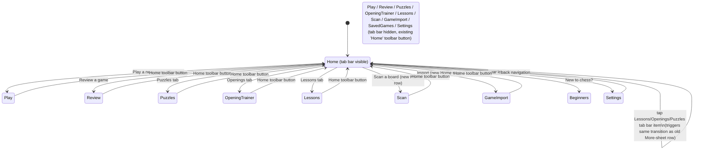

# feat: Home tab bar navigation + Settings reorganization

## Summary

Replace Home's top-leading "More" sheet with a persistent bottom tab bar (Home / Lessons / Openings / Puzzles) shown **only while the Home screen is on screen** — not globally — so gameplay screens (Play, Review, Puzzle session, Opening drill, Lesson practice) keep full width for the move list, coach panel, and best-move hints. Home's hero/actions get restyled to match a reference mockup's structure (dark hero card, resume/continue row, prominent primary CTA, secondary action cards) using our own `Theme`/`ThemeStore` palette, not the mockup's literal colors. Two new Home actions are added — "Scan a board" and "Import a game" — surfaced as their own secondary-action row. Settings is reorganized from a loosely-grouped flat `Form` into clearly labeled sections.

This is a UI/navigation restructuring plan. No new backend, model, or persistence work.

---

## Problem Frame

`GemmaRootView` (`Sources/GemmaChessCore/UI/RootView.swift`) is a single `NavigationStack` driven by a `Mode` enum switch. Every non-Home screen pushes its own "Home" toolbar button to return (`PuzzlesContainerView`, `OpeningTrainerContainerView`, `LessonsContainerView`, `PlayContainerView`, `LessonsView`'s practice view, `reviewFlow`, `GameImportView`, `SavedGamesView` all repeat this pattern independently). Home itself (`HomeView` in the same file) buries Lessons, Opening Trainer, Game Import, Scan, and My Games inside a "More" sheet reached via a top-leading hamburger icon, keeping only "Play", "Resume", "Review a game", "Puzzles", and "New to chess?" as permanent one-tap rows.

The user wants Lessons/Openings/Puzzles promoted to first-class, always-reachable destinations from Home via a bottom tab bar styled after a reference mockup, plus two new Home actions (Scan, Import). A first draft of this plan proposed making the tab bar globally persistent (present during Play/Review too), but the user corrected this: persistent chrome during gameplay would eat into space already tight for the move list, coach card, and best-move hints. The agreed resolution is a **Home-scoped tab bar** — visible only on the Home screen, not during any pushed session (game, puzzle, drill, lesson, scan, import, saved games).

Settings (`Sources/GemmaChessCore/UI/SettingsView.swift`) is a single `Form` with `Section`s that exist but aren't grouped by concern consistently — Appearance sits alone at the top, Statistics/New games/Play mode/Coach are separate sections, and all five "reset" destructive actions are dumped into one "On-device data" section mixed with a "Clear all saved games" action for an unrelated concern (game history vs. per-feature progress resets). This plan re-groups Settings into named, scannable sections without changing any individual toggle/action's behavior.

---

## Requirements

- **R1**: Home renders a bottom tab bar with four items — Home, Lessons, Openings, Puzzles — using the app's existing `Theme`/`ThemeStore` colors and typography (not the mockup's literal green palette).
- **R2**: The tab bar is visible only while the Home screen is the active destination. Navigating into any pushed session (Play, Review, Puzzle session/rush, Opening drill, Lesson practice, Scan, Import, Saved Games, Settings) hides the tab bar; those screens keep their existing "Home" toolbar-button return affordance unchanged.
- **R3**: Tapping Lessons / Openings / Puzzles from the tab bar navigates to the same destinations `HomeView`'s existing `onLessons` / `onOpeningTrainer` / `onPuzzles` callbacks already reach — no new view models or entry logic, just a new entry point replacing the "More" sheet's rows for these three.
- **R4**: Home's hero/actions area is restructured to mirror the reference mockup's information architecture: an app-identity hero block, a "Continue your game" resume row when a game is in progress, a prominent primary "Play a new game" CTA, and a row of secondary action cards — while using our theme's palette, fonts, and existing card/button styles (`PressableStyle`, `theme.cardBackgroundColor`, etc.), not the mockup's specific green gradient.
- **R5**: Two new secondary actions are added to Home: "Scan a board" (wires to `HomeView`'s existing `onScan`/`scanEnabled` gating) and "Import" (wires to existing `onGameImport`). Both become visible, permanent Home actions instead of being buried in the "More" sheet.
- **R6**: The "More" sheet is retired now that Lessons/Openings are tabs and Scan/Import are permanent rows. "My Games" (`onMyGames`), the one remaining item with no other home, gets a new placement (folded into Home's action set or Settings — see KTD-3).
- **R7**: Settings gains explicit section grouping: Appearance, Play defaults (engine strength + Play mode toggles), Coach, Statistics, Data & Progress (all destructive resets + clear-games, grouped together and separated from non-destructive sections), About (onboarding replay, licenses, "New to chess?"). No behavioral change to any individual setting.
- **R8**: The gear-icon Settings entry point continues to be reachable from Home and from every other screen's toolbar exactly as today (`settingsToolbarItem` in `RootView.swift`) — Settings does not become a tab.

---

## Scope Boundaries

**Non-goals:**
- No new backend, persistence, or view-model logic — this is presentation/navigation restructuring over existing callbacks and stores.
- No change to any individual Settings toggle's behavior, default value, or persistence key.
- No macOS-specific tab bar treatment beyond what `#if os(iOS)` conditionals already handle elsewhere in `RootView.swift`/`HomeView` — mirror the existing per-platform conditional pattern if the tab bar needs iOS-only chrome.

### Deferred to Follow-Up Work
- Making the tab bar persistent during gameplay (the user's original ask) was explicitly walked back this session in favor of Home-only — if a future session wants an alternate compact/collapsible tab bar during gameplay, that's new scope, not this plan.
- Any further Home visual polish beyond matching the mockup's structural pattern (e.g., custom illustrations, animated hero backgrounds) is out of scope.

---

## Key Technical Decisions

**KTD-1: Tab bar scope — Home-only, not global.**
Implement as a `TabView` (or an equivalent custom segmented control styled as a bottom bar) rendered only inside the `.home` case of `GemmaRootView`'s mode switch, not wrapping the whole `NavigationStack`. Every other `Mode` case keeps rendering its content directly, unwrapped, exactly as it does today — no new global chrome. This directly satisfies the user's space concern: Play/Review/Puzzle-session/etc. get their full existing screen real estate back with zero layout changes to those views.
- *Alternative considered*: A global `TabView` wrapping all modes with the bar hidden via `.toolbar(.hidden, for: .tabBar)` on non-Home cases. Rejected — adds a permanent structural layer (extra `TabView` hierarchy, extra state) for a bar that's invisible 90% of the time, and SwiftUI's `.tabBar` visibility modifier has known inconsistencies across iOS versions when toggled per-destination. The Home-only approach is simpler and matches exactly what's needed.

**KTD-2: Bottom bar tap targets reuse `HomeView`'s existing callbacks — no new navigation surface.**
The tab bar's Lessons/Openings/Puzzles items call the same `onLessons`/`onOpeningTrainer`/`onPuzzles` closures `HomeView` already receives from `RootView`. Selecting a tab other than Home immediately triggers the corresponding mode transition (same as tapping a "More" sheet row did) rather than the tab bar acting as a persistent multi-screen container — since scope is Home-only, there's no "Lessons tab content sitting behind the tab bar" to maintain; tapping Lessons simply navigates away from Home (which is when the tab bar itself also disappears, per KTD-1).

**KTD-3: "My Games" moves into Settings' new "Data & Progress" section (not a Home row).**
With Lessons/Openings promoted to tabs and Scan/Import promoted to permanent Home rows, "My Games" is the one remaining "More"-sheet item. It's a browse/history action, not a top-level mode — it fits naturally next to Settings' existing "Clear all saved games" destructive action (view your games vs. delete your games, same on-device data concern). Add a non-destructive `NavigationLink("My Games")` in Settings' Data & Progress section, gated the same way the old More row was (`hasSavedGames`).
- *Alternative considered*: A third secondary-action row on Home. Rejected — the user's mockup keeps Home to hero + continue + primary CTA + one secondary row; a second secondary row re-introduces the scroll-growth problem this session's earlier work ("More" sheet) was explicitly built to avoid.

**KTD-4: Home visual restructuring reuses existing theme primitives, not new ones.**
The mockup's hero card, resume row, and action cards map onto primitives already in `HomeView`/`Theme`: `theme.backgroundGradient`/`theme.bgColor` for the hero backdrop, `theme.cardBackgroundColor`/`theme.cardBorderColor` for cards, `PressableStyle` for press feedback, `.borderedProminent`/`.tint(theme.accentColor)` for the primary CTA. No new color tokens or gradient definitions are introduced; existing `emblem`/`header`/`decoRule` pieces are restructured/restyled in place rather than replaced wholesale.

**KTD-5: Settings sections reorganize existing `Form` `Section`s; no toggle logic changes.**
Re-slice `SettingsView`'s existing sections into: Appearance (unchanged), Play defaults (engine strength stepper + the four Play-mode toggles, merged into one section since both configure "how a new game looks/plays"), Coach (unchanged), Statistics (unchanged, conditionally shown), Data & Progress (all five destructive resets + clear-games + the new My Games link, grouped together since they're all "manage what's stored on this device"), About (onboarding replay, licenses, New to chess? — informational/reference links). Confirmation dialogs, state variables, and store calls are untouched — only which `Section` each control lives in, and the section headers/footers, change.

---

## High-Level Technical Design

The diagram's point: nothing about the *destination* screens changes. The only new behavior is Home rendering a tab bar as an additional entry surface, and that entry surface disappearing the instant you leave Home — mirroring exactly the return-to-Home affordance every screen already has.

---

### U1. Home-scoped bottom tab bar

**Goal**: Add a bottom tab bar to `HomeView`, visible only on Home, with Home/Lessons/Openings/Puzzles items in the app theme.

**Requirements**: R1, R2, R3

**Dependencies**: none

**Files**:
- Modify: `Sources/GemmaChessCore/UI/RootView.swift` (`HomeView`'s `body`, remove `menuButton`/`moreSheet` and their state, add tab bar)
- Test: `Tests/GemmaChessCoreTests/HomeViewNavigationTests.swift` (new — logic-only tests around whichever plain state/model this introduces, e.g. a `HomeTab` enum's identity/case-iterable behavior; SwiftUI view bodies themselves aren't unit-testable, so keep this test file scoped to any extractable non-view logic)

**Approach**: Introduce a small `HomeTab: String, CaseIterable` enum (`.home, .lessons, .openings, .puzzles`) local to `RootView.swift`. Render it as a custom bottom bar (four `Button`s in an `HStack`, icon-over-label, using `theme.accentColor` for the selected state and `theme.textColor.opacity(...)` for unselected — mirroring `secondaryActionCard`'s existing icon/label layout) rather than SwiftUI's `TabView`, since `TabView`'s selection binding would imply persistent tab *content*, which KTD-1/KTD-2 explicitly avoid — this is a navigation trigger bar, not a tab content container. Selecting Lessons/Openings/Puzzles calls the existing `onLessons`/`onOpeningTrainer`/`onPuzzles` closures immediately (same as a "More" row tap did); selecting Home is a no-op (already there). Remove `menuButton`, `showMore`, and `moreSheet` — their remaining content (Import, Scan, My Games) is redistributed per U2/KTD-3.

**Patterns to follow**: `secondaryActionCard(icon:title:action:)` for icon/label styling; `PressableStyle` for press feedback; `theme.cardBackgroundColor`/`theme.cardBorderColor` if the bar gets a background container.

**Test scenarios**:
- `HomeTab.allCases` returns exactly `[.home, .lessons, .openings, .puzzles]` in that order (guards against accidental reordering breaking the bar's visual left-to-right sequence).
- Test expectation: the tap-to-navigate wiring itself (bar item → `onLessons`/`onOpeningTrainer`/`onPuzzles`/etc.) is view-body wiring with no independent logic to unit test beyond the closures already covered by existing `HomeView` usage — verify via manual/simulator check per Verification below, not an automated test.

**Verification**: Build succeeds; on Home, four tab items render in theme colors; tapping Lessons/Openings/Puzzles navigates exactly as the old "More" sheet rows did; the "More" sheet and its hamburger icon no longer appear anywhere.

---

### U2. Home actions: Scan, Import, restyled hero/actions layout

**Goal**: Restructure `HomeView`'s hero and action area to match the reference mockup's structure (hero → continue/resume → primary CTA → secondary row(s)) in the app's own theme, and add Scan + Import as a new permanent secondary-action row.

**Requirements**: R4, R5

**Dependencies**: U1 (tab bar occupies the bottom of the same screen being restructured; sequencing avoids re-touching the same layout twice)

**Files**:
- Modify: `Sources/GemmaChessCore/UI/RootView.swift` (`HomeView`'s `header`, `actions`, remove `beginnersCard`'s current standalone placement if folded into the new secondary rows, add Scan/Import row)

**Approach**: Keep `header` (emblem, wordmark, tagline) as the hero block — it already matches the mockup's "icon + title + tagline" shape structurally. Keep the existing `inProgressGameID != nil` "Resume game" row and "Play a new game" primary CTA as-is (they already match the mockup's resume-card + prominent-CTA pattern). Add a second secondary-action row below the existing Review/Puzzles-replacement row: since Puzzles is now a tab (U1), repurpose that row slot for the two new actions — `secondaryActionCard(icon: "camera.viewfinder", title: "Scan a board", action: onScan)` (gated by `scanEnabled`, matching the old More-row's conditional) and `secondaryActionCard(icon: "square.and.arrow.down", title: "Import", action: onGameImport)`. "Review a game" keeps its existing card (not a tab, not covered by R1's four named tabs) — pair it with whichever of Scan/Import fits a 2-column row best, or use a 2-row secondary grid (Review + one new action, then the other new action + New to chess) if three secondary actions don't fit one row. "New to chess?" (`beginnersCard`) stays a permanent full-width row beneath, unchanged.

**Patterns to follow**: The existing `HStack(spacing: 12) { secondaryActionCard(...); secondaryActionCard(...) }` 2-column pattern; `scanEnabled` gating exactly as used in the old `moreSheet`.

**Test scenarios**:
- Test expectation: none -- pure SwiftUI layout/styling change with existing, already-tested callbacks (`onScan`, `onGameImport`); no new branching logic beyond the pre-existing `scanEnabled` conditional, which is unchanged from its current `moreSheet` usage.

**Verification**: Build succeeds; Home shows hero → resume (when applicable) → primary CTA → Review/Scan/Import secondary cards → New to chess, in the app's theme; Scan row respects `scanEnabled` (hidden/shown identically to today's More-sheet behavior); tapping Scan still routes through `RootView.openScan()`'s existing Pro-gate/paywall check unchanged.

---

### U3. Retire "More" sheet, relocate My Games into Settings

**Goal**: Remove the now-redundant "More" sheet entirely and give "My Games" a home in Settings' Data & Progress section.

**Requirements**: R6

**Dependencies**: U1, U2 (both must land first since they redistribute every other item the sheet used to hold)

**Files**:
- Modify: `Sources/GemmaChessCore/UI/RootView.swift` (delete `moreSheet`, `menuButton`, `showMore`, `rowDivider`, `moreRow` if no longer used elsewhere)
- Modify: `Sources/GemmaChessCore/UI/SettingsView.swift` (add `NavigationLink` to `SavedGamesView`, gated by `hasSavedGames`)

**Approach**: `HomeView` currently doesn't own `onMyGames`'s destination directly — `RootView`'s `mode = .savedGames` transition is triggered via the callback passed in. Settings needs its own way to reach `SavedGamesView`; since `SettingsView` is a `NavigationLink`-based push destination off `RootView`'s `NavigationStack` already (reached via `settingsToolbarItem`), add a `NavigationLink(destination: SavedGamesView(onSelect: ...))` following the same pattern `SettingsView` already uses for `CoachSettingsView`/`LicensesView`/`BeginnersView`. The `onSelect` closure needs a way to start a game from within Settings' navigation context — check whether `PlayViewModel`/`play` state is reachable from `SettingsView` today (it currently is not); if not, the simplest correct approach is for `SavedGamesView`'s selection to pop back to Home and hand off the selected game via the existing `openSavedGame(withID:)` path in `RootView`, rather than duplicating game-loading logic inside `SettingsView`.

**Patterns to follow**: `SettingsView`'s existing `NavigationLink { CoachSettingsView() }` pattern; `hasSavedGames` gating from the old `moreSheet`.

**Test scenarios**:
- Test expectation: none -- navigation wiring only; `SavedGamesView`'s own selection/load behavior is pre-existing and unchanged. If the hand-off requires new plumbing between `SettingsView` and `RootView` (per Approach above), note the exact mechanism as an implementation-time decision (Phase 3.6 unknown) rather than specifying it here, since it depends on whichever navigation primitive (`NotificationCenter`-free callback threading vs. a shared observable) reads cleanest once the surrounding code is in view.

**Verification**: Build succeeds; "More" hamburger icon and sheet no longer exist anywhere in the codebase (`grep -r "moreSheet\|showMore" Sources/` returns nothing); Settings shows "My Games" only when `hasSavedGames` is true; selecting a saved game from Settings successfully resumes it in Play mode.

---

### U4. Settings reorganization

**Goal**: Re-group `SettingsView`'s existing `Section`s into clearly labeled Appearance / Play defaults / Coach / Statistics / Data & Progress / About groups.

**Requirements**: R7, R8

**Dependencies**: U3 (Data & Progress section needs the My Games link landed first to avoid re-touching the same section twice)

**Files**:
- Modify: `Sources/GemmaChessCore/UI/SettingsView.swift`

**Approach**: Re-slice the existing `Form`'s sections without changing any `@State`, `Toggle`, `Stepper`, `Button`, or `confirmationDialog` — this is a section-boundary and header/footer-label change only. Proposed grouping (mapping old → new):
- **Appearance**: unchanged (existing top section).
- **Play defaults**: merge the current "New games" (engine strength stepper) and "Play mode" (four toggles) sections into one, since both configure default new-game behavior; keep both footers, adjusted for combined framing.
- **Coach**: unchanged.
- **Statistics**: unchanged (still conditional on `stats.totalGames > 0`).
- **Data & Progress**: all five destructive reset buttons (games, puzzles, puzzle rating, opening trainer, lessons) + the new My Games link (U3), grouped under one header emphasizing "manage what's stored on this device."
- **About**: "How ChessCoach works", "Open Source Licenses", "New to chess?" — informational/reference links, unchanged individually.
- The TestFlight/local-only "Preview Paywall" section stays gated by `BuildChannel.current != .appStore` exactly as today, placed after About.

**Patterns to follow**: Existing `Section("...")`/`Section { } header: { } footer: { }` syntax already used throughout the file — no new patterns introduced.

**Test scenarios**:
- Test expectation: none -- this unit changes `Section` grouping and header/footer text only; every toggle, stepper, button, and confirmation dialog keeps its existing `@State` binding and store call, so there's no new behavior to test beyond what's already exercised by existing manual verification of each control.

**Verification**: Build succeeds; Settings renders with the six named sections in order; every existing toggle/stepper/reset action still reads and writes the same store it did before (spot-check: toggling a Play mode setting still persists via `PlayDisplaySettings`; tapping "Reset puzzle progress" still calls `PuzzleProgressStore.resetAll()` and shows the "Reset." confirmation label).

---

## System-Wide Impact

- Every screen currently reached via `RootView`'s `Mode` switch keeps its exact current toolbar/return behavior — this plan touches zero lines in `PlayContainerView`, `PuzzlesContainerView`, `OpeningTrainerContainerView`, `LessonsContainerView`, `GameImportView`, `BoardScannerView`, or `SavedGamesView` themselves. All changes are contained to `RootView.swift`'s `HomeView` and `SettingsView.swift`.
- No macOS-specific behavior is expected to differ, since the tab bar is Home-only and Home already has `#if os(iOS)` handling only for `.toolbar(.hidden, for: .navigationBar)` — the new tab bar is plain SwiftUI views, not a platform-specific API.

---

## Open Questions

- **My Games hand-off mechanism (U3)**: whether `SavedGamesView`'s selection inside Settings pops back to Home and re-enters via `RootView.openSavedGame(withID:)`, or Settings gets narrow read access to trigger a mode change directly, is deferred to implementation — it depends on exactly how `RootView`'s state is structured once U1-U3 have landed, not on any product decision.
- **Three-way secondary row layout (U2)**: whether Review + Scan + Import fit best as a single 3-item row, a 2+1 split, or two 2-column rows is a visual-fit call best made by looking at the actual rendered card widths on-device/in-simulator, not decidable from the plan alone.
