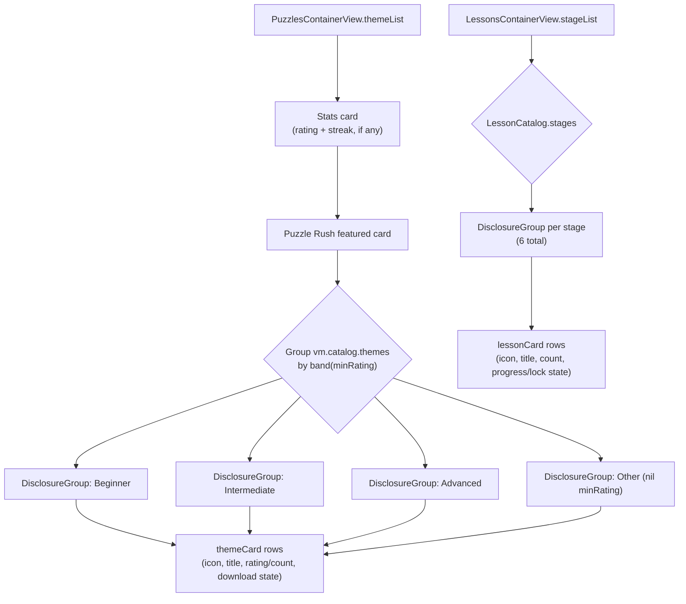

# feat: Redesign Puzzles and Lessons browsing screens

## Summary

Restyle Puzzles' theme list (`PuzzlesContainerView.themeList`) and Lessons' stage list (`LessonsContainerView.stageList`) from plain SwiftUI `List`/`Section` rows into themed card layouts matching Home's and Opening Trainer's visual language — sibling to `docs/plans/2026-07-19-003-feat-tab-bar-nav-settings-plan.md`, same discipline (reuse existing `Theme`/`ThemeStore` primitives, no new color tokens, presentation-only, no view-model or persistence changes).

Puzzles' 20 themes group into three rating bands (Beginner / Intermediate / Advanced) derived from each theme's own `minRating`, rendered as `DisclosureGroup` sections mirroring Opening Trainer's family grouping; Puzzle Rush becomes a featured card above the bands. Lessons' existing 6 stages render the same way, one `DisclosureGroup` per stage.

---

## Problem Frame

Both screens are currently plain system `List`s with `.scrollContentBackground(.hidden)` — free-tier blurb, a couple of stat rows, then flat `Section`s of theme/lesson rows styled as bare HStacks. Neither has any card styling, so both read as a system settings screen rather than matching the redesigned Home (hero cards, `theme.cardBackgroundColor`/`cardBorderColor` rounded cards, `PressableStyle` presses) or Opening Trainer (`DisclosureGroup` family/variation sections solving the exact "flat list is unwieldy" problem this plan now applies to Puzzles/Lessons).

Puzzles has 20 flat theme rows with no grouping at all. Lessons already groups into 6 stages via `LessonCatalog.stages`, but renders them as plain `List` `Section`s with no visual distinction from Puzzles' ungrouped list.

---

## Requirements

- **R1**: Puzzles' theme list groups its 20+ themes into three rating bands — Beginner (`minRating` < 500), Intermediate (500–649), Advanced (650+) — computed from each theme's own `minRating` rather than a hardcoded per-theme table, so a newly downloaded "extra" theme (see the prior bundle-puzzle-packs plan) bands automatically. A theme with no `minRating` falls into a fourth "Other" band.
- **R2**: Each rating band renders as a `DisclosureGroup`, mirroring Opening Trainer's `familyGroup` pattern, with the free-standing "Themes" `Section` retired.
- **R3**: Each theme row inside a band becomes a themed card (icon, title, rating range or puzzle count, download/delete/bundled-state control) on `theme.cardBackgroundColor`/`cardBorderColor`, replacing the bare HStack row.
- **R4**: Puzzle Rush becomes a featured card above the rating bands (not inside any band), keeping its existing "timed run" description and tap target unchanged in behavior.
- **R5**: The puzzle-rating and daily-streak stat rows restyle as a themed stats card (mirroring Home's stat-card visual language), not plain List rows.
- **R6**: Lessons' 6 stages each render as a `DisclosureGroup`, replacing the plain `Section(stage.title)` grouping — same collapsible-section mechanics as Puzzles' bands and Opening Trainer's families.
- **R7**: Each lesson row (locked or unlocked) becomes a themed card matching the puzzle theme card's visual language (icon, title, puzzle count, progress badge or lock/download state).
- **R8**: Neither screen's live session view (`PuzzleSessionView`, `LessonExplanationView`, `LessonPracticeView`) changes — this plan is scoped to the two browsing/entry screens only.
- **R9**: No `PuzzleViewModel`/`LessonViewModel` public API, persistence, or download/delete logic changes — every existing action (download, delete, start session, progress badge) keeps its current trigger and behavior, only its visual presentation changes.

---

## Scope Boundaries

**Non-goals:**
- No changes to `PuzzleSessionView`, `LessonExplanationView`, or `LessonPracticeView` (already redesigned earlier this session).
- No new theme colors, gradients, or design tokens — only `Theme`/`ThemeStore` properties already in use elsewhere (`cardBackgroundColor`, `cardBorderColor`, `accentColor`, `accent2Color`, `textColor`, `PressableStyle`).
- No change to how themes are fetched, downloaded, deleted, bundled, or how lesson progress/streak/rating are computed or persisted.

### Deferred to Follow-Up Work
- A dedicated per-theme icon set (today's cards reuse a single generic icon per band/stage or a simple SF Symbol chosen per theme name) — if the user wants bespoke iconography per theme later, that's new scope.
- Search/filter within Puzzles or Lessons (Opening Trainer has search-driven auto-expand; neither Puzzles' 20 themes nor Lessons' ~30 lessons are large enough to need it yet).

---

## Key Technical Decisions

**KTD-1: Rating bands are computed, not hardcoded per theme.**
A small pure function maps a theme's `minRating` to a band (`< 500` → Beginner, `500..<650` → Intermediate, `>= 650` → Advanced, `nil` → Other) — verified against the 20 bundled themes' actual `minRating` values (ranging 399–736), which splits roughly 6/8/6 across the three real bands. This generalizes to any future downloaded "extra" theme category without touching this view, unlike a hardcoded theme→category table (the approach originally proposed and turned down in favor of real rating data).
- *Alternative considered*: a hand-authored theme→motif-category map (tactics/mates/strategy). Rejected per user direction — favors data already on `PuzzleThemeInfo` over fabricated categories.

**KTD-2: `DisclosureGroup` sections reuse Opening Trainer's exact pattern, not a new grouping primitive.**
`OpeningTrainerContainerView.familyGroup(_:)`/`isExpandedBinding(for:)` already solved "many flat rows need collapsible grouping" earlier this session. Puzzles' bands and Lessons' stages both apply the same shape: a `DisclosureGroup(isExpanded:)` per group, default-expanded (no search-driven collapse rule is needed here since there's no search field on either screen, per Deferred to Follow-Up Work).

**KTD-3: Card styling reuses Home's existing primitives verbatim.**
Both new row types (`themeCard`, `lessonCard`) style with `theme.cardBackgroundColor`/`cardBorderColor` in a `RoundedRectangle(cornerRadius: 14...16)`, `PressableStyle` for press feedback — the same trio `HomeView.secondaryActionCard` and `beginnersCard` already use. No new `ViewModifier` is introduced; if the exact card shell is reused three or more times across this plan's two files, it may be worth extracting a small shared helper, left as an implementation-time call (Phase 3.6 unknown) rather than specified here.

**KTD-4: Puzzle Rush becomes a featured card, not a band member.**
It sits between the stats card (R5) and the rating-band `DisclosureGroup`s — same visual tier as Home's "Resume game" callout: a full-width prominent card, not nested in any collapsible group, since it's a mode (timed run across all themes) rather than a single theme.

---

## High-Level Technical Design

The point: both screens follow the identical shape (stat/featured content → grouped `DisclosureGroup`s → themed cards), so the two units below can be implemented and reviewed against the same mental model as Opening Trainer's grouping work.

---

### U1. Puzzles theme list redesign

**Goal**: Replace `PuzzlesContainerView.themeList`'s flat `List` with a themed stats card, a featured Puzzle Rush card, and rating-band `DisclosureGroup` sections of theme cards.

**Requirements**: R1, R2, R3, R4, R5, R9

**Dependencies**: none

**Files**:
- Modify: `Sources/GemmaChessCore/UI/PuzzlesView.swift` (`PuzzlesContainerView.themeList`, `themeRow`; add a band-grouping helper and `themeCard`)
- Test: `Tests/GemmaChessCoreTests/PuzzleThemeBandingTests.swift` (new — pure banding-function tests, no view rendering)

**Approach**: Replace the `List` with a `ScrollView` + `VStack`, mirroring `HomeView.body`'s structure. Keep the existing free-tier blurb text. Combine the rating/streak rows into one themed stats card (R5) using the same two-column stat layout Home/Settings already use elsewhere (`statColumn`-style). Render Puzzle Rush as its own full-width card (icon, title, description, tap target unchanged — still sets `showingRush = true`). Add a pure function (e.g. `PuzzleThemeInfo.ratingBand` or a private helper) mapping `minRating` to one of four bands per KTD-1, group `vm.catalog.themes` by that band, and render each non-empty band as a `DisclosureGroup` (default-expanded) containing `themeCard` rows built from the existing `themeRow`'s content (icon+title+rating label on the left, existing download/delete/bundled control on the right) restyled onto a card background. Preserve every existing piece of logic verbatim: `vm.downloadingTheme`, `vm.isBundled`, `vm.isDownloaded`, the delete confirmation dialog, the download-error alert, and the `.id("\(theme.theme)-\(vm.packDeletionTick)")` re-render trick.

**Patterns to follow**: `OpeningTrainerView.familyGroup`/`isExpandedBinding` for the `DisclosureGroup` shape; `HomeView.secondaryActionCard`/`beginnersCard` for card styling; `HomeView.actions`' `VStack(spacing: 12)` composition rhythm.

**Test scenarios**:
- Banding function: `minRating` of 399 → Beginner; 500 → Intermediate; 649 → Intermediate; 650 → Advanced; 736 → Advanced; `nil` → Other.
- Banding function: boundary values exactly at 500 and 650 land in the band whose range includes them (Intermediate starts at 500 inclusive, Advanced starts at 650 inclusive).
- Given the 20 bundled themes' real `minRating` values, grouping produces three non-empty bands (Beginner, Intermediate, Advanced) and an empty Other band (Test expectation: this can be a single test snapshotting the three real counts, e.g. asserting they sum to 20 and each band is non-empty, without hardcoding which theme lands where — keeps the test resilient to future rating-data recuration).
- Test expectation: none beyond the above for the view layer itself -- `themeRow`'s existing download/delete/bundled-state branches and their triggering actions (`vm.downloadAndStart`, `vm.deletePack`, confirmation dialog) are unchanged logic already covered by `PuzzleDownloadStoreTests`/`PuzzleViewModelTests`; only their visual container changes.

**Verification**: Build succeeds; Puzzles shows a themed stats card, a featured Puzzle Rush card, then three (or four, if any theme lacks `minRating`) collapsible rating-band sections of themed theme cards, all using existing theme colors; every existing interaction (download, delete, bundled no-op, Puzzle Rush entry, rating/streak display) behaves identically to before.

---

### U2. Lessons stage list redesign

**Goal**: Replace `LessonsContainerView.stageList`'s flat `List`/`Section`-per-stage with `DisclosureGroup` stage sections of themed lesson cards.

**Requirements**: R6, R7, R9

**Dependencies**: none (independent of U1; both files are disjoint)

**Files**:
- Modify: `Sources/GemmaChessCore/UI/LessonsView.swift` (`LessonsContainerView.stageList`, `lessonRow`/`unlockedLessonRow`/`lockedLessonRow`)

**Approach**: Replace the `List` with a `ScrollView` + `VStack`, keeping the existing free-tier blurb text. Render one `DisclosureGroup` per `LessonCatalog.stages` entry (default-expanded, per KTD-2), each containing the stage's lessons as themed cards. Preserve `unlockedLessonRow`'s tap-to-select and `lockedLessonRow`'s tap-to-download behavior verbatim, restyling both onto the same card shell U1 introduces (icon + title + puzzle count on the left; progress badge, lock/download state, or download-in-progress spinner on the right, exactly as today). Keep `progressBadge(for:)` unchanged.

**Patterns to follow**: `OpeningTrainerView.familyGroup`/`isExpandedBinding`; U1's `themeCard` shell (reuse directly if U1 lands first, or apply the same shape independently since the units are otherwise unordered).

**Test scenarios**:
- Test expectation: none -- this unit changes only the `List`/`Section` container to `ScrollView`/`DisclosureGroup` and restyles existing rows; `isUnlocked(_:)`, `downloadTheme(_:)`, and `progressBadge(for:)` are unchanged logic already covered by `LessonProgressStoreTests`/`LessonViewModelTests`.

**Verification**: Build succeeds; Lessons shows 6 collapsible stage sections of themed lesson cards; locked lessons still show a Download affordance that unlocks in place on success (mirroring today's `sessionUnlockedThemes` behavior); progress badges (checkmark/in-progress count) still render per lesson exactly as before.

---

## System-Wide Impact

Both units are presentation-only changes to two independent files (`PuzzlesView.swift`, `LessonsView.swift`) with zero overlap — safe to implement in either order or in parallel. No other screen, view model, or store is touched.

---

## Open Questions

- **Shared card-shell extraction**: whether `themeCard`/`lessonCard` end up sharing one private helper or stay as two near-identical implementations is an implementation-time call once both are actually written side by side (Phase 3.6 unknown), not a planning-time decision.
- **Per-theme/per-lesson iconography**: today's plan uses one representative icon per band/stage (or a generic puzzle/book icon) rather than a bespoke icon per individual theme/lesson name — deferred per Scope Boundaries.
