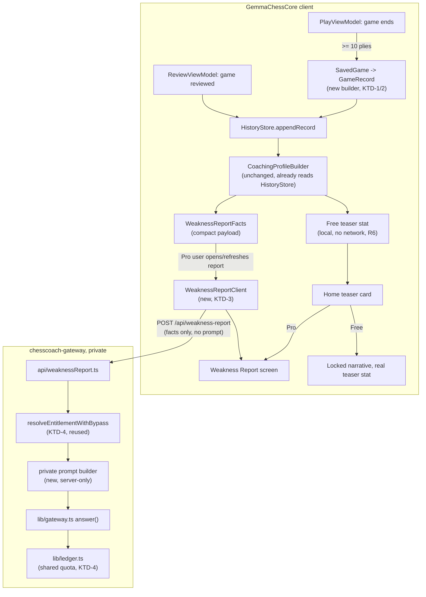

# feat: Coach Weakness Report

**Target repos:** this repo (`GemmaChessCore` client) and `chesscoach-gateway` (nested at `chesscoach-gateway/`, its own git repo, private/closed-source). File paths below are repo-relative to whichever repo each unit names.

## Summary

Ship a Pro-gated "Weakness Report": a coach-synthesized narrative built from the user's unified game history (Play mode's own games folded into the same pipeline Review mode already populates), reached from a Home teaser card, with the actual coaching prompt living only on `chesscoach-gateway` — never in this open-source client (see origin: `docs/brainstorms/2026-07-19-coach-profile-weakness-report-requirements.md`).

Two findings from research materially size this plan beyond the brainstorm's framing: (1) bridging Play games into the existing `CoachingProfile` pipeline requires deriving fields (motifs, phase, best-move) that Play mode's own data model doesn't currently carry, and (2) the client-side call for this feature can't reuse the existing `CoachLLM` abstraction at all, since every current coach call sends a client-built prompt — exactly what this feature must avoid.

---

## Problem Frame

`CoachingProfile`/`CoachingProfileBuilder` (`Sources/GemmaChessCore/History/CoachingProfile.swift`) already aggregates `HistoryStore`'s `GameRecord`s into recent-form accuracy, top motifs, weakest phase, and per-opening/per-speed stats — but `HistoryStore.recordGame` (`Sources/GemmaChessCore/History/HistoryStore.swift:292`) is only ever called from `ReviewViewModel.swift:130`, when a user imports and reviews a game. Play mode's own games, tracked separately in `SavedGameStore`/`SavedGame` (`Sources/GemmaChessCore/History/SavedGame.swift`), never reach it. `SavedGame`'s per-move data (`CoachPromptBuilder.PlayMoveRecord`, `Sources/GemmaChessCore/Coach/CoachPrompt.swift:351`) has a classification, win-before/after, and a "better" SAN move — but no motif tags, no best-move UCI, and no phase label, all of which `GameRecord.Mistake`/`Motifs.tagMotifs` (`Sources/GemmaChessCore/History/Motifs.swift`) need and today only get computed from Review's full Stockfish-swept `ReviewSession`.

On the backend, `chesscoach-gateway`'s `api/coach.ts` accepts a client-supplied `{system, prompt}` pair and calls `lib/gateway.ts`'s `answer()` — every existing coach call site (`ManagedCoach.swift`) builds its prompt client-side and sends it over the wire. That's incompatible with keeping the Weakness Report's prompt private (origin R7): a new endpoint must accept only structured facts and build its own prompt server-side.

---

## Requirements

(Carried from origin: `docs/brainstorms/2026-07-19-coach-profile-weakness-report-requirements.md`, R1-R10.)

- **R1**: A Weakness Report screen synthesizes a coach narrative naming a specific recurring flaw and pairing it with a concrete, free next step (a Lesson or puzzle theme).
- **R2**: Reached via a themed Home card, below the existing action rows.
- **R3**: Data source unifies Play mode games into `HistoryStore`/`GameRecord` — Play games will now also appear in Review mode's own history list (accepted side effect).
- **R4**: v1 data source is game history only — no puzzle/lesson/opening-trainer stats.
- **R5**: Narrative is cached; a "Refresh" action is disabled until enough new games have accumulated since the last generation.
- **R6**: All local aggregation (including the free teaser stat) computes lazily, on-demand, with zero network/LLM calls for non-Pro users.
- **R7**: Available only through the managed backend (`chesscoach-gateway`) — no BYOK Gemini support, prompt never ships in this client.
- **R8**: Free users see a real, already-free teaser stat with the narrative locked.
- **R9**: Tone is growth-framed; every named flaw pairs with a concrete free next step.
- **R10**: (Direction only, not built here) all coach prompts should eventually move server-side, retiring BYOK for coaching — deferred, see Scope Boundaries.

---

## Key Technical Decisions

**KTD-1: `SavedGame` → `GameRecord` via a new, dedicated builder — not a reuse of `buildGameRecord(from: ReviewSession, identity:)`.**
`HistoryStore.buildGameRecord` derives motifs/phase/mistakes from `ReviewSession.mistakes`, which already carries `bestLineUCI`, `evalBefore`, `clockAfter`, etc. — none of which `SavedGame`/`PlayMoveRecord` carries today. Rather than force Play data through the Review shape, add a parallel `buildGameRecord(from: SavedGame, identity:)` that: derives `phase` from `SavedGame.fenHistory` (reusing `HistoryStore.phase(fen:moveNumber:)`, already `static`/internal-visible), derives motifs from `PlayMoveRecord` plus a **newly captured** best-move UCI (see KTD-2), and computes `plyCount`/`accuracy` from `PlayMoveRecord`'s existing win-before/after values (already exactly what `Evaluation.moveAccuracy` needs, per `CoachPromptBuilder.playGameFactsText`'s existing usage).
- *Alternative considered*: convert `SavedGame` into a synthetic `ReviewSession` and reuse the existing builder untouched. Rejected — `ReviewSession` carries fields (full PGN headers, `sweepDepth`, `reviewElo`, `thresholds`) that don't exist for a live Play game and would have to be faked, which is more fragile than a small dedicated builder.

**KTD-2: `PlayMoveRecord` gains a `bestUCI` field to enable motif tagging.**
`Motifs.tagMotifs` requires `bestUCI` (a UCI string) to compare the played move against the engine's top choice; `PlayMoveRecord` only stores `betterSan` (already-formatted SAN for display). Add `bestUCI: String?` alongside the existing `betterSan` at the point `PlayViewModel` already computes the top engine move per ply (it already has this data live per `topMoves`, from earlier work this session) — additive field, `Codable` default-nil for existing saved games decodes safely.

**KTD-3: The Weakness Report's client call is a new, narrow path — not a `CoachLLM` conformance.**
Every existing coach call flows through `CoachLLM.generate(system:prompt:sessionID:)`/`CoachOrchestrator`, which assumes the caller supplies the prompt. This feature's client call sends only structured facts (a compact `WeaknessReportFacts` payload — recent motifs, phase-loss, accuracy trend, game count) and receives back finished narrative text; it does not fit the `CoachLLM` shape and should not be forced into it. A small, standalone client (e.g. `WeaknessReportClient`, mirroring `ManagedCoach`'s request-building/error-handling style but with its own wire types) is more honest than stretching an abstraction built for client-authored prompts.

**KTD-4: Reuse the existing entitlement + quota pool — no separate ledger.**
The new gateway endpoint reuses `resolveEntitlementWithBypass` (`lib/entitlementGate.ts`) and `lib/ledger.ts`'s existing per-user monthly token cap exactly as `api/coach.ts` does — a Weakness Report generation just adds to the same usage tally. A separate quota was considered and rejected: it adds a second cap to reason about for a feature that's still just "the coach talking," not a functionally distinct resource.

**KTD-5: Refresh gate threshold — 5 new unified-history games since last generation, and a minimum 10-ply floor to exclude noise.**
Origin left both thresholds as planning-time tuning calls. 5 games mirrors the rough order of magnitude `CoachingProfileBuilder`'s own aggregation already treats as meaningful (its `topMotifs` cutoff is top-8 across a much larger recent window); games under 10 plies (an abandoned/instant-resign game) are excluded from `SavedGame`→`GameRecord` bridging entirely, so they never enter the profile or Review's history list. Both are simple constants, trivially retunable later.

---

## High-Level Technical Design

---

### U1. `PlayMoveRecord.bestUCI` + `SavedGame` → `GameRecord` bridge

**Goal**: Play mode games become eligible to enter `HistoryStore`, carrying the fields `CoachingProfile`'s aggregation needs.

**Requirements**: R3 (see origin), KTD-1, KTD-2, KTD-5

**Dependencies**: none

**Files**:
- Modify: `Sources/GemmaChessCore/Coach/CoachPrompt.swift` (`PlayMoveRecord`: add `bestUCI: String?`)
- Modify: `Sources/GemmaChessCore/ViewModels/PlayViewModel.swift` (wherever `PlayMoveRecord`s are constructed per-ply, thread through the already-computed top engine move's UCI)
- Modify: `Sources/GemmaChessCore/History/HistoryStore.swift` (add `buildGameRecord(from: SavedGame, identity:)` and a small ply-count/exclusion check; `phase(fen:moveNumber:)` is already reusable)
- Test: `Tests/GemmaChessCoreTests/SavedGameToGameRecordTests.swift` (new)

**Approach**: Mirror `buildGameRecord(from: ReviewSession, identity:)`'s shape for the new overload: for each `PlayMoveRecord`, compute `phase` via the existing `HistoryStore.phase(fen:moveNumber:)` using the matching `SavedGame.fenHistory` entry, classify counts (inaccuracy/mistake/blunder — `PlayMoveRecord.classification` already carries this), accumulate `phaseLoss` per phase from `winBefore - winAfter`, and call `Motifs.tagMotifs` with the new `bestUCI`. `plyCount`/`accuracy` derive from `PlayMoveRecord`'s existing win values via `Evaluation.moveAccuracy` (already used by `CoachPromptBuilder.playGameFactsText`). Games under the 10-ply floor (KTD-5) are skipped entirely — never appended, never shown in Review's history list.

**Patterns to follow**: `HistoryStore.buildGameRecord(from: ReviewSession, identity:)`'s exact structure (same file); `Motifs.tagMotifs`'s existing signature; `CoachPromptBuilder.playGameFactsText`'s existing accuracy computation from `PlayMoveRecord`.

**Test scenarios**:
- A `SavedGame` with 3 `PlayMoveRecord`s (one each: normal, mistake, blunder) produces a `GameRecord` with matching `counts.mistake`/`counts.blunder`.
- A `SavedGame` under 10 plies is excluded — the bridge function returns nil/skips, and no `HistoryStore` record is appended.
- A `PlayMoveRecord` with `bestUCI == nil` (an old saved game decoded before this change) still bridges successfully, just without motif tags for that ply (graceful degradation, not a crash).
- A game where the player was Black produces `GameRecord.reviewedSide`/`playerResult` matching Black's result, not White's.
- Phase classification: a move made when few pieces remain classifies as `endgame`, matching `HistoryStore.phase`'s existing logic.

**Verification**: Build succeeds; a Play mode game finished end-to-end (resign or checkmate) produces a `HistoryStore` record visible in Review's own history list; `CoachingProfileBuilder.buildProfile` run against a player who has only ever played (never reviewed) returns a non-empty profile.

---

### U2. Wire Play mode game completion into `HistoryStore`

**Goal**: Every finished Play mode game (meeting the ply floor) is recorded via U1's bridge, automatically.

**Requirements**: R3

**Dependencies**: U1

**Files**:
- Modify: `Sources/GemmaChessCore/ViewModels/PlayViewModel.swift` (`recordOutcome()`, or immediately after)

**Approach**: Call the new `HistoryStore.recordGame(from: SavedGame, identity:)` path (or equivalent) from `recordOutcome()` — the existing method already runs exactly once per real game ending (per its own header comment: "never from `load(_:)`"), which is the correct hook point to avoid double-recording a resumed/replayed game.

**Patterns to follow**: `recordOutcome()`'s existing "exactly once per real ending" discipline; `ReviewViewModel.swift:130`'s `HistoryStore().recordGame(...)` call site as the sibling pattern.

**Test scenarios**:
- Finishing a Play game once calls the recording path exactly once (no duplicate on subsequent `checkGameOver` checks).
- Resuming and replaying an already-finished saved game does NOT re-record it (mirrors the existing win/loss/draw stats discipline that already guards against double-counting on `load(_:)`).

**Verification**: A game played start-to-finish in Play mode, never opened in Review mode, appears in `HistoryStore.loadRecords()` afterward.

---

### U3. Gateway: `/api/weaknessReport` endpoint (private prompt)

**Goal**: A new `chesscoach-gateway` endpoint accepts structured facts (never a prompt) and returns a coach-synthesized narrative.

**Requirements**: R7, R9

**Dependencies**: none (independent of the client-side units; only needs the facts payload shape, defined here and mirrored in U4)

**Files** (in `chesscoach-gateway/`):
- Create: `api/weaknessReport.ts`
- Create: `lib/weaknessReportPrompt.ts` (the private prompt template — the actual IP this whole plan exists to protect)
- Test: `test/weaknessReport.test.ts`

**Approach**: Mirror `api/coach.ts`'s shape exactly: a Zod request schema (facts fields — recent motifs with counts, phase-loss totals, accuracy trend, game count, appUserId — no `system`/`prompt` fields at all), `resolveEntitlementWithBypass` (KTD-4), the same monthly quota check via `lib/ledger.ts`, then build the system+prompt entirely server-side in `lib/weaknessReportPrompt.ts` from the validated facts and call `lib/gateway.ts`'s existing `answer()`. The prompt template encodes the tone requirement (R9: growth-framed, always pairs a flaw with a concrete pointer) as an instruction to the model — this is exactly the content that must never appear in the open-source client.

**Patterns to follow**: `api/coach.ts`'s full request-validation → App-Attest(soft) → entitlement → quota → `lib/gateway.ts` sequence; `lib/gateway.ts`'s existing `answer()` signature (reused unchanged).

**Test scenarios**:
- A request with valid facts and an entitled `appUserId` returns 200 with narrative text.
- A request from a non-entitled `appUserId` returns 403, mirroring `api/coach.ts`'s existing behavior.
- A request over the monthly quota returns 402, mirroring `api/coach.ts`.
- A malformed facts payload (missing required field) returns 400 with validation details.
- The debug-bypass token path works identically to `api/coach.ts`'s existing bypass (for local/TestFlight testing without a live subscription).

**Verification**: `npm test` (vitest) passes for the new endpoint; a manual request with valid facts and a debug-bypass token returns a narrative; grepping the response body confirms no verbatim prompt text is echoed back to the client.

---

### U4. Client: `WeaknessReportClient` + facts payload builder

**Goal**: A new, narrow client path posts `WeaknessReportFacts` (derived from `CoachingProfile`) to U3's endpoint and returns the narrative — Pro-gated.

**Requirements**: R6, R7

**Dependencies**: U3 (needs the finalized facts payload shape/endpoint contract)

**Files**:
- Create: `Sources/GemmaChessCore/Coach/WeaknessReportClient.swift`
- Modify: `Sources/GemmaChessCore/History/CoachingProfile.swift` (a small `CoachingProfile` → `WeaknessReportFacts` mapping function, alongside the existing `formatProfileForPrompt`)
- Test: `Tests/GemmaChessCoreTests/WeaknessReportClientTests.swift`

**Approach**: `WeaknessReportClient` mirrors `ManagedCoach`'s request-building/error-handling shape (same backend-URL/appUserId/debug-token sourcing from `ManagedCoachStore`) but posts to `/api/weaknessReport` with the facts payload instead of `{system, prompt}` (KTD-3) — it does not conform to `CoachLLM`, since that protocol's shape assumes a client-authored prompt. Call `ProEntitlementStore.shared.requireProOrThrow()` at the same interception point every other coach call site uses, so the Pro-gate stays uniform even though this client bypasses `CoachOrchestrator` itself.

**Patterns to follow**: `ManagedCoach.swift`'s request-building, `checkStatus`, and friendly-error patterns (same file's structure, new wire types); `ProEntitlementStore.requireProOrThrow()`'s existing call-site convention.

**Test scenarios**:
- A non-Pro user's request throws `ProRequiredError` before any network call is made (mirrors every other coach call site's existing gate behavior).
- A successful response decodes into the narrative text.
- A 402 (quota exceeded) or 403 (not entitled) response surfaces the same user-facing error messages `ManagedCoach.checkStatus` already produces for the existing `/api/coach` endpoint.
- `CoachingProfile` → `WeaknessReportFacts` mapping: an empty profile (no games) produces facts indicating "not enough data" rather than a malformed/empty payload.

**Verification**: Build succeeds; a Pro-entitled test run (debug bypass) against a local `chesscoach-gateway` instance returns a narrative end-to-end.

---

### U5. Client: refresh-gate cache store

**Goal**: The narrative is cached; "Refresh" is disabled until 5 new unified-history games have accumulated since the last generation (KTD-5).

**Requirements**: R5

**Dependencies**: U1, U2 (needs unified game counts to gate against), U4 (caches U4's output)

**Files**:
- Create: `Sources/GemmaChessCore/Coach/WeaknessReportStore.swift`
- Test: `Tests/GemmaChessCoreTests/WeaknessReportStoreTests.swift`

**Approach**: `UserDefaults`-backed, mirroring `ReviewPromptStore`'s style (a plain enum namespace, injectable `UserDefaults` for tests): stores the last-generated narrative text, its timestamp, and the total unified-history game count at generation time. `canRefresh(currentGameCount:) -> Bool` returns true once `currentGameCount - gameCountAtLastGeneration >= 5`. A first-ever generation (no cache) is always allowed regardless of count.

**Patterns to follow**: `ReviewPromptStore.swift`'s injectable-`UserDefaults`, enum-namespace, tunable-constant style.

**Test scenarios**:
- No cached report yet → generation is always allowed.
- Cached report with 3 new games since → refresh disabled.
- Cached report with 5+ new games since → refresh enabled.
- Cache round-trips narrative text and timestamp correctly across a fresh `UserDefaults` read (mirrors existing store test patterns in this codebase, e.g. `ReviewPromptStoreTests`).

**Verification**: Build succeeds; opening the report screen a second time with no new games shows the cached narrative and a disabled Refresh button with an explanatory label (e.g. "Play N more games to refresh").

---

### U6. Client: free teaser stat (local, no network)

**Goal**: A cheap, purely local stat (e.g. top recurring motif) computed lazily for the Home card teaser — never triggers a network or LLM call.

**Requirements**: R6, R8

**Dependencies**: U1, U2 (needs the unified profile to have real data to show)

**Files**:
- Modify: `Sources/GemmaChessCore/History/CoachingProfile.swift` (a small `topTeaserMotif(_:) -> String?`-style helper alongside existing view-summary helpers)

**Approach**: Derive directly from `CoachingProfile.recent.topMotifs` (already computed, already free) — no new aggregation pass, no caching needed since it's cheap enough to compute on every Home render. Returns nil when there's no data yet (Home card doesn't render at all in that case — see U7).

**Patterns to follow**: `CoachingProfileBuilder.viewSummary`'s existing motif-labeling logic (`Motifs.labels`).

**Test scenarios**:
- A profile with recorded motifs returns its top motif's human-readable label.
- An empty profile (no games at all) returns nil.

**Verification**: Build succeeds; a free user with game history sees a real motif name on the Home card; a free user with zero games sees no card at all (not an empty/broken one).

---

### U7. UI: Home teaser card + Weakness Report screen + free-content deep links

**Goal**: Surface everything above — the Home card (locked/unlocked variants), the dedicated report screen, and tappable pointers from a named flaw to a specific free Lesson or puzzle theme.

**Requirements**: R1, R2, R8, R9

**Dependencies**: U1-U6 (this is the integration/presentation layer over everything else)

**Files**:
- Modify: `Sources/GemmaChessCore/UI/RootView.swift` (`HomeView`: new teaser card in the secondary-action area, new `Mode` case or navigation destination for the report screen)
- Create: `Sources/GemmaChessCore/UI/WeaknessReportView.swift`
- Modify: `Sources/GemmaChessCore/Lessons/LessonCatalog.swift` or a new small mapping file (motif-key → Lesson id / puzzle theme id table — `Motifs.labels`' keys like `"missed_fork"`/`"back_rank"` don't match `LessonCatalog`/puzzle theme ids like `"fork"`/`"backRankMate"` verbatim, confirmed via direct comparison)
- Test: `Tests/GemmaChessCoreTests/MotifToFreeContentMappingTests.swift`

**Approach**: Home card follows the plan's KTD-3-established theme (`theme.cardBackgroundColor`, `PressableStyle`) already used throughout this session's Home/Puzzles/Lessons redesigns — free users see U6's teaser stat with a locked/blurred narrative section and an upsell; Pro users see the full narrative plus a Refresh button gated by U5. The narrative's structured facts (which motif/phase was named) drive a lookup into the new motif→content mapping table to render a tappable "Try this Lesson" / "Practice this puzzle theme" row, reusing existing navigation (`onLessons`/`onPuzzles` callbacks already threaded through `HomeView`).

**Patterns to follow**: This session's Home/Puzzles/Lessons redesign patterns (`theme.cardBackgroundColor`/`cardBorderColor` cards, `PressableStyle`, `DisclosureGroup`-free simple card here since there's only one report, not a list); `PaywallView`'s existing presentation pattern for the free-user upsell.

**Test scenarios**:
- Every motif key produced by `Motifs.tagMotifs`/`Motifs.labels` has a corresponding entry in the new mapping table (exhaustiveness test — catches a future new motif silently having no deep-link target).
- A named flaw with a mapped Lesson renders a tappable row that, when tapped, navigates to that Lesson (reusing `onLessons`).
- A named flaw with a mapped puzzle theme (no matching Lesson) renders a tappable row navigating to Puzzles filtered/scrolled to that theme.

**Verification**: Build succeeds; Home shows the teaser card only when U6 has data; tapping it as a free user shows the locked-narrative/upsell screen; tapping it as a Pro user (debug bypass) shows the full report with a working deep link into an actual free Lesson or puzzle theme.

---

## System-Wide Impact

- **Review mode's history list** gains new entries (Play games) as a deliberate, user-approved side effect (R3) — no code change needed there beyond what U1/U2 already produce, since `LoadView` already reads `HistoryStore().historyRows()`.
- **No changes** to any currently-free feature's gating, to `CoachOrchestrator`'s existing four call sites (chat, hint rationale, per-move notes, summary), or to BYOK Gemini for anything other than this new feature (which BYOK never had access to in the first place).

---

## Scope Boundaries

**Non-goals:**
- No puzzle/lesson/opening-trainer data sources feeding the profile (R4).
- No BYOK support for the Weakness Report (R7).
- No change to any individual toggle, store, or already-shipped coach call's behavior.

### Deferred to Follow-Up Work
- **Migrating all existing coach prompts server-side and retiring BYOK for coaching (R10).** Confirmed product direction, not built here — touches four already-shipped call sites and the `CoachBackendPreference`/BYOK architecture broadly enough to deserve its own brainstorm and plan.
- Expanding the profile to include Puzzle/Lesson/Opening Trainer stats, and feeding the broadened profile into every coach call ambiently (both explicitly deferred in the origin doc).

## Open Questions

- Exact wording/structure of the private prompt in `lib/weaknessReportPrompt.ts` is intentionally not specified here — it's the private IP this plan protects, and its exact phrasing is an implementation-time (not planning-time) call, to be iterated on directly against real model outputs.
- Whether the motif→content mapping table (U7) should live in the open-source client (likely fine — it's just a lookup table, not a persona/prompt) or also move server-side eventually; no privacy concern was raised for it, so it stays client-side by default here.
