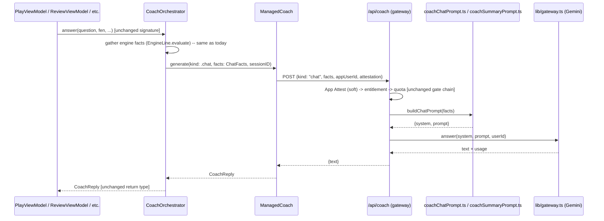

# feat: Move Pro coach prompts server-side, retire BYOK

**Target repos:** BOTH `GemmaChess` (this repo, client) and the nested `chesscoach-gateway/` (private, separate git repo, its own Vercel deployment).

## Summary

Today `CoachPromptBuilder` (`Sources/GemmaChessCore/Coach/CoachPrompt.swift`) assembles the Pro coach's full system+prompt text client-side — including the actual persona instructions (`chatInstructions`, `moveNoteInstructions`, `summaryInstructions`) — and `ManagedCoach` sends that finished text to `chesscoach-gateway`'s `/api/coach`, which simply relays it to the LLM. Anyone can read the coach's exact instructions in this open-source (GPL) repo. This plan applies the pattern already proven by the Weakness Report feature (`api/weaknessReport.ts` + `lib/weaknessReportPrompt.ts`, shipped 2026-07-19): the client sends only structured facts, and the gateway assembles the actual prompt privately before calling the LLM. All three coach interactions currently reaching `/api/coach` — chat, the per-move reaction note, and the end-of-game summary — move together, since they already share the same client plumbing (`CoachOrchestrator`) and endpoint. BYOK (`GeminiCoach`, direct client→Gemini calls with a user-supplied key) is retired in the same change, since it cannot coexist with prompts living only server-side.

## Problem Frame

`CoachOrchestrator` exposes four public methods (`answer`, `answerStream`, `gameSummary`, `summaryStream`) called from five view models (`BoardScannerView`, `ReviewViewModel`, `PlayViewModel`, `LessonViewModel`, `OpeningTrainerViewModel`). Internally, `composePrompt` builds structured facts (via `CoachPromptBuilder.engineFactsText`) and then formats them, together with one of three hard-coded personas, into a single text blob sent to `ManagedCoach.generate`/`.stream`, which POSTs `{system, prompt}` to `/api/coach`. `api/coach.ts` validates and relays that text as-is to the LLM via `lib/gateway.ts`.

This means the actual coaching instructions — including tone rules, formatting constraints, and behavioral guardrails developed through iteration — are plaintext in the client binary and this repo's git history. The Weakness Report already established the fix for exactly this problem for one feature; this plan extends it to the rest of the coach.

BYOK (`Sources/GemmaChessCore/Coach/GeminiCoach.swift`) calls Google's Gemini API directly from the client with a user-supplied key, entirely bypassing the gateway. It is structurally incompatible with the goal: BYOK's whole design requires the persona text to exist client-side to send to Gemini directly. There are no users on BYOK yet, so no migration path is needed — it is removed outright.

Confirmed not a cost concern: every Pro coach interaction already requires `ProEntitlementStore.shared.requireProOrThrow()` and already goes over the network to `/api/coach` today. This plan changes what's inside that existing call (structured facts instead of assembled text), not how often it fires.

## Requirements

- **R1** — Chat (`CoachOrchestrator.answer`/`.answerStream`), the per-move reaction note (same methods, `system: moveNoteInstructions` override), and the end-of-game summary (`gameSummary`/`summaryStream`) all send structured facts to the gateway; none send a client-assembled `system`/`prompt` pair.
- **R2** — The gateway assembles the actual persona instructions and formatted prompt text server-side, mirroring `lib/weaknessReportPrompt.ts`'s shape, and the resulting text is never returned to the client.
- **R3** — `CoachOrchestrator`'s four public method signatures (`answer`, `answerStream`, `gameSummary`, `summaryStream`) are unchanged, so none of the five existing call sites need to change.
- **R4** — `/api/coach` continues to serve all three "kinds" (chat, move-note, summary) through one endpoint, discriminated by a request field, reusing its existing entitlement/quota/App-Attest gate chain and the shared monthly token cap unchanged.
- **R5** — Streaming continues to work for chat and summary (both currently stream); the move-note path (non-streaming today via `answer`, not `answerStream` — confirm at implementation) is preserved as-is.
- **R6** — BYOK is fully removed: `GeminiCoach.swift`, `GeminiKeyStore.swift`, `CoachBackendPreference.swift`, the Gemini-key entry UI in `CoachSettingsView.swift`, and `BuildChannel.allowsGeminiBYOK` are deleted; Managed Coach becomes the only Pro backend on every channel.
- **R7** — No behavior change to the free tier, the already-migrated Weakness Report, or the local hint rationale templates (`HintRationaleTemplates.swift`).

## Key Technical Decisions

### KTD-1: One endpoint, three "kinds," not three endpoints

Chat, move-note, and summary already share `/api/coach` and its entire gate chain (App Attest, entitlement, quota) today — they differ only in which persona and fact shape apply. Splitting into three endpoints would triplicate that gate-chain code (a real risk of the three copies drifting, as already flagged as a maintenance concern in `api/weaknessReport.ts`'s near-duplicate App-Attest helper). Instead, `/api/coach`'s request schema gains a discriminated `kind: "chat" | "moveNote" | "summary"` field; the handler branches to the matching TypeScript prompt builder before calling `lib/gateway.ts`'s existing `answer`/`answerStream`. This is a breaking change to `/api/coach`'s wire contract, acceptable since there are no external consumers besides this app's own `ManagedCoach` and no shipped users yet.

### KTD-2: `CoachOrchestrator`'s public surface is preserved; only its internals and `ManagedCoach`'s wire contract change

`composePrompt` today turns structured facts into text via `CoachPromptBuilder.chatPrompt`. Under this plan, `CoachOrchestrator` instead assembles a facts payload (still gathering the same inputs — engine facts via `EngineLine.evaluate`, opening/profile/speed context) and hands it to `ManagedCoach`, which sends JSON facts instead of `{system, prompt}`. Because none of `answer`/`answerStream`/`gameSummary`/`summaryStream`'s parameters change, the five existing call sites (`BoardScannerView`, `ReviewViewModel`, `PlayViewModel`, `LessonViewModel`, `OpeningTrainerViewModel`) require no changes — the entire migration is contained to `Sources/GemmaChessCore/Coach/`.

### KTD-3: `CoachLLM` protocol's `generate`/`stream` signature changes from `(system, prompt)` to structured facts, now that `ManagedCoach` is its only conformer

Today `CoachLLM.generate(system:prompt:sessionID:)` is shaped around two conformers (`ManagedCoach`, `GeminiCoach`) that both need a plain `(system, prompt)` text pair — Gemini's REST API takes nothing else. With `GeminiCoach` removed (R6), `ManagedCoach` is the sole conformer, freeing the protocol to take whatever shape actually fits: a `kind` plus a facts payload, instead of pre-formatted text. `CoachOrchestrator` and `ManagedCoach` both need to change together; `CoachLLM` as an abstraction over "any text-generating backend" no longer earns its keep once there is exactly one backend — worth collapsing `CoachOrchestrator`'s `backends: [CoachLLM]`/`active` selection logic down to a direct `ManagedCoach` dependency in the same pass (see U1).

### KTD-4: TypeScript prompt builders mirror `CoachPromptBuilder.swift`'s three personas and formatting functions, ported not reinvented

`lib/coachChatPrompt.ts` and `lib/coachSummaryPrompt.ts` (or one `lib/coachPrompt.ts` covering both — implementer's call on file split) port `chatInstructions`, `moveNoteInstructions`, `summaryInstructions` (verbatim persona text — no rewriting) and the formatting logic of `engineFactsText`, `chatPrompt`, `gameFactsText`, `playGameFactsText`, `boardFactsText`, `openingFactsText` from Swift to TypeScript, following `lib/weaknessReportPrompt.ts`'s established shape (a pure function taking validated facts, returning `{system, prompt}`). The Swift originals stay in the client repo only as the historical/reference implementation until removed in U1's cleanup — the gateway versions become authoritative once this ships.

### KTD-5: Facts payload shape mirrors `CoachLineInfo`/`CoachGameInput`/`PlayMoveRecord`'s existing Swift structures, Zod-validated

The request schema's fact fields are a direct JSON transliteration of the Swift structs already carrying this data (`CoachLineInfo`, `CoachAltLine`, `CoachMoveInfo`, `CoachGameInput`, `CoachFlaggedMove`, `PlayMoveRecord`) — no new data model to design, just a wire encoding of what already exists. Per `api/weaknessReport.ts`'s established pattern, the Zod schema has no `system`/`prompt` fields at all, so even a client bug or malicious payload cannot smuggle prompt text through.

## High-Level Technical Design



## Implementation Units

### U1. Client: `CoachOrchestrator` + `ManagedCoach` send facts, not text; `CoachLLM` collapses to one backend

**Goal:** `CoachOrchestrator`'s public methods keep their exact signatures and return types; internally they assemble a facts payload per "kind" and hand it to `ManagedCoach`, which sends it as JSON. `CoachLLM`'s abstraction-over-multiple-backends is removed since `ManagedCoach` is now the only implementation.

**Requirements:** R1, R3, R4, R5

**Dependencies:** none (client-side unit; can be built against the gateway's new contract once U3 defines it — sequence after U3, or stub the gateway contract locally first and verify against U3's live endpoint)

**Files:**
- Modify: `Sources/GemmaChessCore/Coach/CoachOrchestrator.swift` (`composePrompt` becomes fact assembly, not text formatting; `backends`/`active` selection removed in favor of a direct `ManagedCoach` dependency)
- Modify: `Sources/GemmaChessCore/Coach/ManagedCoach.swift` (`generate`/`stream` accept a `kind` + facts payload, JSON-encode per the new gateway contract from U3)
- Modify: `Sources/GemmaChessCore/Coach/CoachLLM.swift` (protocol signature changes per KTD-3; consider whether the protocol abstraction is still worth keeping at all now that there is one conformer — implementer's call, document the choice)
- Modify: `Sources/GemmaChessCore/Coach/CoachPrompt.swift` (retains the fact-shaping structs — `CoachLineInfo`, `CoachGameInput`, etc. — and their construction helpers like `boardFactsText` if still needed client-side for anything; removes `chatInstructions`, `moveNoteInstructions`, `summaryInstructions`, `chatPrompt`, `engineFactsText`'s text-formatting, `gameFactsText`, `playGameFactsText` now that the equivalent logic lives server-side per U2)
- Test: `Tests/GemmaChessCoreTests/CoachOrchestratorTests.swift` (new or extend existing coverage if present — check first)
- Test: `Tests/GemmaChessCoreTests/ManagedCoachTests.swift` (existing per prior session's `ManagedCoachTests.swift` reference — extend for the new request shape)

**Approach:** Keep `CoachOrchestrator.answer(question:fen:lastMove:...)`'s parameter list identical. Where it currently builds `current`/`move` facts via `EngineLine.evaluate` + `CoachPromptBuilder.engineFactsText` and then calls `CoachPromptBuilder.chatPrompt(...)` to get text, it instead packages the same already-gathered structured data (question, fen, lastMove, moveFen, playerSide, opening/profile/speed context, `CoachLineInfo` for current/move) into a facts struct and passes `kind: .chat` (or `.moveNote` when `system` was overridden to `moveNoteInstructions` — thread a `kind` parameter through instead of a raw `system` string override) to `ManagedCoach.generate`. `gameSummary`/`summaryStream` similarly package `CoachGameInput`/`PlayMoveRecord` facts with `kind: .summary`.

**Patterns to follow:** `WeaknessReportClient.swift`'s existing shape (a facts-in, text-out client with no `system`/`prompt` concept) is the closest existing precedent for what `ManagedCoach`'s new request-building should look like, even though `WeaknessReportClient` is a standalone type outside the `CoachLLM` hierarchy — mirror its request-building style, not its class structure.

**Test scenarios:**
- Happy path: `CoachOrchestrator.answer(question:fen:...)` with no pre-supplied facts triggers an engine evaluation and produces a facts payload equivalent in content to what today's `chatPrompt` text would have encoded (assert on the facts struct's fields, not string matching).
- Happy path: `answer` with pre-supplied `currentFacts`/`moveFacts` (the existing caller-reuse path, e.g. from `requestHint`) skips the redundant engine call — same as today's behavior, verify the facts passed through unchanged.
- Happy path: `gameSummary`/`summaryStream` produce a `kind: .summary` facts payload matching `CoachGameInput`/`playGameFactsText`'s existing inputs.
- Edge case: the per-move reaction note path (`system: moveNoteInstructions` today) correctly maps to `kind: .moveNote` rather than being conflated with chat.
- Edge case: `ProEntitlementStore.requireProOrThrow()` still gates every method identically to today — no regression in the Pro gate.
- Integration: an end-to-end call against a mocked `URLProtocol` (mirroring `ManagedCoachTests.swift`'s existing pattern per the prior session) verifies the actual JSON body sent to `/api/coach` contains fact fields and no `system`/`prompt` keys.

**Verification:** Every existing call site (`BoardScannerView`, `ReviewViewModel`, `PlayViewModel`, `LessonViewModel`, `OpeningTrainerViewModel`) compiles and works unchanged; a network inspection of a live chat/summary/move-note call shows a facts-only JSON body.

---

### U2. Gateway: TypeScript prompt builders for chat, move-note, and summary

**Goal:** Port the three personas and their formatting logic from `CoachPromptBuilder.swift` to TypeScript, following `lib/weaknessReportPrompt.ts`'s established shape.

**Requirements:** R2, R4

**Dependencies:** none (can be built in parallel with U1; U3 depends on this)

**Files:**
- Create: `lib/coachChatPrompt.ts` (ports `chatInstructions`, `moveNoteInstructions`, `chatPrompt`, `engineFactsText`, `boardFactsText`, `openingFactsText` — or split move-note into its own file if the implementer judges the two personas' formatting differs enough to warrant it)
- Create: `lib/coachSummaryPrompt.ts` (ports `summaryInstructions`, `gameFactsText`, `playGameFactsText`)
- Test: `test/coachChatPrompt.test.ts` (new)
- Test: `test/coachSummaryPrompt.test.ts` (new)

**Approach:** Each builder is a pure function taking Zod-validated facts (matching U3's schema) and returning `{system, prompt}`, exactly mirroring `buildWeaknessReportPrompt`'s signature shape. Persona text (`chatInstructions` etc.) is copied verbatim from the Swift source — this plan does not revise the coaching voice, only relocates it. Formatting functions (`engineFactsText`, `gameFactsText`, etc.) are ported line-for-line for behavioral parity; TypeScript's string templating replaces Swift's `String(format:)`/string interpolation.

**Patterns to follow:** `lib/weaknessReportPrompt.ts` in full — its function signature shape, its comment style explaining *why* each instruction exists, and its lack of any client-facing export beyond the builder function itself.

**Test scenarios:**
- Happy path: `buildChatPrompt` with a representative facts payload (question, fen, current-position facts, an alternative move within `altWinGap`) produces prompt text containing the expected fact lines, mirroring `CoachPromptBuilder.chatPrompt`'s existing Swift test expectations if any exist (check for a `CoachPromptTests.swift` or similar to port assertions from).
- Happy path: `buildMoveNotePrompt` (or the chat builder with a move-note kind) produces the terse one-line-reaction persona, not the full chat persona.
- Happy path: `buildSummaryPrompt` with `CoachGameInput`-equivalent facts (including `mistakes`) produces the flagged-moves block sorted worst-first, matching `gameFactsText`'s existing sort order.
- Edge case: empty/no-mistakes game facts produce the "clean game" message (`gameFactsText`'s existing branch), not an empty block.
- Edge case: facts with no `profileFacts`/`speedContext`/`openingFacts` omit those prompt sections entirely (matching `chatPrompt`'s existing `if let` guards) rather than emitting empty placeholders.
- Edge case: a `playerSide` of white vs. black produces the correct "who is you" framing sentence for each (mirrors `chatPrompt`'s existing branch).

**Verification:** Given the same structured inputs, the TypeScript builders produce prompt text materially equivalent (same facts, same structure, same personas) to what the Swift `CoachPromptBuilder` would have produced for the same inputs today — spot-check a few real call-site payloads by hand.

---

### U3. Gateway: `/api/coach` accepts a `kind` + facts request, routes to the matching prompt builder

**Goal:** `/api/coach`'s request schema replaces `{system, prompt}` with `{kind, facts, ...}`; the handler builds the prompt server-side via U2's builders before calling `lib/gateway.ts`, keeping the existing gate chain (App Attest, entitlement, quota) and streaming support unchanged.

**Requirements:** R1, R2, R4, R5

**Dependencies:** U2

**Files:**
- Modify: `api/coach.ts` (request schema, prompt-building step, kind-based branching)
- Modify: `test/coach.test.ts` (update existing tests for the new request shape; check current file for what already exists before rewriting)
- Test: add a case verifying the schema has no `system`/`prompt` fields, mirroring `weaknessReport.test.ts`'s equivalent smuggling-prevention test

**Approach:** The Zod schema's `system`/`prompt` string fields are replaced with `kind: z.enum(["chat", "moveNote", "summary"])` plus a `facts` field whose shape is validated per-kind (a Zod discriminated union keyed on `kind`, or per-kind optional fields with cross-field validation — implementer's call). Immediately after the existing quota check (unchanged), branch on `kind` to call the matching U2 builder for `{system, prompt}`, then proceed exactly as today (`answer`/`answerStream` from `lib/gateway.ts`, `recordUsage`, `recordUsageEvent`, streaming response writing) — none of that downstream logic changes.

**Technical design:**
```
requestSchema = z.discriminatedUnion("kind", [
  z.object({ kind: "chat", facts: ChatFactsSchema, appUserId, stream, attestation, model? }),
  z.object({ kind: "moveNote", facts: MoveNoteFactsSchema, appUserId, attestation }),
  z.object({ kind: "summary", facts: SummaryFactsSchema, appUserId, attestation }),
])
...
const { system, prompt } = kind === "summary"
  ? buildSummaryPrompt(facts)
  : buildChatPrompt(facts, kind)   // chat vs moveNote persona selection inside
```
Directional only — exact schema composition (discriminated union vs. per-kind endpoint-internal branching) is an implementation-time call.

**Patterns to follow:** `api/weaknessReport.ts` end-to-end — its App-Attest helper, entitlement/quota sequencing, and the "no system/prompt in the schema" test pattern from `test/weaknessReport.test.ts`.

**Test scenarios:**
- Happy path: a `kind: "chat"` request with valid facts returns 200 with generated text, same response shape as today.
- Happy path: a `kind: "summary"` request returns 200 with generated text.
- Happy path: a `kind: "chat", stream: true` request still streams SSE chunks correctly (Covers the existing streaming test if one exists in `test/coach.test.ts` — adapt it).
- Edge case: a request with an invalid/missing `kind` is rejected with 400.
- Edge case: a request that includes extraneous `system`/`prompt` fields alongside valid facts has those fields silently dropped by Zod and never reaches the prompt builder — direct port of `weaknessReport.test.ts`'s smuggling-prevention test.
- Edge case: `kind: "moveNote"` facts missing a required field (e.g. no move classification) is rejected with 400, not silently defaulted.
- Regression: entitlement/quota/App-Attest gating behavior (403 not-subscribed, 402 quota-exceeded, soft-fail App Attest) is unchanged from today's `test/coach.test.ts` coverage — re-run those cases against the new schema shape.

**Verification:** `npm test` passes with the updated/new test files; `npm run typecheck` is clean; a manual `curl` against a local dev server with a `kind: "chat"` facts payload returns coaching text with no `system`/`prompt` ever appearing in the request.

---

### U4. Client: retire BYOK

**Goal:** Remove `GeminiCoach`, the Gemini key store, the backend-choice preference, and the BYOK UI in Coach Settings; Managed Coach is the only Pro backend on every `BuildChannel`.

**Requirements:** R6

**Dependencies:** U1 (cleanest once `CoachOrchestrator`'s backend-selection logic is already being touched)

**Files:**
- Delete: `Sources/GemmaChessCore/Coach/GeminiCoach.swift`
- Delete: `Sources/GemmaChessCore/Coach/GeminiKeyStore.swift`
- Delete: `Sources/GemmaChessCore/Coach/CoachBackendPreference.swift`
- Modify: `Sources/GemmaChessCore/Coach/BuildChannel.swift` (remove `allowsGeminiBYOK`)
- Modify: `Sources/GemmaChessCore/UI/CoachSettingsView.swift` (remove `geminiIntroSection`/`geminiKeySection`/`geminiModelSection`/`geminiFooterSection`, the backend-choice picker, and `offersChoice`; the managed-coach section becomes unconditional)
- Delete or update any tests referencing the removed types (search `Tests/GemmaChessCoreTests/` for `GeminiCoach`, `GeminiKeyStore`, `CoachBackendPreference` first)

**Approach:** Straightforward deletion once U1 has already collapsed `CoachOrchestrator` to a single `ManagedCoach` dependency — this unit removes the now-dead code around it. `CoachSettingsView` keeps its managed-coach section (local-dev backend URL/debug token entry, TestFlight auto-config messaging, App Store subscribe/restore) exactly as-is; only the BYOK-specific sections and the segmented picker between them are removed.

**Patterns to follow:** None new — this is subtraction, following the shape already established by U1's `CoachOrchestrator` changes.

**Test scenarios:**
- Happy path: `CoachSettingsView` renders correctly on every `BuildChannel` (local, TestFlight, App Store production) with only the managed-coach section present.
- Regression: no remaining reference to `GeminiCoach`/`GeminiKeyStore`/`CoachBackendPreference`/`allowsGeminiBYOK` anywhere in `Sources/` or `Tests/` (a grep-based check, not necessarily an automated test).
- Test expectation: none beyond the above -- this unit is subtractive with no new behavior to unit test beyond confirming the settings screen still renders per channel.

**Verification:** The app builds and runs with zero BYOK code paths reachable; Coach Settings shows only ChessCoach Pro configuration on every channel.

---

## Scope Boundaries

### Deferred for later
- Any change to Weakness Report's already-migrated endpoint or prompt.
- Any change to the free local hint rationale templates (`HintRationaleTemplates.swift`) — untouched, zero network, out of scope.
- A stale-BYOK-key migration/notice flow — explicitly not needed (no existing users).

### Outside this plan's scope entirely
- Any pricing, quota, or entitlement logic change (the existing gate chain is reused unchanged).
- Any change to which LLM/model the gateway calls (`lib/modelSelection.ts` untouched).

## Sources & Research

- Pattern reference (primary): `docs/plans/2026-07-19-005-feat-coach-weakness-report-plan.md`, `chesscoach-gateway/api/weaknessReport.ts`, `chesscoach-gateway/lib/weaknessReportPrompt.ts`.
- Client code read directly during planning: `Sources/GemmaChessCore/Coach/CoachOrchestrator.swift`, `CoachPrompt.swift`, `CoachLLM.swift`, `ManagedCoach.swift`, `GeminiCoach.swift`, `CoachBackendPreference.swift`, `BuildChannel.swift`, `Sources/GemmaChessCore/UI/CoachSettingsView.swift`, and call sites in `PlayViewModel.swift`, `ReviewViewModel.swift`, `BoardScannerView.swift`, `LessonViewModel.swift`, `OpeningTrainerViewModel.swift`.
- Gateway code read directly during planning: `chesscoach-gateway/api/coach.ts`, `lib/gateway.ts`.
