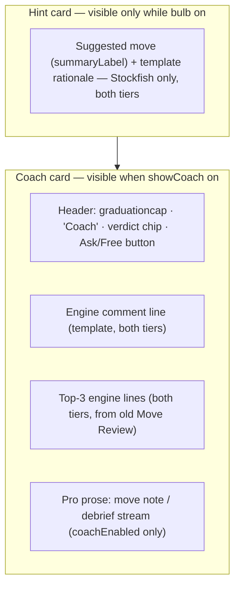

# feat: Unified Coach card in Play

## Summary

Merge Play's "Move Review" and "Coach" cards into one Coach card: engine verdict + a short template-based engine comment on both tiers, with the Pro coach's streamed prose beneath for subscribers, and an "Ask"/"Free" button on the card header. The bulb becomes a persistent hint mode showing a compact, engine-only hint card above Coach (the Pro-streamed hint rationale is removed). A single Coach toggle replaces the separate `showMoveComments` and `showCoach` switches.

---

## Problem Frame

Play splits engine commentary across three differently-controlled surfaces: a hint card with no toggle (lightbulb-driven), a Move Review card gated by `showMoveComments`, and a Coach card gated by `showCoach`. The same conceptual thing — the app commenting on the game — is scattered, and the ⋯ menu's toggle set doesn't match how users think about it. The origin doc (see `docs/brainstorms/2026-07-21-unified-coach-card-requirements.md`) pins the product shape: Coach explains the last move (one card, one toggle, Pro adds prose), Stockfish suggests the next one (bulb, free everywhere).

---

## Key Technical Decisions

- **Keep the `play.showCoach` UserDefaults key as the single Coach toggle; delete `play.showMoveComments` and `play.showBestMove`.** `showCoach` already drives `coachDisplayEnabled` → `coachEnabled` in `PlayViewModel`, which stops all coach network calls when off (R5's requirement). `showBestMove` is dead code — persisted and tested but read by no view. No migration for deleted keys: pre-launch, orphaned defaults are harmless.
- **Bulb becomes view-model state (`hintMode`), not a per-request action.** Today `requestHint()`/`clearHint()` are one-shot and a played move clears the hint. The bulb now sets a mode; while on, the view model re-requests the hint whenever it becomes the user's turn, and turns off at game start. Auto-refresh is free (Stockfish-only) so a lit bulb never costs anything (R8).
- **Remove the Pro hint stream at the source.** `requestHint()` drops its `coachEnabled`-gated `answerStream` branch entirely; `HintInfo` loses `rationale` and `isLoading`, and `freeRationale` becomes the only rationale (rename to `rationale`). This deletes a `CoachOrchestrator.answerStream` call site — the orchestrator itself is unchanged.
- **The free engine comment is template-based, mirroring `HintRationaleTemplates`.** A new template set builds one line about the played move from facts the move handler already has: classification, `betterMoveSAN`, eval/mate, and material-change detection via `Motifs`' hanging-piece/capture helpers (the existing backward-looking classifier, built on `BoardAttacks`). No network, no LLM.
- **Card tier split keys off the entitlement predicate, not coach availability.** `CoachAvailability` is config-based and entitlement-blind, so it cannot distinguish free from Pro. "Free" shows when `BuildChannel.current.requiresProEntitlement && !ProEntitlementStore.shared.isProActive` (the exact check `openChat()` already uses), opening `PaywallView`; "Ask" shows otherwise. The per-move Pro prose request (move note / debrief) gates on the same predicate so free App Store users never fire a doomed 403-per-move network call; `coachEnabled` continues to cover the toggle-off and config-unavailable cases.

---

## Requirements

Carried from origin (R-IDs match the requirements doc).

**Coach card**

- R1. One "Coach" card replaces "Move Review" and "Coach" in Play's in-game layout.
- R2. After each player move the card shows the Stockfish verdict and a short engine-derived comment, on both tiers.
- R3. Pro prose streams in beneath the engine content of the same card.
- R4. Card header button: "Ask" (Pro → chat) / "Free" (free tier → paywall).
- R5. One Coach toggle shows/hides the card and stops all coach network calls when off.

**Hint (bulb)**

- R6. Bulb is on/off; while on, a compact hint card sits above Coach with the suggested move and one-line rationale.
- R7. Hint content is Stockfish-only and identical on both tiers; the Pro hint stream is removed.
- R8. Bulb never triggers network calls or credit spend.

**Toggles**

- R9. The ⋯ menu's commentary toggles collapse to the single Coach toggle; board options (captured, move list, opening) stay.

---

## High-Level Technical Design

Unified card composition (directional, not a layout spec):

State flow: `hintMode` (VM) drives hint requests on turn change → `hint: HintInfo?` renders the hint card. `settings.showCoach` → `coachDisplayEnabled` → `coachEnabled` gates C3's network work exactly as today; C0–C2 render whenever the card is visible, regardless of tier.

---

## Implementation Units

### U1. Toggle consolidation and settings cleanup

- **Goal:** One Coach toggle; retired keys removed; Settings copy current.
- **Requirements:** R5, R9.
- **Dependencies:** none.
- **Files:** `Sources/GemmaChessCore/ViewModels/PlayDisplaySettings.swift`, `Sources/GemmaChessCore/UI/PlayView.swift` (menuButton and the two body reads of `showMoveComments`), `Sources/GemmaChessCore/UI/SettingsView.swift`, `Tests/GemmaChessCoreTests/PlayDisplaySettingsTests.swift`.
- **Approach:** Delete `showMoveComments` and `showBestMove` properties, keys, and registered defaults from `PlayDisplaySettings`. PlayView's body reads `showMoveComments` twice (the `bestMovesCard` gate and its spacer else-branch) — remove both so the package compiles at this unit's checkpoint, rendering `bestMovesCard` unconditionally as the interim state (U4 deletes it). In PlayView's ⋯ menu, drop the "Move review" toggle and relabel the Coach toggle plainly ("Coach"); in SettingsView, drop the "Move review" toggle from Play defaults, keep the Coach section's toggle, and update the stale "Coach backend (ChessCoach Pro / Gemini)" label and Gemini-credit footer copy to the managed-only world (BYOK was removed this week).
- **Patterns to follow:** existing `PlayDisplaySettings` didSet-persist pattern; SettingsView section/footer style.
- **Test scenarios:**
  - Defaults: fresh settings has `showCoach == true`; deleted properties no longer exist (compile-time).
  - Persistence: toggling `showCoach` off persists across a new `PlayDisplaySettings` instance.
  - Independence: `showCoach` toggle leaves `showCaptured`/`showMoveList`/`showOpening` untouched.
- **Verification:** Package builds; `PlayDisplaySettingsTests` pass; no references to the deleted keys remain. R5's network-stop half is preserved from the existing `coachEnabled` gating and is confirmed by U4's verification, not here.

### U2. Hint mode: persistent bulb, engine-only rationale

- **Goal:** Bulb is a mode; hint auto-refreshes on the user's turn; Pro hint stream removed.
- **Requirements:** R6, R7, R8. Covers origin AE3.
- **Dependencies:** none.
- **Files:** `Sources/GemmaChessCore/ViewModels/PlayViewModel.swift` (`HintInfo`, `requestHint`, move handler, `startNewGame`), `Sources/GemmaChessCore/UI/PlayView.swift` (hintButton, hintCard), `Tests/GemmaChessCoreTests/PlayHintTests.swift`.
- **Approach:** Add `hintMode: Bool` to the view model; bulb toggles it. While on, request a hint whenever it becomes the user's turn (after the opponent replies, after undo). During a refresh, keep the previous hint (card and board arrows) visible unchanged until the new analysis resolves — never a blank or stale-flash interval, and never hint content for a position that isn't current when it lands (drop stale results if the position advanced). Mode resets to off at new-game setup. Strip `HintInfo.rationale`/`isLoading` and the `answerStream` branch from `requestHint`; keep the template rationale as the sole rationale field. Slim the hint card: drop the FREE capsule and streamed-prose block; keep summary label, rationale line, and the close button (closing also turns the mode off).
- **Execution note:** Update `PlayHintTests` characterization first — several existing tests assert the cleared-on-move and dual-field behavior this unit changes.
- **Test scenarios:**
  - Covers AE3. Bulb on → hint appears with template rationale and no network dependency (`coachEnabled` false and true produce identical `HintInfo`).
  - Mode persistence: with mode on, user plays a move and the engine replies → a fresh hint appears for the new position without another bulb tap.
  - Mode off: bulb off (or card closed) → hint cleared and no re-request on subsequent turns.
  - New game: mode is off at the start of a new game even if left on previously.
  - Edge: game over / viewing history → no auto-request fires.
- **Verification:** `PlayHintTests` pass; no `answerStream` call remains in `requestHint`; hint behavior identical with coach disabled.

### U3. Move-comment templates

- **Goal:** A free one-line engine comment about the played move, for the unified card body.
- **Requirements:** R2.
- **Dependencies:** none.
- **Files:** `Sources/GemmaChessCore/Coach/MoveCommentTemplates.swift` (new), `Tests/GemmaChessCoreTests/MoveCommentTemplatesTests.swift` (new).
- **Approach:** Pure function from played-move facts (classification, SAN, `betterMoveSAN`, eval string, FENs before/after) to one sentence. Material-change detection uses `Motifs`' hanging-piece/capture helpers on `BoardAttacks` primitives — `HintRationaleTemplates`' capture check is forward-looking only and can't detect a played move losing material. Priority order mirrors `HintRationaleTemplates`: mate delivered/allowed > material won/lost > blunder/mistake naming the better move > good/best affirmation > neutral fallback. Reuse `HintRationaleTemplates.mateIn` for eval parsing, verifying the sign convention for the after-move (side-to-move flipped) perspective.
- **Patterns to follow:** `Sources/GemmaChessCore/Coach/HintRationaleTemplates.swift` — same enum-of-static-functions shape, same fail-soft philosophy (always returns a usable string).
- **Test scenarios:**
  - Best move → affirming line; blunder with `betterMoveSAN` → line naming the better move.
  - Move that loses material (FEN diff) → line mentioning the loss; capture that wins material → line mentioning the gain.
  - Eval `"#2"` after the move → mate-threat phrasing; malformed/empty inputs → generic fallback, never crashes.
- **Verification:** New test suite passes; function is deterministic for fixed inputs.

### U4. Unified Coach card in PlayView

- **Goal:** One card replacing Move Review + Coach, with the tiered body and Ask/Free header button.
- **Requirements:** R1, R2, R3, R4. Covers origin AE1, AE2, AE4.
- **Dependencies:** U1, U2, U3.
- **Files:** `Sources/GemmaChessCore/UI/PlayView.swift` (body layout, `bestMovesCard` removal, `coachCard`, `focusLine`, `verdictChip`), `Sources/GemmaChessCore/ViewModels/PlayViewModel.swift` (expose the U3 comment alongside `lastVerdict`).
- **Approach:** Remove `bestMovesCard` and its layout slot. Coach card header gains the verdict chip (moved from Move Review) and the Ask/Free button per KTD; body stacks the U3 engine comment, the top-3 lines list, then the existing `focusLine` (Pro prose: per-ply note / debrief / streaming states). Replace `focusLine`'s free-tier filler ("Engine review only…") — the engine comment and lines now fill that role; keep the error branch with its subscribe button. Empty state before the first move keeps a single "Make a move…" line. History browsing (`vm.viewingPly != nil`): the live-only engine comment and top-3 lines hide; the verdict chip shows the browsed ply's classification from the already-persisted `moveRecords`; the per-ply note keeps its current behavior — so the card never shows live content against a historical position.
- **Test scenarios:** UI composition is exercised manually plus by the view-model-level assertions below (the repo has no snapshot tests):
  - Covers AE1/AE2 (view-model level): after a graded move, `lastVerdict` and the U3 comment are non-nil regardless of `coachEnabled`; Pro prose (`lastCoachNote`) populates only when `coachEnabled`.
  - Covers AE4: with `showCoach` off, `coachDisplayEnabled` is false and no coach requests fire after moves (existing `coachEnabled` gating tests extend to the unified card wiring).
  - Manual: free build shows "Free" button → paywall sheet; Pro/dev shows "Ask" → chat sheet.
- **Verification:** Builds and runs on device; free tier shows verdict + comment + lines with nothing visibly locked; Pro adds prose beneath; Move Review card gone.

---

## Scope Boundaries

- Coach chat, gateway, prompts, entitlement logic: unchanged.
- Review, Puzzles, Lessons, Opening Trainer coaching surfaces: untouched.
- End-of-game debrief stays in the Coach card's `focusLine` slot, unchanged.

### Deferred to Follow-Up Work

- Per-feature sub-toggles under Coach (rejected in origin; revisit only on user demand).
- Persisting bulb state across games (reset-per-game chosen; cheap to revisit).

---

## Risks & Dependencies

- **Auto-refreshing hints add one uncached `analyse` call per user turn while the bulb is on.** The `EnginePool` cache only dedupes repeats of the same position (bulb re-toggle, undo), so each new position is a miss, serialized behind the move-grading and eval queries on the pool's single busy gate — confirm hint/verdict latency stays acceptable on older devices during manual testing.
- **`PlayHintTests` and `PlayDisplaySettingsTests` encode the old behavior** and will fail until updated — expected, handled per-unit, not a regression signal.
- **Full-suite flakiness** under parallel Stockfish load is a known repo condition; isolate suites before treating failures as caused by this work.

---

## Sources / Research

- Grounding dossier with verified quotes: `/tmp/compound-engineering/ce-brainstorm/coach-surface-unify/grounding.md` (session-temporary).
- Current card structure and gating: `Sources/GemmaChessCore/UI/PlayView.swift` (body ~103–133, menu ~318–345, hintButton/hintCard ~366–429, bestMovesCard ~449–489, coachCard/focusLine ~491–583).
- Toggle keys/defaults: `Sources/GemmaChessCore/ViewModels/PlayDisplaySettings.swift`.
- Hint flow and coach gating: `Sources/GemmaChessCore/ViewModels/PlayViewModel.swift` (`requestHint` ~305–369, `coachDisplayEnabled`/`coachEnabled` ~228–237).
- Template pattern: `Sources/GemmaChessCore/Coach/HintRationaleTemplates.swift`.
- Prior structure decisions: `docs/plans/2026-06-26-001-feat-play-ui-enhancements-plan.md`; free/Pro gating rule: `docs/plans/2026-07-18-001-feat-free-tier-feature-expansion-plan.md`.
