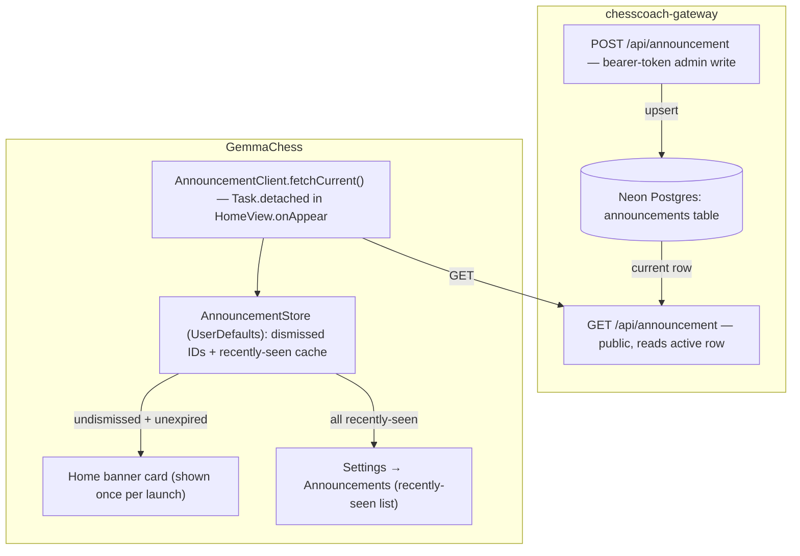

# feat: In-app announcement banner

**Target repos:** this repo (GemmaChess, client) and the nested `chesscoach-gateway/` repo (private, separate git repo).

## Summary

Add a single dismissible "nudge" card on Home for occasional announcements (promo codes, launches, offers), sourced from a small gateway endpoint the user can update via an authenticated POST — no redeploy per message. Dismissing hides it for good on that device; a small "Announcements" entry in Settings lets a user revisit anything they dismissed.

---

## Problem Frame

ChessCoach has no way to reach installed users with an occasional message — a coupon, a Product Hunt launch, a new offer — short of an app update. The user's explicit design constraint: this must read as a low-key nudge, never an interruption — no push permission prompt, no modal takeover, no repeated nagging after a dismiss. A user who dismisses by accident should still be able to find the message again.

---

## Key Technical Decisions

- **Home-only placement, once per app launch.** A single themed card at the top of `HomeView.actions`, following the existing `weaknessReportCard`/`beginnersCard` teaser-card idiom (`Sources/GemmaChessCore/UI/RootView.swift`). Shown at most once per process lifetime via a non-persisted `@State` flag — re-entering Home mid-session doesn't re-show it, and it never appears mid-game or mid-puzzle since Play/Puzzles are separate tabs. This is deliberately a passive channel for users who already open the app, not a time-critical broadcast — a flash-sale-style announcement with a strict deadline may not reach everyone before it expires, and that's an accepted tradeoff of the "never an interruption" goal, not an oversight.
- **Dismiss is permanent, per announcement ID.** Mirrors the "never nag" instinct behind `ReviewPromptStore`'s lifetime cap: dismissing announcement `X` hides `X` forever on that device, tracked by ID so a *new* announcement still shows even if a past one was dismissed.
- **New `AnnouncementStore` mirrors `ReviewPromptStore`'s shape, not `PlayDisplaySettings`'s.** Dismissed IDs and a small recently-seen cache are device-local facts, not live view-bound preferences — a plain `enum` over `UserDefaults` with an injectable `defaults:` parameter (for testability) fits better than an `@Observable` class.
- **Gateway endpoint skips App Attest and entitlement gating entirely.** This isn't a paid feature or a client trust boundary — `api/coach.ts`'s layered gates don't apply. The read side (`GET`) is public, matching `api/usage.ts`'s minimal shape; the write side (`POST`, admin-only) uses a single timing-safe bearer-token check mirroring `lib/revenueCat.ts`'s `verifyWebhookAuth`, not App Attest.
- **Content is persisted in Neon Postgres (`DATABASE_URL`), not a hand-edited file.** Considered and rejected: a static JSON file edited and redeployed (this session's initial default suggestion) — the user explicitly chose the authenticated-endpoint alternative specifically to avoid a deploy per update, which is the deciding factor given how the endpoint will actually be used (frequent small edits, not infrastructure). A new `announcements` table (mirroring the existing `usage_ledger`/`entitlements` tables in `lib/schema.sql`) holds announcement history; the admin endpoint always inserts a new row rather than updating one in place (see next decision).
- **Re-promoting or editing content always means a new row (and a new ID), never an in-place edit.** If `POST` could update an existing row's text while keeping its ID, everyone who already dismissed that ID would silently never see the edit — the dismissed-set only ever compares IDs. Making every `POST` an insert (the `GET` endpoint returns the most recent non-expired row) sidesteps this entirely: an edit is definitionally a new announcement with a new ID, so it reaches previously-dismissing users the same as any other new announcement. This is the intended workflow, not a gap — re-running or updating an offer always mints a new ID.
- **Wire contract mirrors this session's established convention**: the Swift `Codable` struct and the TS Zod schema share identical field names (`id`, `title`, `body`, `link`, `expiresAt`) — no separate naming per side.

---

## Requirements

**Gateway**

- R1. A public `GET` endpoint returns the current active announcement (`{id, title, body, link, expiresAt}`) or a null/empty response when none is active or the active one has expired.
- R2. An authenticated `POST` endpoint lets the developer create/replace the current announcement, gated by a single bearer-token check against an env-var secret (not App Attest, not RevenueCat entitlement).
- R3. Announcement content persists in Neon Postgres so a new announcement never requires a redeploy.

**Client**

- R4. Home shows at most one announcement card per app launch, only when an unexpired, undismissed announcement exists.
- R5. Dismissing an announcement hides it permanently on that device, keyed by announcement ID (a later, different announcement still shows).
- R6. A "Announcements" entry in Settings lists recently-seen announcements (including dismissed ones) so a user can revisit one they dismissed by accident.
- R7. Fetching the announcement fails soft — a network error or malformed response never blocks or delays the Home screen, and simply results in no banner.

---

## High-Level Technical Design

State flow: on Home's `.onAppear`, fetch the current announcement (fail-soft); if it exists, record it in `AnnouncementStore`'s recently-seen cache regardless of dismiss state, then show the card only if its ID isn't in the dismissed set and it hasn't expired. Dismissing adds the ID to the dismissed set. Settings' Announcements screen reads the recently-seen cache directly, independent of dismiss state, so a dismissed one is still listed there with its content and link intact.

---

## Implementation Units

### U1. Gateway: announcement storage and endpoint

- **Goal:** Persist and serve the current announcement; let the developer update it without a redeploy.
- **Requirements:** R1, R2, R3.
- **Dependencies:** none.
- **Files:** `chesscoach-gateway/lib/schema.sql` (new table), `chesscoach-gateway/lib/announcements.ts` (new — query helpers), `chesscoach-gateway/api/announcement.ts` (new), `chesscoach-gateway/.env.example` (new secret documented), `chesscoach-gateway/test/announcement.test.ts` (new).
- **Approach:** Add an `announcements` table (`id TEXT PRIMARY KEY, title TEXT, body TEXT, link TEXT, expires_at TIMESTAMPTZ, created_at TIMESTAMPTZ DEFAULT now()`) to `lib/schema.sql`, following that file's `CREATE TABLE IF NOT EXISTS` convention. `lib/announcements.ts` exposes `getCurrentAnnouncement()` (returns the most-recently-created non-expired row, ordered by `created_at DESC LIMIT 1`, or null) and `insertAnnouncement(...)` (always inserts a new row — never updates an existing one, per the Key Technical Decision above), both using the `neon(...)` tagged-template pattern from `lib/ledger.ts`. `api/announcement.ts` dispatches on HTTP method: `GET` calls `getCurrentAnnouncement()` and returns it (or `null`) with no auth; `POST` validates a bearer token via a new `verifyAnnouncementAuth(header)` in `lib/announcements.ts` (timing-safe compare against `process.env.CHESSCOACH_ANNOUNCEMENT_ADMIN_TOKEN`, structurally identical to `lib/revenueCat.ts`'s `verifyWebhookAuth`), rate-limits repeated failed-auth attempts (a simple per-process or per-IP counter is enough given this endpoint's low real traffic — no need to match `coach.ts`'s heavier quota machinery), Zod-validates the body (`title`/`body` capped at a few hundred/few thousand characters; `link`, when present, must parse as an `http`/`https` URL — reject other schemes), then inserts.
- **Patterns to follow:** `chesscoach-gateway/api/usage.ts` (minimal endpoint shape: Zod `safeParse`, method check, typed JSON response); `chesscoach-gateway/lib/revenueCat.ts`'s `verifyWebhookAuth` (bearer-token pattern, adapt to a single static token rather than a webhook signature); `chesscoach-gateway/lib/ledger.ts` (Neon query style).
- **Test scenarios:**
  - `GET` with an active, unexpired announcement returns its fields.
  - `GET` with no announcement, or only an expired one, returns null (not a 404/500).
  - `GET` with multiple past announcements returns only the most recently created non-expired one.
  - `POST` with a valid bearer token and body inserts a new row and is reflected in the next `GET`.
  - `POST` with a missing or wrong bearer token is rejected (401/403), body is not persisted; repeated failures are throttled.
  - `POST` with an invalid body (Zod failure — oversized title/body, or a `link` with a non-http(s) scheme) returns 400, does not touch the database.
  - `POST` with the same `id` as an existing row is rejected or treated as a new insert per the schema's primary-key constraint — confirm which, since content edits are expected to use a new ID, not reuse one.
- **Verification:** New test suite passes; a manual `curl` against a deployed instance shows the full author → fetch round trip.

### U2. Client: AnnouncementStore and fetch client

- **Goal:** Device-local persistence and a fail-soft network client, independent of any UI.
- **Requirements:** R5, R6, R7.
- **Dependencies:** none.
- **Files:** `Sources/GemmaChessCore/Announcements/AnnouncementStore.swift` (new), `Sources/GemmaChessCore/Announcements/AnnouncementClient.swift` (new), `Sources/GemmaChessCore/Announcements/Announcement.swift` (new — the Codable wire struct), `Tests/GemmaChessCoreTests/AnnouncementStoreTests.swift` (new).
- **Approach:** `Announcement` is a small `Codable, Equatable, Sendable` struct with fields matching the gateway's wire names exactly (`id`, `title`, `body`, `link`, `expiresAt`). `AnnouncementStore` follows `ReviewPromptStore.swift`'s shape at the API level — a plain `enum`, static funcs, injectable `defaults: UserDefaults = .standard`, a `reset()` — but its storage is necessarily more involved than `ReviewPromptStore`'s two bare scalars: the dismissed-ID set and the recently-seen cache (an array of `Announcement`) need `JSONEncoder`/`JSONDecoder` round-tripping under their own keys, with corrupt/missing data treated as empty rather than a crash, and the cache capped (e.g. last 10, oldest evicted first) so it can't grow unbounded. `shouldShow(_:dismissedIDs:now:) -> Bool` is a pure function checking not-expired and not-dismissed. `AnnouncementClient` reuses `ManagedCoachStore.loadBackendURL()` for the base URL (same backend host as the coach, no new config surface) and does a plain unauthenticated `GET`; any failure (network, decode) returns `nil`, never throws to the caller.
- **Patterns to follow:** `Sources/GemmaChessCore/ReviewPrompt/ReviewPromptStore.swift` (store shape, injectable `defaults:`, `reset()` for Settings); `Sources/GemmaChessCore/Coach/ManagedCoachStore.swift` (backend URL source).
- **Test scenarios:**
  - `shouldShow` is true for an unexpired, undismissed announcement; false once dismissed; false once expired.
  - Recording a seen announcement adds it to the recently-seen cache even if never shown (i.e., independent of dismiss/shouldShow) so Settings can list it.
  - Cache caps at its configured limit — oldest entries drop as new ones arrive.
  - `reset()` clears both dismissed IDs and the recently-seen cache.
  - `AnnouncementClient` returns `nil` (not a thrown error) on a malformed response body — covers R7's fail-soft requirement.
- **Verification:** New test suite passes; no test requires network access (client tests use an injected/mocked transport or accept `nil` paths only).

### U3. Client: Home banner card

- **Goal:** Show the announcement, once per launch, without blocking Home.
- **Requirements:** R4, R5, R7.
- **Dependencies:** U2.
- **Files:** `Sources/GemmaChessCore/UI/RootView.swift` (HomeView).
- **Approach:** Add a themed card following `weaknessReportCard`/`beginnersCard`'s structure (icon + title/body `VStack`, `theme.cardBackgroundColor`, stroke border), gated by a non-persisted `@State` flag set from a `Task.detached` fetch in `HomeView.onAppear`. Unlike the existing `weaknessReportTeaser` fetch this precedent mirrors (which reads a local file, no network), this fetch is a real network call — the task must be cancelled if the view disappears before it resolves, and a reasonable timeout applies so a slow/unreachable gateway never leaves the flag pending indefinitely. Nothing renders while the fetch is in flight (no skeleton/placeholder), so Home's layout never shifts to make room for a pending card. On fetch success, call `AnnouncementStore.recordSeen(...)` unconditionally, then only render the card if `AnnouncementStore.shouldShow(...)` is true.
  Unlike `weaknessReportCard` (a single wrapping `Button`), this card has two independent tap targets that must not both fire from one tap: the dismiss control (✕, with `.accessibilityLabel("Dismiss announcement")`) is a sibling control with its own tap target, not nested inside a card-wide `Button` — e.g. the title/body `VStack` carries its own tap gesture (or is itself the only `Button`/`Link`) while the ✕ sits outside that tappable region. Tapping the body opens `link` via `Link`/`openURL` when present; when there's no link, the body is not an interactive control (no chevron, no tap effect) — only the ✕ does anything.
- **Test scenarios:** UI composition — no snapshot tests in this repo; covered by U2's pure-function tests plus manual verification (U4 covers the Settings side; this unit's manual check is listed under Verification below).
  - Test expectation: none for the view itself — behavior is exercised by U2's `AnnouncementStore`/`AnnouncementClient` tests; this unit is composition only.
- **Verification:** Manual: fresh launch with an active announcement shows the card once; re-entering Home (without relaunching) doesn't re-show a dismissed card; a relaunch after dismiss never shows that same ID again.

### U4. Client: Settings "Announcements" entry

- **Goal:** Let a user revisit anything they dismissed.
- **Requirements:** R6.
- **Dependencies:** U2.
- **Files:** `Sources/GemmaChessCore/UI/SettingsView.swift`, `Sources/GemmaChessCore/UI/AnnouncementsView.swift` (new).
- **Approach:** Add its own `Section("Announcements") { NavigationLink("Announcements") { AnnouncementsView() } }` in `SettingsView` (not folded into "About" — unrelated content), matching the file's `Section { } header: { } footer: { }` convention. `AnnouncementsView` lists `AnnouncementStore`'s recently-seen cache, newest first; each row shows title/body and, when the cache is empty, a centered "No announcements yet" caption instead of a blank list. Each still-active row's link (if present) is tappable, same as the Home card; an expired row shows a trailing "Expired" caption in secondary text color and its link is not tappable (a stale offer shouldn't be actionable). No dismiss/undismiss action needed here since revisiting is the whole point; re-triggering the Home banner isn't (see Scope Boundaries).
- **Test scenarios:** Test expectation: none — pure list rendering over data already covered by U2's store tests; no new decision logic here.
- **Verification:** Manual: Settings → Announcements shows a previously-dismissed announcement's full content and link.

---

## Scope Boundaries

- No push notifications — this is content shown only to users who already have the app open, not a re-engagement channel for lapsed users (explicitly discussed and deferred in the earlier product conversation).
- No rich content (images, multiple simultaneous announcements, per-user targeting) — one active text+link announcement at a time.
- No in-app "un-dismiss and show again on Home" action from Settings — revisiting the content in Settings is the stated need; re-triggering the Home banner isn't.
- Any dedicated admin UI for authoring announcements (beyond a `curl`/script hitting the `POST` endpoint) is out of scope.

### Deferred to Follow-Up Work

- An admin UI or CLI wrapper around the `POST` endpoint, if manual `curl` proves tedious in practice.
- Multiple concurrently-active announcements or a rotation/priority scheme.

---

## Risks & Dependencies

- **Neon Postgres already provisioned** (`DATABASE_URL`, used by `lib/ledger.ts`) — no new infrastructure, just a new table.
- **Fail-soft is load-bearing (R7).** A slow or failing `GET` must never delay Home's own render; the `Task.detached` pattern already used for the weakness-report teaser is the existing, proven precedent for this.
- **Bearer-token secret handling**: the admin token is a shared secret in an env var, not a per-request signed credential like App Attest — acceptable here since this is a developer-only write path, not a user-facing trust boundary, but the token must never be logged or echoed in responses, and it's a distinct secret from `CHESSCOACH_REVENUECAT_WEBHOOK_SECRET` — don't reuse or confuse the two when scripting the admin `curl` workflow.

---

## Sources / Research

- Teaser-card precedent: `Sources/GemmaChessCore/UI/RootView.swift` (`weaknessReportCard`, `beginnersCard`, `HomeView.onAppear`'s `Task.detached` fetch pattern).
- Nudge/dismiss precedents: `Sources/GemmaChessCore/UI/GameImportView.swift` (`reviewNudgeSection`, pure `shouldShowImportNudge` decision function); `Sources/GemmaChessCore/ReviewPrompt/ReviewPromptStore.swift` (store shape to mirror exactly: static funcs, injectable `defaults:`, `reset()`).
- Settings structure: `Sources/GemmaChessCore/UI/SettingsView.swift` (`Section { } header: { } footer: { }` convention, "About" section).
- Gateway auth precedent: `chesscoach-gateway/lib/revenueCat.ts`'s `verifyWebhookAuth` (timing-safe bearer-token check); `chesscoach-gateway/api/usage.ts` (minimal endpoint shape, deliberately not `api/coach.ts`'s heavier App Attest/entitlement pattern).
- Persistence precedent: `chesscoach-gateway/lib/schema.sql` / `lib/ledger.ts` (Neon Postgres table + query conventions).
- Wire-contract mirroring convention: `docs/plans/2026-07-21-002-feat-server-side-coach-prompts-plan.md` (KTD-4/KTD-5 — Swift Codable structs and TS Zod schemas share field names exactly).
