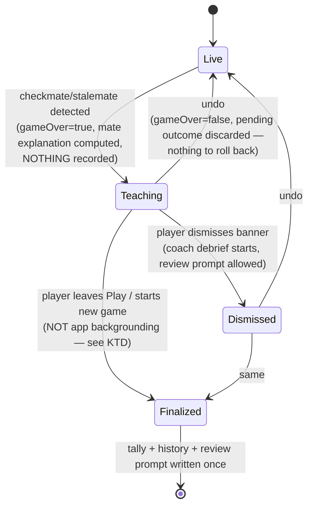
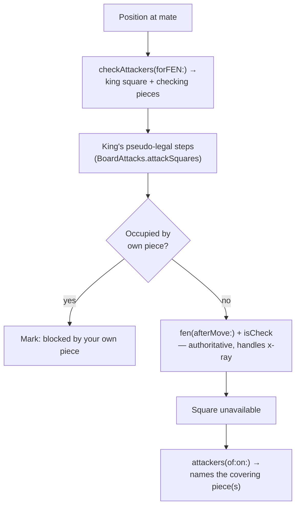

# feat: Checkmate teaching moment

## Summary

Turn the end of a Play game into a teaching moment: on checkmate the board shows *why* the king is trapped (every flight square, and which enemy piece covers it), the result message animates in beside the board instead of over it, nothing auto-advances until the player dismisses, and undoing the mating move leaves no trace in stats or history.

---

## Problem Frame

Today a mate ends the game abruptly: `checkGameOver()` fires `startGameSummary()`, `recordOutcome()`, and `persistCheckpoint()` in one breath, and `PlayView` throws `GameOverBanner` up as a full-frame `.overlay` that covers the board. The player gets a verdict but no explanation, the coach debrief starts streaming immediately, and `checkReviewPrompt()` can pop a rating sheet over the whole thing. A beginner sees "Checkmate — you lose" and learns nothing about *why* the king had nowhere to go.

Undo is a related gap. `canUndo` already permits undo after mate and `undoLastMove()` already clears `gameOver`/`resultText`/`gameSummary` — but `recordOutcome()` has already written the win/loss tally and appended a history record by then, and neither store has a rollback API. So taking back a mating move leaves a phantom loss counted and a stale record feeding the Weakness Report.

---

## Key Technical Decisions

- **Defer the whole result recording to game exit, rather than building rollback.** `recordOutcome()` moves out of `checkGameOver()`/`resign()` and into a `finalizeOutcome()` called when the player actually leaves the game — navigating away from Play, or starting a new game. Nothing is recorded at mate, so undo-after-mate needs no rollback at all. The alternative (record-then-reverse) would require new `PlayStatsStore.unrecord` and a JSONL-rewriting `HistoryStore.removeRecords`, plus a "what did I record" token, and risks double-counting; deferral deletes that whole surface.
- **App backgrounding is deliberately NOT a finalize point.** Backgrounding doesn't end the player's relationship with the game — they routinely come back to the same mated position. If finalize fired on `.background`, a player who mates, switches apps, returns, and then undoes would have already had the tally and history record written, with no rollback API to reverse them: the exact phantom-loss bug this deferral exists to prevent, on a common path rather than an edge case. Only the two exits that genuinely end the game finalize it.
- **Accept losing the result on a hard exit.** Because backgrounding doesn't finalize, a game whose `PlayViewModel` is never returned to — app killed from the switcher, or a crash — loses both its tally increment *and* its `GameRecord`, the history entry that feeds the Weakness Report. Nothing reconciles this later: history is deliberately never written from `load(_:)` (see `docs/plans/2026-07-19-005-feat-coach-weakness-report-plan.md`). This is still a better failure mode than rollback bugs that silently corrupt counts, and the saved game itself always survives via the unchanged checkpoint write — but it is a real loss, not just a stat increment.
- **Validate flight squares by playing the move, explain them with the attacker query.** `BoardAttacks.attackers(of:on:in:)` runs against the *current* position, where the king still occupies its square — so for a checking slider, the square directly behind the king reads as unattacked (x-ray blind spot). Escape squares are therefore determined with `ChessLogic.fen(afterMove:fromFEN:)` + `isCheck`, and `attackers(of:on:)` is used only to name which piece covers a square once it's known to be unavailable.
- **Banner moves inline, below the board.** The existing `.overlay { GameOverBanner }` becomes a sibling in the layout `VStack`, using the app's established non-covering idiom (the hint-tip bubble's `.opacity.combined(with: .move(edge:))` transition) plus the existing celebration spring. Tap-anywhere-to-dismiss is replaced by an explicit button so the board stays interactive underneath.
- **Stalemate shares the mechanism, not the visual.** The same computation entry point and rendering path handle stalemate, but "why" there means "no piece has a legal move" rather than "the king is surrounded" — so it marks the stalemated side's pieces rather than flight squares.
- **The explanation is computed once and stored, not derived in the view body.** `PlayView` already computes `checkInfo` as a body-read property, but the mate explanation is far heavier — up to eight `fen(afterMove:)` + `isCheck` round trips plus attacker scans, which would re-run on every body evaluation while the banner animates and the king pulses. This repo has documented first-render cost pathology severe enough to trip the scene-create watchdog, so the view model computes the explanation once when `checkGameOver()` sets `gameOver` and stores it.
- **The explanation's lifecycle follows `gameOver`, not the banner.** It is stored when `gameOver` becomes true and cleared wherever `gameOver` is cleared — so undo clears it automatically, a second mate after undo-and-replay recomputes it fresh, and dismissing the banner leaves the board explanation up (dismiss releases the debrief; it doesn't end the lesson). Stale tints can never outlive the mate they describe.

---

## Requirements

**Teaching visualization**

- R1. On checkmate, the board marks the mated king, every square it could otherwise flee to, and which enemy piece covers each such square.
- R2. Flight-square determination is correct for x-ray cases — a square behind the king along a checking slider's line is correctly shown as unavailable.
- R3. A flight square blocked by the mated side's own piece is distinguished from one covered by an enemy piece, by a cue that does not rely on color alone.
- R4. On stalemate, the board conveys that the side to move has no legal move, rather than showing king-trap geometry.
- R10. The explanation is available to VoiceOver as text, not only as board tints and arrows.

**Pacing**

- R5. Nothing auto-advances at game over: the coach debrief does not begin streaming, and the review prompt does not appear, until the player dismisses the result.
- R6. The result message animates in and does not cover the board; the player can keep studying the position while it's shown.

**Undo and recording**

- R7. The win/loss tally, history record, and review-prompt check are not written at game over — only when the player leaves the game (navigates away, starts a new game, or the app backgrounds).
- R8. Undoing a mating move leaves no recorded result: no tally change, no history record, no review prompt.
- R9. Leaving a game records its result exactly once, regardless of how many times the exit path fires.

---

## High-Level Technical Design

Game-end lifecycle, with the deferred-finalization change:

Mate-explanation computation, showing why the two chess primitives play different roles:

---

## Implementation Units

### U1. Mate/stalemate explanation primitive

- **Goal:** A pure function that answers "why is this mate/stalemate," reusing existing chess primitives.
- **Requirements:** R1, R2, R3, R4.
- **Dependencies:** none.
- **Files:** `Sources/GemmaChessCore/Chess/ChessLogic.swift`, `Tests/GemmaChessCoreTests/ChessLogicTests.swift`.
- **Approach:** Add a public function returning the mated/stalemated king square, the checking pieces, and for each of the king's pseudo-legal steps whether it's blocked by an own piece or covered (and by which enemy squares). Candidate steps come from `BoardAttacks.attackSquares(of:in:)`; availability is decided by `ChessLogic.fen(afterMove:fromFEN:)` + `isCheck` (authoritative, handles the x-ray case); `BoardAttacks.attackers(of:on:in:)` supplies the *explanation* only. For stalemate, return the shape indicating no legal move exists for the side to move rather than king-trap geometry — `ChessLogic.legalDestinations(forFEN:)` already answers this directly.
- **Execution note:** Implement test-first — the x-ray case is exactly the kind of thing that looks right until a specific FEN proves otherwise.
- **Patterns to follow:** `ChessLogic.checkAttackers(forFEN:)` for the return-tuple shape and nil-on-not-applicable convention; `Sources/GemmaChessCore/Chess/Attacks.swift` for the primitives.
- **Test scenarios:**
  - Back-rank mate: the king's forward steps are reported blocked by its own pawns; the escape squares along the rank are reported covered by the mating rook.
  - X-ray case: a mate where the square directly behind the king (along the checking slider's line) is *not* a legal escape — assert it's reported unavailable, which a naive `attackers()`-only implementation would get wrong.
  - Smothered mate: every step reported blocked by own pieces, with the knight as the checker.
  - A position where a flight square is covered by two enemy pieces: both are named.
  - Stalemate: returns the no-legal-move shape, not king-trap geometry, and does not report the king as checked.
  - Non-terminal positions (normal, plain check) return nil.
  - Malformed FEN returns nil rather than crashing.
- **Verification:** New `ChessLogicTests` cases pass, including the x-ray FEN.

### U2. Board rendering of the explanation

- **Goal:** Show the explanation on the board.
- **Requirements:** R1, R3, R4, R10.
- **Dependencies:** U1, U3 (reads the explanation the view model stores).
- **Files:** `Sources/GemmaChessCore/UI/ChessBoardView.swift`, `Sources/GemmaChessCore/UI/PlayView.swift`.
- **Approach:** Add one defaulted parameter to `ChessBoardView` carrying the explanation (defaulted, so the other four call sites — Review, Puzzles, Lessons, previews — are untouched). Render covered flight squares distinctly from own-blocked ones using **both** a tint and a non-color cue (a small per-state glyph or distinct border treatment), so the R3 distinction survives colorblindness and low-contrast viewing. The mated king reuses the existing `checkSquare` glow. `PlayView` reads the stored explanation off the view model (computed once in U3's game-over path, not derived in `body`) and passes it down; the existing `boardArrows` already draws checker→king arrows, so that part is inherited rather than rebuilt.
  Arrow density: draw one arrow per (coverer, flight square) pair. Flight squares max out at eight and most mates involve far fewer coverers, so the honest full picture is the teaching goal — but if a specific position renders unreadably during manual verification, prefer thinning to the *nearest* coverer per square and leaving the complete list to the accessibility summary below, rather than dropping the visualization.
  Accessibility (R10): expose the explanation as a VoiceOver-readable summary on the board container (e.g. "King on g8 has no escape: f7 blocked by your own pawn, g7 covered by the rook on g1"), built from the same U1 output. Board squares carry no accessibility labels today, so this summary is the only thing a VoiceOver user will get — it is the feature for them, not a nicety.
- **Patterns to follow:** `ChessBoardView`'s existing `checkSquare` pulse (`kingPulse`) for the animation idiom; `BoardArrow(from:to:color:thick:)` for arrows; `PlayView.boardArrows` for how arrows are assembled per-state.
- **Test scenarios:** UI composition — no snapshot tests in this repo; correctness is covered by U1's tests.
  - Test expectation: none for the view itself — the explanation logic is tested in U1; this unit is rendering only.
- **Verification:** On device, a back-rank mate visibly shows the trapped king, the covered squares, and which piece covers each; the covered/own-blocked distinction is legible with color vision simulation on; VoiceOver reads a coherent explanation; undoing the mate clears the visualization immediately; a stalemate shows its own treatment; Review/Puzzles/Lessons boards are visually unchanged.

### U3. Deferred outcome finalization

- **Goal:** Stop recording the result at game over; record it when the player leaves.
- **Requirements:** R7, R8, R9.
- **Dependencies:** none (parallel to U1/U2).
- **Files:** `Sources/GemmaChessCore/ViewModels/PlayViewModel.swift`, `Sources/GemmaChessCore/UI/PlayView.swift`, `Tests/GemmaChessCoreTests/PlayOutcomeTests.swift`, `Tests/GemmaChessCoreTests/PlayHistoryBridgeTests.swift`.
- **Approach:** Remove the `recordOutcome()` call from `checkGameOver()` and `resign()`; instead set a pending-outcome value there, and (for checkmate/stalemate) store the U1 explanation on the view model at the same point. Add a `finalizeOutcome()` that records the tally, appends the history record, and runs the review-prompt check *only* when a pending outcome exists, clearing it afterward so repeat calls are no-ops (R9). `undoLastMove()` clears both the pending outcome and the stored explanation — nothing was recorded, so there's nothing to reverse.
  Exit hooks, named concretely because "leaving the Play screen" is not one hook: attach `.onDisappear { vm.finalizeOutcome() }` to `PlayContainerView` — this covers *every* route out including the global tab bar, which reassigns `RootView`'s mode directly and bypasses the `onExit`/`onNewGame` closures entirely — plus an explicit call at the top of `newGame(...)`. Wiring finalize to the `onExit`/`onNewGame` closures alone would silently stop recording results for tab-bar exits, which are reachable during play whenever the tab bar is kept visible.
  Also expose a projected tally (current stats with the pending outcome folded in, unpersisted) for the banner to display — see U4. `persistCheckpoint()` keeps firing at game over exactly as today, so the saved game is never at risk. `load()` sets `gameOver` directly without going through `checkGameOver()`, so a resumed finished game sets no pending outcome and cannot double-record. Preserve the existing `moveGen` discipline for any async work.
- **Execution note:** Characterization-first — `PlayOutcomeTests` already asserts that resign records stats exactly once and a second resign is a no-op; capture that behavior against the new timing before changing it.
- **Patterns to follow:** `PlayOutcomeTests`'s existing resign/stats assertions for shape; `PlayViewModel.forTesting()` (isolated `statsDefaults`/`historyBaseDir`) so tests never touch real user data; `flushPendingSave()` for deterministic file assertions.
- **Test scenarios:**
  - Reaching checkmate does **not** change the tally or append a history record; the pending outcome is set.
  - Calling finalize after that mate records the tally once and appends exactly one history record.
  - Calling finalize twice records only once (R9).
  - Mate → undo → finalize records nothing: tally unchanged, no history record, no review prompt (R8).
  - Mate → undo → play on → mate again → finalize records exactly one result, reflecting the second ending.
  - Resign follows the same deferred path as mate (it's the other game-over route).
  - A game abandoned mid-play (no game over) finalizes to nothing.
  - The saved-game checkpoint still reflects `isGameOver` at mate time, before any finalize.
  - Loading a previously-finished saved game sets no pending outcome, so a later finalize records nothing (guards the "never record from `load(_:)`" invariant).
  - The projected tally reflects the pending outcome before finalize, while the persisted tally does not.
- **Verification:** `PlayOutcomeTests` and `PlayHistoryBridgeTests` pass; stats and history reflect the deferred timing.

### U4. Non-covering animated result banner

- **Goal:** The result message animates in beside the board and gates what happens next.
- **Requirements:** R5, R6.
- **Dependencies:** U3 (dismiss is what releases the debrief and review prompt).
- **Files:** `Sources/GemmaChessCore/UI/PlayView.swift`, `Sources/GemmaChessCore/ViewModels/PlayViewModel.swift`.
- **Approach:** Move `GameOverBanner` from the full-frame `.overlay` into the layout `VStack` as a sibling below the board, so the board stays fully visible and interactive. Animate with the app's existing celebration spring plus a move+opacity transition (the hint-tip bubble's idiom). Replace tap-anywhere-to-dismiss with an explicit dismiss control.
  Vertical budget — the banner is a ~300pt card and `PlayView.body` is a plain non-scrolling `VStack` already carrying header, board, captured row, hint card, move list, opening row, and a greedy coach card, so the banner cannot simply be appended. It takes the **coach card's slot** while the teaching state is showing: during that state the coach card has nothing to display anyway, since the debrief deliberately hasn't started yet. On dismiss, the banner gives the slot back and the debrief streams into the coach card as usual. Requires a compact banner variant if the card's natural height still overflows on the smallest supported device.
  Pacing: move `startGameSummary()` out of `checkGameOver()`/`resign()` so the coach debrief only begins on dismiss. Gate the review prompt explicitly rather than by inference — `finalizeOutcome()` records the tally and history unconditionally but calls `checkReviewPrompt()` only when the game-over state has already been dismissed, so no path presents a rating sheet during the teaching moment (R5). The banner's existing share affordance is preserved.
  Display the projected tally from U3, not the persisted one: with recording deferred, `vm.stats` no longer includes the game just finished, so a player winning their first game would otherwise see "0W · 0L · 0D" beside "you win."
- **Patterns to follow:** `PlayView`'s `hintTipBubble` for the inline non-covering placement and transition; the existing `GameOverBanner` appear-spring; `PlayView`'s existing `.onChange(of: vm.gameOver)` for show/hide wiring (it already hides the banner when undo un-ends the game).
- **Test scenarios:** View-level layout has no automated coverage in this repo; behavior gated at the view-model level:
  - The coach debrief does not start while the game-over state is undismissed; it starts after dismiss (assert on the summarizing/summary state).
  - Undo while the banner is showing returns to live play with the banner hidden and no debrief started.
  - The review prompt does not fire while the game-over state is undismissed, on any finalize path.
  - The banner's displayed tally includes the game just finished, while the persisted tally does not yet.
- **Verification:** On device at the smallest supported screen size, the board remains fully visible and tappable with the banner shown and nothing is pushed off-screen; the banner animates in rather than snapping; the debrief only streams after dismiss; no rating sheet appears during the teaching state; undo from the mate position returns to a live game.

---

## Scope Boundaries

- No change to how mate is *detected* — `ChessLogic.status(forFEN:)` is already correct and stays authoritative.
- No change to the coach debrief's content or prompt — only when it starts.
- No change to Review, Puzzles, Lessons, or Opening Trainer board rendering (the new board parameter is defaulted).
- Resign keeps its existing behavior apart from the deferred recording; it gets no teaching visualization (there's no mate geometry to explain).

### Deferred to Follow-Up Work

- An explicit "why did I lose?" replay control that re-shows the mate explanation from the saved game later, outside the live game-over moment.
- Extending the teaching visualization to Puzzles' mate-in-N completions.

---

## Risks & Dependencies

- **A game never returned to loses both its tally and its Weakness Report history record.** Accepted per the Key Technical Decision above, and broader than a stat increment: with backgrounding deliberately excluded as a finalize point, any game whose view model is abandoned (app killed from the switcher, crash) records nothing, and no later reconciliation is possible since history is never written from `load(_:)`. The saved game itself always persists via the unchanged checkpoint write.
- **The x-ray blind spot is a genuine correctness trap.** `attackers(of:on:)` alone produces a wrong-but-plausible answer on slider mates. U1's test-first execution note and the dedicated x-ray scenario exist specifically to catch this.
- **Exit-point coverage determines recording reliability.** If an exit path is missed, results silently stop being recorded on that path — and the tab bar is exactly such a trap, since it swaps the Play screen out by reassigning the root mode rather than going through Play's own exit closures. U3 pins finalize to `PlayContainerView.onDisappear` specifically to catch every route; verify on device that a tab-bar exit mid-game still records.
- **`HistoryStore` dedupe won't save a mistake here.** Its gameID is derived from the move list, so a post-undo replay yields a *different* ID — a stale record would not be superseded. This is an argument for the deferral approach, and a reason not to fall back to record-then-reverse later.

---

## Sources / Research

- Game-over path and its side effects: `Sources/GemmaChessCore/ViewModels/PlayViewModel.swift` (`checkGameOver`, `recordOutcome`, `resign`, `undoLastMove`, `canUndo`, `persistCheckpoint`, the `moveGen` generation counter).
- Banner and board wiring: `Sources/GemmaChessCore/UI/PlayView.swift` (`GameOverBanner` overlay, `board`, `boardArrows`, `checkInfo`, `hintTipBubble`).
- Board parameter surface and animation idioms: `Sources/GemmaChessCore/UI/ChessBoardView.swift` (`checkSquare`, `arrows`, `legalDots`, `kingPulse`).
- Chess primitives to reuse: `Sources/GemmaChessCore/Chess/ChessLogic.swift` (`status`, `checkAttackers`, `legalDestinations`, `fen(afterMove:)`), `Sources/GemmaChessCore/Chess/Attacks.swift` (`attackSquares`, `attackers`).
- Stores that recording touches: `Sources/GemmaChessCore/ViewModels/PlayStatsStore.swift` (record-only, no decrement API), `HistoryStore` (append-only JSONL, move-derived gameID).
- Test helpers and existing coverage: `Tests/GemmaChessCoreTests/TestSupport.swift` (`PlayViewModel.forTesting()`), `PlayOutcomeTests.swift`, `PlayGameLoopTests.swift`, `PlayHistoryBridgeTests.swift`, `ChessLogicTests.swift`.
- Prior constraint to preserve: `docs/plans/2026-07-19-005-feat-coach-weakness-report-plan.md` (history record written exactly once per real ending, never from `load(_:)`).
