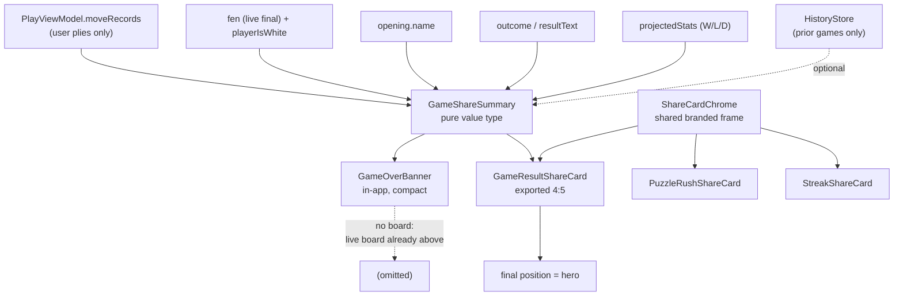

# feat: Make the end-of-game result card share-worthy

## Summary

The end-of-game card announces a result. It should be an artifact worth posting.

This plan makes the **final position the hero** of the exported share card, adds a plain-language accuracy band and a positive-first move-quality strip, and puts every share card in one shared branded frame. The in-app banner is restyled in place and deliberately does **not** gain a board.

---

## Problem Frame

The origin brainstorm scoped shareable result cards as the bundle's *"one deliberate virality play, since a single-player app has few natural sharing loops"* (see origin: `docs/brainstorms/2026-07-21-competitor-review-improvement-bundle-requirements.md`, section 4). What shipped satisfies the letter of that requirement and none of its intent.

Observed on device (screenshot IMG_0377), the in-app card shows:

- A red flag icon over **"Game over"**, then **"Checkmate — you lose."** immediately beneath — the same fact twice, in two type sizes. A flag also reads as *resignation*, not checkmate.
- A loose gray `0W · 7L · 0D` row. After seven straight losses the most prominent number on the card is a running record of failure.
- A dim green low-contrast "Share" beside a solid green "Continue".
- A red glow shadow around the whole card.

The exported card (`GameResultShareCard`) carries even less: result text, outcome, opening name. No board, no stats, nothing earned. Nobody posts it.

### What the research changed

Landscape research reframed the target and is the main reason this plan is not simply "prettier scoreboard":

1. **Neither Chess.com nor Lichess ships a designed result card.** What they actually export is the *position* — a static diagram or an animated GIF. Chess.com's own framing: GIFs are "a popular way to share chess games, especially on social media." The board is the shareable artifact; the scoreboard is not.
2. **Accuracy screenshots circulate inward, not outward** — into chess forums as "is 92% good?" threads, not to general audiences.
3. **A naked accuracy percentage is not understood by beginners.** Chess.com benchmarks CAPS2 to a school grade precisely because of this; third-party "is your accuracy good?" pages exist to service the confusion.
4. **Gain-framing beats loss-framing** on interest and attitude; rigid score/streak framing produces guilt and all-or-nothing thinking.
5. **Shareable-card convention:** one hero, few supports, 1080px wide, 4:5 the best all-round feed ratio, wordmark small and never competing with the hero.

---

## Requirements

| ID | Requirement |
|---|---|
| R1 | The exported share card makes a **board position** its hero element, not the result text. The position is outcome-aware: wins and draws show the final position; losses show the position after the player's best-classified move. |
| R2 | Accuracy is never shown as a bare percentage — always paired with a plain-language band. |
| R3 | Move quality is shown on a positive-first ladder, not a list of errors. |
| R4 | The card leads with something the player *earned*; when the data supports nothing honest, it shows nothing rather than fabricating praise. |
| R5 | W/L/D is retained but restyled so it does not read as a failure list (user's explicit choice). |
| R6 | Loss treatment drops alarm red and the resignation-flag icon. |
| R7 | Every share card carries consistent ChessCoach branding in one shared frame. |
| R8 | The exported card is 4:5 (1080×1350 at 3x). |
| R9 | The in-app banner is restyled but gains no board and no new height. |
| R10 | The card's accuracy figure can never disagree with the Review screen or history. |
| R11 | The exported card carries a resolvable destination (`chesscoach.im`) so a viewer can act on it. |

---

## Key Technical Decisions

| Decision | Rationale |
|---|---|
| **The hero position is outcome-aware.** | Board-as-hero comes from platforms whose exported positions are wins and brilliancies; this app's modal game-over is a beginner being mated. An unconditional final position makes the card's most prominent element a picture of the user's own king in checkmate — the artifact a beginner is least likely to post. Wins and draws show the final position (the mate you delivered is worth showing); losses show the position after the player's best-classified move, captioned as such, so the hero is always something worth posting. |
| **The card carries `chesscoach.im`.** | A viewer who cannot act on the card cannot become a user, which forfeits the point of a reach vehicle. The domain already ships in `PaywallView` for terms/privacy, so no new infrastructure is needed. |
| **The board goes on the exported card only, never the in-app banner.** | The banner's only call site (`PlayView.swift:133`) passes `compact: true` and renders it into the coach card's slot in a fixed, non-scrolling `VStack`, directly beneath the live board. A board there is redundant (the real one is inches above) and does not fit. |
| **Reuse `ChessBoardView` for the mini board rather than hand-rolling one.** | It reads *no* environment — every color is an explicit parameter — and only `fen` is required, precisely so it can render non-interactive previews. Passing no `onTapSquare` makes it display-only. `BoardPiece` is internal, so a hand-rolled grid would have to live in-module anyway with no benefit. |
| **Reproduce accuracy via `Evaluation.moveAccuracy` + `aggregateAccuracy` + round-to-1dp.** | That is the exact chain `HistoryStore` uses (`HistoryStore.swift:362-365, 391`). `moveRecords` already contains only the user's plies, so no side filtering is needed. **Sharing the chain is not sufficient for R10 — the inputs must match too.** `moveRecords` is appended inside the async analysis `Task` in `makeMove`, while the banner renders the instant `gameOver` is set (e.g. `resign()`), so a resignation mid-analysis leaves the banner computing over N-1 records and history over N. `shareSummary` must therefore be recomputed on every `moveRecords` change, never cached. |
| **Extract one `ShareCardChrome` and adopt it in all three cards.** | `GameResultShareCard`, `PuzzleRushShareCard`, and `StreakShareCard` are near-identical copies of the same frame (same 360×480, same emblem, same wordmark). Branding is the reach vehicle; three drifting frames undercut it. |
| **Compute the summary as a pure value type, not inside the view.** | Keeps `GameResultShareCard` renderable off the live view tree via `ShareCardRenderer` (its stated design constraint) and makes every threshold testable without the engine or a running game. |
| **Celebration is earned from *this* game first, history second.** | A best-move count is always honest and needs no history. The personal-best line is a bonus that requires prior games; where neither exists, the slot renders nothing (R4). |
| **Exclude the current game from the comparison by IDENTITY, not by timing.** | It is tempting to rely on `finalizeOutcome()` deferring the write, but that is not invariant: it also fires from `.onDisappear` and from `newGame()`. A player who backgrounds the app or visits Review and returns while the banner is still up has already had this game recorded, and the personal-best line would then compare the game against itself and silently never fire. Filter prior records by the current game's identity instead. |
| **Prior accuracies come from Play-mode games only.** | `HistoryStore.loadRecords()` returns every analyzed game, including Chess.com/Lichess imports. `GameRecord` carries `platform: String` (`HistoryStore.swift:88`) and Play games are written as `platform: "play"` (`:373`). Unfiltered, "your most accurate game yet" would be measured against imported games analyzed at different depths against different opponents. |

---

## High-Level Technical Design

Data flow, and the deliberate divergence between the two surfaces:



Exported card composition, hero-first (proportions are directional, not spec):

```
┌─────────────────────────────┐
│  final position   ~55%      │  ← hero: board, last move + mate net shown
│  (ChessBoardView, static)   │
├─────────────────────────────┤
│  earned headline            │  ← "You found the best move 6 times"
│  accuracy 78% · Solid       │  ← never a bare number (R2)
│  ●Best 6  ●Good 11  ●Miss 2 │  ← positive-first ladder (R3)
├─────────────────────────────┤
│  Queen's Pawn Game · D00    │
│  Checkmate · 0W 7L 0D       │  ← result demoted to a supporting line
├─────────────────────────────┤
│  ♛ ChessCoach   THE GAMBIT  │  ← shared branded footer (R7)
└─────────────────────────────┘
```

---

## Implementation Units

### U1. `GameShareSummary` — the pure summary value type

**Goal:** One `Sendable` value type carrying everything both surfaces render, computed by pure functions from data already in memory.

**Requirements:** R2, R3, R4, R10

**Dependencies:** none

**Files:**
- Create `Sources/GemmaChessCore/UI/GameShareSummary.swift`
- Test `Tests/GemmaChessCoreTests/GameShareSummaryTests.swift`

**Approach:** Carry accuracy (rounded 1dp), an accuracy band, per-classification counts, best-move count, move count, **hero FEN and a hero caption (outcome-aware per R1: final position on win/draw; on a loss, the `fen` of the player's best-classified `moveRecord`, falling back to the final position when no record carries one)**, player orientation, **`lastMove` (as an Equatable-safe pair, not a tuple property)**, **`terminalExplanation: ChessLogic.TerminalExplanation?`**, opening name, outcome, result headline, and W/L/D. The last two are required by U3 to draw the mating net; omitting them forces a struct redesign mid-stream. Provide a static factory taking `[PlayMoveRecord]` plus the surrounding values, and an optional prior-game accuracy list for the personal-best line.

Accuracy must go through `Evaluation.moveAccuracy(winBefore:winAfter:)` per record, then `Evaluation.aggregateAccuracy`, then round to 1dp — no reimplementation.

Bands are plain language, not chess jargon. Directional: `90+ Excellent`, `80-89 Strong`, `70-79 Solid`, `60-69 Getting there`, below that a non-judgmental "Learning". Exact wording is a design call at implementation; the constraint is that no band shames.

The earned headline resolves in priority order, and **returns nil rather than inventing praise**: personal best (needs ≥3 prior games) → best-move count (needs ≥1 best move) → nil.

Derive the result headline from the **typed `outcome`** plus a resignation flag — not from `resultText` string equality. Matching literal English sentences breaks the moment copy is edited or localized, and `resultText` is also restored from persisted saves (`PlayViewModel.swift:879`), so an older save written before a copy change would not match. Keep `resultText` only as a fallback for what the enum cannot express, and degrade to outcome-derived text rather than nil. Note the current win string carries a 🎉 that must not reach a designed card.

**Patterns to follow:** `CapturedMaterial` (`Sources/GemmaChessCore/Chess/CapturedMaterial.swift`) — a plain `Equatable, Sendable` struct with a static `from(...)` factory. `MoveVerdict.color(for:theme:)` for classification→color; do not invent a second palette. The summary must also expose the classification **labels** in a form usable as an `accessibilityLabel` — the quality strip is colored dots plus counts, which conveys nothing to a color-blind or VoiceOver user unless each segment carries text ("6 best moves, 11 good moves, 2 misses").

**Execution note:** Test-first. Every threshold and the nil-vs-praise boundary is a pure function, and these are the assertions that stop the card from lying.

**Test scenarios:**
- Accuracy for a known `[(winBefore, winAfter)]` set matches `Evaluation` composed by hand — the anti-drift guard for R10.
- Empty `moveRecords` (resignation on move 1) yields no crash, no fabricated accuracy, and a nil earned headline.
- All-best-moves game bands as the top tier; a game of only blunders bands at the bottom without shaming wording.
- Counts tally correctly across a mixed classification set, including a classification string the ladder does not know (must not crash or miscount).
- Personal-best headline fires only with ≥3 prior games AND this accuracy strictly above the prior maximum.
- With ≥3 prior games but no improvement, falls through to best-move count.
- With ≥1 best move and no history, returns the best-move headline.
- With zero best moves and no history, returns nil (R4) — asserted explicitly, not implied.
- Result headline strips the 🎉 from the win string.
- Rounding matches `HistoryStore`'s 1dp on a value that would differ at 2dp.
- An imported (non-Play) record does not participate in the personal-best comparison.
- The personal-best line still evaluates correctly when the current game has *already* been recorded to history (the backgrounded-then-returned case).

**Verification:** Accuracy computed here is bit-identical to what `HistoryStore` records for the same move set.

---

### U2. `ShareCardChrome` — one shared branded frame

**Goal:** Extract the triplicated card frame into one branded container and adopt it in all three share cards.

**Requirements:** R7, R8

**Dependencies:** none

**Files:**
- Create `Sources/GemmaChessCore/UI/ShareCardChrome.swift`
- Modify `Sources/GemmaChessCore/UI/GameResultShareCard.swift`, `Sources/GemmaChessCore/UI/PuzzleRushShareCard.swift`, `Sources/GemmaChessCore/UI/StreakShareCard.swift`
- Modify `Tests/GemmaChessCoreTests/PuzzleShareCardsTests.swift` (asserts the old dimensions)
- Test `Tests/GemmaChessCoreTests/ShareCardChromeTests.swift`

**Approach:** A container taking card size and content, supplying background, gradient, padding, and a branded footer lockup (emblem + "ChessCoach" wordmark + `chesscoach.im`). The theme name is dropped from the footer — it means nothing to a stranger, where the domain is the only element that converts attention into an install (R11). Move branding from the current top position to the footer: research is unanimous that the wordmark must not compete with the hero, and the hero is now the board.

"Bolder branding" is honored through **consistency and legibility at thumbnail size**, not size — a proper lockup on every card beats a large wordmark on one.

Collapse the **three separate** `public static let cardSize` declarations (one per card, all `360×480`) into a single `ShareCardChrome.cardSize` at 4:5 (360×450 points → 1080×1350 at 3x). `PuzzleShareCardsTests.swift` asserts rendered dimensions against two of them, so omitting it from the sweep lands a red suite.

The puzzle and streak cards lose 30 points of height in the process; their content was laid out for the taller frame and must be re-checked, not assumed.

**Patterns to follow:** the existing emblem in `GameResultShareCard.swift:86` and `RootView`'s Home emblem.

**Test scenarios:**
- Each of the three cards renders non-nil at the new size via `ShareCardRenderer` with an injected `ThemeStore`.
- Rendered `image.size` equals `cardSize` (points) and `image.cgImage` pixel dimensions equal `cardSize × scale` — confirming 4:5 at 1080×1350. `UIImage.size` is in points; asserting it against `cardSize × scale` would fail on every device (see `ShareCardRendererTests.swift:35-36`).
- Renders correctly under a light-background theme as well as dark (`theme.isLightBackground`) — footer contrast must hold both ways.

**Verification:** All three cards render, share one frame, and no card declares its own background, wordmark, or `cardSize`. Puzzle Rush and Streak content still fits at 360×450 — checked visually, not inferred from a passing test.

---

### U3. `ShareBoardThumbnail` — the static final position

**Goal:** A fixed-size, non-interactive board for the exported card.

**Requirements:** R1

**Dependencies:** none

**Files:**
- Create `Sources/GemmaChessCore/UI/ShareBoardThumbnail.swift`
- Test `Tests/GemmaChessCoreTests/ShareBoardThumbnailTests.swift`

**Approach:** Wrap `ChessBoardView(fen:orientation:...)` at a fixed frame, oriented to the player's side, with no `onTapSquare` so it is display-only. Pass theme board colors explicitly. Pass `lastMove` and `terminalExplanation` so a checkmate shows the mating net — that is the showmanship, and `ChessLogic.terminalExplanation(forFEN:)` already produces it.

**Risk to resolve at implementation:** `ChessBoardView` holds animation state (`kingPulse`) and uses a `GeometryReader`. Under `ImageRenderer` these should capture at initial state, but this is unverified for a *synchronous* off-tree render. Verify the rendered image shows a settled board; if a pulse or a zero-size `GeometryReader` bites, add an explicit static path rather than fighting the animation.

**Test scenarios:**
- Renders non-nil from a normal mid-game FEN.
- Renders non-nil from a checkmate FEN with a terminal explanation attached.
- Renders in both orientations, and black orientation is not identical to white for an asymmetric position.
- A malformed/empty FEN degrades without crashing.
- Output is square and matches the requested frame.

**Verification:** A checkmate position renders with the mate visible and no animation artifact.

---

### U4. Redesign `GameResultShareCard`

**Goal:** The exported card becomes board-hero with a supporting stats strip.

**Requirements:** R1, R2, R3, R4, R5, R6, R8

**Dependencies:** U1, U2, U3

**Files:**
- Modify `Sources/GemmaChessCore/UI/GameResultShareCard.swift`
- Modify `Tests/GemmaChessCoreTests/ShareCardRendererTests.swift`

**Approach:** Replace the `(resultText, outcome, openingName)` init with one taking `GameShareSummary`. Compose top-to-bottom: board hero, earned headline, accuracy + band, quality chips, opening, demoted result + W/L/D, branded footer from U2.

Drop `flag.fill` and `.red` for losses. Use a neutral / second-accent treatment — the result is stated in words; the color does not need to editorialize (R6).

**Breaking change:** the five existing call sites in `ShareCardRendererTests.swift` (lines 28, 43, 54, 67, 82) use the old init and must be updated. This is the only external consumer.

**Test scenarios:**
- Renders non-nil for win, loss, and draw summaries.
- Renders when the earned headline is nil (empty slot, no layout collapse, no placeholder text).
- Renders with a very long opening name and a long result string without clipping the hero (the existing long-content test, retained).
- Renders with zero move records (immediate resignation).
- Renders under a light theme.
- Rendered size is the 4:5 `cardSize`.

**Verification:** The exported image leads with the board; the result is a supporting line, not the headline.

---

### U5. Restyle `GameOverBanner` in place

**Goal:** Fix the in-app card's visual problems without adding height or a board.

**Requirements:** R2, R3, R5, R6, R9

**Dependencies:** U1, U6 — the banner renders accuracy and quality, which only exist once U6 exposes `shareSummary`. Build U6 before U5.

**Files:**
- Modify `Sources/GemmaChessCore/UI/PlayView.swift` (`GameOverBanner`)

**Approach:** Collapse the duplicated `title` + `resultText` into one headline. Drop `flag.fill`/`.red`/the red glow shadow. Restyle W/L/D into a contained pill rather than a loose gray row (R5). Add the accuracy band and a compact quality strip — this is the in-app payoff for the same data. Give Share and Continue equal visual weight; the current dim-green-on-dark-green Share is barely legible, and the artifact is now worth sharing.

**Scope note:** `compact: false` is dead — the only call site passes `compact: true`. Removing the flag is a legitimate simplification but is **not** in scope here; leaving one unused branch is cheaper than an unrequested signature change. Flagged in Deferred.

**Height constraint is hard.** The banner occupies the coach card's slot in a non-scrolling `VStack`. Anything added must be offset by what the collapsed headline frees. Net height must not grow.

**Test scenarios:** No unit tests — this is a SwiftUI view body with no extractable logic (all thresholds live in U1 and are tested there). `Test expectation: none -- presentation-only; logic is covered by U1.`

**Verification:** Measured on an iPhone 16e simulator against the pre-change build, the banner is no taller, and no red remains on a loss. **Also measured at the largest accessibility text size** — the freed headline space is a fixed budget at default Dynamic Type only, and the added band and quality strip are the first things to overflow the non-scrolling column when text scales. They must truncate or reflow rather than push the column.

---

### U6. Wire the summary through `PlayViewModel`

**Goal:** Both surfaces receive a `GameShareSummary` built from live state.

**Requirements:** R1, R10

**Dependencies:** U1

**Files:**
- Modify `Sources/GemmaChessCore/ViewModels/PlayViewModel.swift`
- Modify `Sources/GemmaChessCore/UI/PlayView.swift` (banner call site and `shareGame()`)
- Test `Tests/GemmaChessCoreTests/PlayShareSummaryTests.swift`

**Approach:** Expose `shareSummary` assembling `moveRecords`, the live final **`fen`**, `playerIsWhite`, `lastMove`, `mateExplanation`, `opening?.name`, `outcome`, `resultText`, and `projectedStats`.

**Use `fen`, never `displayFEN`.** `displayFEN` returns `fenHistory[viewingPly]` while the user is browsing (`PlayViewModel.swift:317-319`), so sourcing from it ships a card showing whatever position was last scrubbed to.

**Split the sync and async halves.** A computed property cannot await, so `shareSummary` stays a pure synchronous computed property that reads a stored `priorAccuracies: [Double]` on the view model. That property is populated from a detached task when `gameOver` becomes true, before the banner appears — mirroring how `HomeView` moved the weakness-teaser read off the main actor after it blocked a screen transition. `HistoryStore.loadRecords(playerID:)` is synchronous JSONL disk I/O, so leaving it inline would block the main actor exactly where the banner animates in.

Filter those records to `platform == "play"` and to the current `playerID`, and exclude any record matching the current game's identity.

**Test scenarios:**
- After a short scripted game, `shareSummary` accuracy equals the value `HistoryStore` computes for the same records (R10, end-to-end).
- `shareSummary` is safe to read before any move is played.
- Reflects the final position, not a browsed history position, when the user has scrubbed back before the banner appears — an easy bug given `displayFEN` follows browsing.
- Opening name absent yields a summary that still renders.

Also pass the destination URL as a second share-sheet item alongside the image, so link-capable targets (Messages, Slack, X) render a tappable link beside the card.

**Verification:** Sharing a finished game produces a card showing that game's real position and accuracy, and the share sheet offers both image and link.

---

## Scope Boundaries

**In scope:** the game-result card (in-app + exported), one shared branded frame adopted by the existing three share cards, and the summary data behind them.

### Deferred to Follow-Up Work

- **Share-rate measurement.** Review correctly flagged that nothing here tells you whether the redesign worked. Deferred on purpose rather than solved quietly: the app has **no analytics infrastructure at all**, and adding one pulls in a privacy manifest, an App Store data-collection disclosure, and a privacy-policy change. That is a deliberate product decision, not a side effect of a card redesign. Until it exists, the follow-ups below are prioritized on judgment.
- **9:16 Story variant.** 4:5 is the best single ratio; a second size doubles the layout surface and its safe-zone rules for unproven incremental reach.
- **Puzzle framing** ("mate in 2 — can you see it?"). Research names this the single most viral chess format, but it is a different product idea — posing a question rather than reporting a result — not a card restyle. Highest-value follow-up here.
- **Animated GIF export.** What Chess.com actually leans on; a much larger piece of work.
- **Removing the dead `compact: false` branch** from `GameOverBanner`.

### Not in scope (with reason)

- **Weakness Report share cards.** The origin brainstorm deferred these deliberately: they push semi-personal weakness data into a share sheet and need their own consideration. "Branding everywhere" does not override that reasoning.
- **Any gateway change.** Client-only.
- **Changing game behavior**, including when outcomes are recorded. The user scoped this to appearance.

---

## Risks & Dependencies

| Risk | Mitigation |
|---|---|
| `ChessBoardView` animation/`GeometryReader` state renders wrong under synchronous `ImageRenderer`. | U3 verifies a settled render first; fall back to an explicit static path. This is the one genuinely unproven assumption in the plan. |
| Accuracy on the card drifts from history's. | Single computation chain, asserted end-to-end in U6, not just in the unit test. |
| Banner grows and breaks the non-scrolling Play column. | Height is a hard constraint in U5, verified by simulator measurement against the pre-change build. |
| The `cardSize` change ripples. | It is public; sweep all references, and U2's tests assert the rendered dimensions. |
| A band or headline reads as condescending. | Wording is a design call at implementation; the plan fixes the *structure* (never a bare number, never fabricated praise), not the adjectives. |
| **The game-ending move is never graded.** `makeMove` returns at `checkGameOver(youMoved: true)` before the analysis `Task` appends to `moveRecords`, so a user's own checkmating move is absent. The best-move count for the most celebratory game of all excludes the move worth celebrating, and the accuracy denominator is one short. | No fix in this plan — grading the final move is engine work outside this scope. Documented so the numbers are understood as "graded moves", and so nobody reads the gap as a bug in `GameShareSummary`. Revisit if the count reads as visibly wrong on a won game. |

## Open Questions

### Resolved by review

- **Hero is outcome-aware** — adopted into R1 and the decisions table.
- **Card carries `chesscoach.im`** — adopted into R11, U2's footer, and U6's share sheet.

### Design-level

- Exact band wording. Structure is constrained; adjectives are not.
- Whether the demoted W/L/D belongs on the *exported* card at all. R5 keeps it in-app; on a public card it may read oddly to strangers. Implementation should look at both and may drop it from the export only.

---

## Sources & Research

- Origin: `docs/brainstorms/2026-07-21-competitor-review-improvement-bundle-requirements.md` §4 — share cards as the bundle's virality play.
- Chess.com share export is a link/PGN/GIF/position image, not a stats card — [share help](https://support.chess.com/en/articles/14463498-how-do-i-share-a-game-link-pgn-gif-or-image). Shaped the board-as-hero decision (R1).
- CAPS2 accuracy is benchmarked to a school grade; beginner "what is good accuracy?" threads are widespread — [accuracy help](https://support.chess.com/en/articles/8708970-how-is-accuracy-in-analysis-determined). Shaped R2.
- Lichess uses ACPL with three negative-only categories and no praise tier — rejected as the model for a share card. Shaped R3.
- Gain-framed messaging outperforms loss-framed on interest and attitude — [HNMR 2024](https://www.hnmr.org/journal/view.php?doi=10.22720%2Fhnmr.2024.00206). Shaped R4.
- 4:5 as the best all-round feed ratio; wordmark small and non-competing — [Buffer](https://buffer.com/resources/social-media-image-sizes/). Shaped R8 and U2's footer placement.
