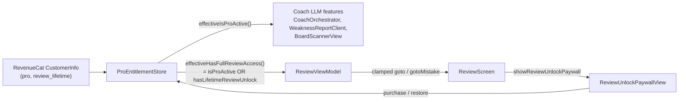

# Lifetime Full Game Review unlock, separate from Pro

## Summary

Add a second, independent paid product to ChessCoach: a $10 lifetime (non-consumable, one-time) "Full Game Review" unlock. Free users can review the first 6 full moves (12 plies) of any game; buying the lifetime unlock removes that cap. The existing Pro subscription remains a strict superset — Pro subscribers get full review *and* the LLM coach features (chat, summary, weakness report) that the lifetime purchase does not include. Review's move analysis is local Stockfish (zero marginal cost, no LLM quality risk); only the coach's prose features stay LLM-gated under Pro.

---

## Problem Frame

The user doubted whether the Pro subscription's value holds up, tracing the doubt to the LLM coach's prose quality (not Review's move analysis, which is deterministic Stockfish). Rather than resolve that by cutting Pro, the decision this session was to add a second, cheap, low-friction product that monetizes the part of the app that's unambiguously reliable — Review — while leaving Pro's LLM features untouched and separately priced. There are currently zero paying Pro subscribers, so this ships with no migration or grandfathering concerns.

A repo-state issue surfaced during research and was resolved before this plan was written: the `feat/debug-paywall-simulation` branch (which added `effectiveIsProActive()`/`DebugProSimulation` — the predicate this plan builds on) had never been merged into `main`. It has now been merged (commit `90f51c1`) and pushed, so this plan builds on `main` as of that commit.

---

## Requirements

- **R1**: Free tier (no purchase) can review the first 6 full moves (12 plies, both colors) of any game in Review; positions/moves beyond that are locked.
- **R2**: A $10 lifetime, non-consumable purchase removes the ply cap for that device's Apple ID, for every game, permanently. It grants no other capability.
- **R3**: An active Pro subscription grants everything the lifetime purchase grants (full review, no cap) *plus* the LLM coach features (chat, summary, weakness report) — Pro subscribers never need to also buy the lifetime unlock.
- **R4**: The LLM coach features (`CoachOrchestrator`, `WeaknessReportClient`, `BoardScannerView`'s vision path) remain gated on Pro only — the lifetime purchase must never unlock them.
- **R5**: The gate applies uniformly to every way a game reaches Review — live-captured Play-mode games (`ReviewSessionBuilder`), imported PGNs, and Lichess-fetched games (`GameAnalyzer`) — since all of them route through the same `ReviewViewModel`.
- **R6**: Local and TestFlight builds get a debug simulation control (mirroring the existing Pro one) to exercise all three real purchase states (free / lifetime-only / pro) without a sandbox purchase.
- **R7**: No changes to `chesscoach-gateway` — Review's gating is entirely local/on-device with no network call, confirmed during research.

---

## Key Technical Decisions

**KTD1 — Two separate RevenueCat entitlements, not one shared entitlement.** External research surfaced RevenueCat's documented pattern of attaching multiple products to a *single* shared entitlement when they all grant the same capability set. That pattern doesn't fit here: Pro and the lifetime purchase grant *different* capability sets (Pro ⊃ lifetime for review access, but lifetime excludes the LLM features Pro includes). Sharing one entitlement would silently grant lifetime buyers LLM access, violating R4. So this plan keeps the existing `"pro"` entitlement untouched and adds a second, independent entitlement (`review_lifetime`); a new composite predicate ORs them together, scoped only to the Review-access check.

**KTD2 — Gate at the `ReviewViewModel`/UI layer, not inside `ReviewSessionBuilder`.** Keeps `ReviewSessionBuilder` a pure, entitlement-agnostic builder (its existing zero-Stockfish, fully-testable design, per `ReviewSessionBuilderTests.swift`). It also means a user who purchases while already viewing a locked game doesn't need the session rebuilt — `ProEntitlementStore` is `@Observable`, so the view re-renders live once the entitlement flips.

**KTD3 — Extend the existing `DebugProSimulation` enum to a 4th case (`lifetime`) rather than adding a second, independent debug toggle.** The three real purchase states are mutually exclusive in practice (owning Pro already implies full review access, so "lifetime AND pro simulated together" tests nothing that "pro" alone doesn't). A single control covers every state QA needs to exercise with less UI surface than two independent toggles.

**KTD4 — A dedicated `ReviewUnlockPaywallView`, not an extended `PaywallView`.** The two purchases need different messaging (subscription vs. one-time), different legal footer (a non-consumable needs no auto-renewal disclosure), and different entry points (Review's locked content vs. Settings/`CoachSettingsView`). `PaywallView`'s package list is filtered to exclude the lifetime package so it doesn't leak into the subscription plan picker.

**KTD5 — The lifetime package lives in the same RevenueCat "current" offering as the two subscription packages**, as a third package with `packageType == .lifetime`, rather than a separate offering. Avoids offering-selection logic client-side; `ReviewUnlockPaywallView` just filters `offering.availablePackages` for the one lifetime package. Confirmed via research: `Package.PackageType.lifetime` already exists in `purchases-ios` (the SDK version already pinned in `Package.swift`), so no SDK upgrade is needed.

**KTD6 — Free-tier cutoff: 12 plies (6 full moves), as a single named constant on `ReviewViewModel`.** Easy to retune later without touching gating logic elsewhere. Node 0 (start position) and the aggregate accuracy header stay visible to everyone regardless of tier — showing the game's overall accuracy % (not per-move detail) doubles as the upsell hook. The win-percentage graph (`WinGraphView`) is capped at the same boundary as navigation, not left as a separate exception — showing the full game's evaluation curve would let a locked user see roughly where every mistake happened, undermining the boundary this KTD otherwise defines.

**KTD7 — No `chesscoach-gateway` changes.** Confirmed via repo research: the gateway's `entitlementGate.ts` only ever checks the `"pro"` entitlement for its LLM endpoints (`coach`, `weaknessReport`); Review's gating never touches the network.

---

## High-Level Technical Design



Two independent entitlement signals feed one store; the store exposes two separate predicates (never merged into one) so the LLM path and the Review path can diverge exactly as required by R3/R4. `ReviewViewModel` is the only consumer of the review predicate; everything downstream of it (the screen, the new paywall) only ever reads through the view model, never `ProEntitlementStore` directly, keeping the gate in one place (KTD2).

---

## Implementation Units

### U1. `ProEntitlementStore` — second entitlement + composite predicate + debug simulation extension

**Goal:** Add the `review_lifetime` entitlement alongside the existing `pro` one, a composite "full review access" predicate that ORs them, and extend the debug-simulation enum to cover the new tier.

**Requirements:** R1, R2, R3, R4, R6

**Dependencies:** none (builds on the just-merged `effectiveIsProActive`/`DebugProSimulation`, already on `main`)

**Files:**
- Modify `Sources/GemmaChessCore/Coach/ProEntitlementStore.swift`
- Modify (test) `Tests/GemmaChessCoreTests/ProEntitlementStoreTests.swift`

**Approach:**
- Add `public static let lifetimeReviewEntitlementID = "review_lifetime"`.
- Add `public private(set) var hasLifetimeReviewUnlock = false`, populated alongside `isProActive` in `refreshCustomerInfo()`, `purchase(_:)`, and `restore()` — all three already fetch the full `CustomerInfo`/result, so reading a second entitlement key off the same response is a one-line addition per call site, no extra network round trip.
- Extend `DebugProSimulation` (rename to something like `DebugEntitlementSimulation` only if needed for clarity, otherwise keep the name and just add a case) with a `.lifetime` case alongside the existing `off`/`free`/`pro`. Existing storage key/`didSet` logic is unchanged — `RawRepresentable` `String` persistence already handles a new case transparently.
- Add `public func effectiveHasFullReviewAccess(for channel: BuildChannel = .current) -> Bool`, mirroring `effectiveIsProActive`'s exact shape: when a non-`.off` simulation is active and `channel != .appStore`, return `sim == .pro || sim == .lifetime`; otherwise `!channel.requiresProEntitlement || isProActive || hasLifetimeReviewUnlock`.
- Leave `effectiveIsProActive(for:)` untouched in logic — it already only returns true for `sim == .pro`, correctly excluding `.lifetime`. No behavior change for existing Pro-gated call sites.
- **Accepted risk, documented explicitly (resolved in doc review, security-lens reviewer):** unlike `isProActive` (a UI signal backed by `chesscoach-gateway`'s independent server-side entitlement check for every LLM call), `hasLifetimeReviewUnlock`/`effectiveHasFullReviewAccess` has no server backstop anywhere — per R7/KTD7, Review's gating never touches the network. A client-side bypass (jailbreak, runtime patching) gets full paid Review content. Consciously accepted given the $10 price point and non-confidential, already-locally-computed content — mirror `isProActive`'s existing doc-comment framing ("purely a UI signal... must never be trusted as the actual authorization check") on the new property so future readers don't assume server-side parity between the two entitlements.

**Patterns to follow:** Mirror the existing `debugProSimulation`/`effectiveIsProActive` pair exactly (same file, same doc-comment style explaining the App-Store-production safety guarantee).

**Test scenarios:**
- Happy: after a purchase/restore/refresh where `CustomerInfo.entitlements["review_lifetime"].isActive == true`, `hasLifetimeReviewUnlock` becomes `true`.
- Happy: with `hasLifetimeReviewUnlock == true` and `isProActive == false`, `effectiveHasFullReviewAccess(for: .appStore) == true`.
- Covers R4. Same state as above: `effectiveIsProActive(for: .appStore) == false` — the critical asymmetry check that a lifetime-only buyer never gets LLM access.
- Edge: both `isProActive` and `hasLifetimeReviewUnlock` true (a user who owns both) — `effectiveHasFullReviewAccess` and `effectiveIsProActive` both `true`, no conflict.
- Edge: `debugProSimulation = .lifetime`, channel `.local` — `effectiveHasFullReviewAccess == true`, `effectiveIsProActive == false`.
- Edge: `debugProSimulation = .pro`, channel `.local` — both predicates `true`.
- Edge: `debugProSimulation` set to any non-`.off` value with `channel == .appStore` — simulation is ignored entirely (matches today's `.free`/`.pro` safety guarantee, extended to `.lifetime`).
- Regression: the three pre-existing `DebugProSimulation` cases (`off`/`free`/`pro`) behave identically to before this change — existing `ProEntitlementStoreTests` continue passing unmodified.

**Verification:** All new and existing tests in `ProEntitlementStoreTests.swift` pass; `swift build` and `swift test` clean.

---

### U2. `PaywallView` — exclude the lifetime package from the subscription plan list

**Goal:** Prevent the lifetime package (once it exists in the shared offering per KTD5) from appearing as a third row in the subscription paywall, which would show wrong copy (an auto-renewal legal footer) for a one-time purchase.

**Requirements:** KTD4, KTD5

**Dependencies:** U1 (not strictly required for compilation, but should land before U7's dashboard work adds the live package, so the filter is in place first)

**Files:**
- Modify `Sources/GemmaChessCore/UI/PaywallView.swift`

**Approach:** Change the `packages` computed property from `offering.availablePackages` to `offering.availablePackages.filter { $0.packageType != .lifetime }`. One-line change; no other logic in this view needs to move.

**Patterns to follow:** The existing `packages` computed property (`Sources/GemmaChessCore/UI/PaywallView.swift`).

**Test scenarios:** `Test expectation: none -- SwiftUI view, no existing view-testing convention in this codebase (verified: no PaywallViewTests.swift exists). Verify manually per the Verification step.`

**Verification:** With a lifetime package present in the offering (after U7's dashboard setup), `PaywallView` shows only the monthly/annual rows it showed before this change.

---

### U3. `ReviewUnlockPaywallView` — dedicated one-time-purchase view

**Goal:** A small, focused purchase screen for the lifetime Review unlock, visually consistent with `PaywallView` (same theme tokens, same shell) but with review-specific copy and no subscription legal language.

**Requirements:** R2, KTD4, KTD5

**Dependencies:** U1

**Files:**
- Create `Sources/GemmaChessCore/UI/ReviewUnlockPaywallView.swift`

**Approach:** Mirror `PaywallView`'s shell (`ZStack` with theme background, `ScrollView`, `closeButton`) but simplified for a single package:
- Header: distinct icon (e.g. `magnifyingglass` or `chart.line.uptrend.xyaxis`) and copy framed around "one-time purchase, unlock every move of every game, forever" — explicitly not reusing "ChessCoach Pro" branding.
- Feature list: review-specific bullets (e.g. move-by-move classification and best-move suggestions for the whole game, no subscription).
- `.task { await store.loadOfferings() }` on appear, mirroring `PaywallView` exactly (`store.offerings` starts `nil` and is only ever populated by this call — caught in doc review, feasibility + design-lens reviewers independently: since Review's lock banner may be a free user's first paywall encounter, `offerings` will commonly still be `nil` when this view appears if the call is omitted). While `store.isLoadingOfferings`, show a spinner; if loaded but no `.lifetime` package is found (offerings loaded but U7's dashboard product isn't live yet, or a transient fetch gap), show a "Not available right now, try again shortly" state with the purchase button disabled — same states `PaywallView` already defines for its own empty-package case.
- A single package row (not a picker) sourced from `store.offerings?.current?.availablePackages.first { $0.packageType == .lifetime }`, showing `package.storeProduct.localizedPriceString`.
- `continueButton` calls the existing `ProEntitlementStore.purchase(_ package:)` unchanged (it's already entitlement-agnostic — no new purchase method needed) and dismisses on `store.hasLifetimeReviewUnlock == true`.
- `restoreButton` calls the existing `store.restore()` unchanged; on failure to restore, an explicit "No lifetime purchase found for this Apple ID" message (distinct from `PaywallView`'s subscription-specific restore-failure text).
- Footer: a short "One-time purchase. No subscription, no renewal." line plus the same Terms/Privacy links `PaywallView` uses — no auto-renewal disclosure, since Guideline 3.1.2 (the disclosure requirement ChessCoach was rejected for previously) is scoped to auto-renewing subscriptions and doesn't apply to a non-consumable.

**Patterns to follow:** `Sources/GemmaChessCore/UI/PaywallView.swift` end to end (theme usage, purchase/restore `Task` blocks, error-message state).

**Test scenarios:** `Test expectation: none -- SwiftUI view, manual verification only.`

**Verification:** View renders the single lifetime package with correct localized price; purchase and restore flows work against RevenueCat's sandbox once U7's dashboard setup is live.

---

### U4. `ReviewViewModel` — free-tier gating logic

**Goal:** Cap navigation at the free-tier ply limit unless the viewer has full review access, and surface a way to trigger the new paywall.

**Requirements:** R1, R2, R3, R5, KTD2, KTD6

**Dependencies:** U1

**Files:**
- Modify `Sources/GemmaChessCore/ViewModels/ReviewViewModel.swift`
- Create (test) `Tests/GemmaChessCoreTests/ReviewViewModelGatingTests.swift`

**Approach:**
- Add `public static let freeReviewPlyLimit = 12` (6 full moves).
- Add `public var hasFullReviewAccess: Bool { ProEntitlementStore.shared.effectiveHasFullReviewAccess() }`.
- Add `public var showReviewUnlockPaywall = false` (mirrors `WeaknessReportViewModel.showPaywall`'s existing shape/name convention).
- Add a private `maxReachableNode: Int` computed as `hasFullReviewAccess ? (nodeCount - 1) : min(Self.freeReviewPlyLimit - 1, nodeCount - 1)`. **Off-by-one note (caught in doc review, feasibility reviewer, confidence 100):** `TimelineNode.ply` is the node's *outgoing* move, so node `k` carries ply `k + 1`; a naive `min(freeReviewPlyLimit, nodeCount - 1)` would let a free user reach node 12 (ply 13) and see that ply's verdict, one move past the stated 12-ply boundary. Subtracting 1 clamps to node 11 (ply 12), the correct last free position.
- `goto(node:)` clamps its upper bound to `maxReachableNode` instead of `nodeCount - 1` when locked.
- `gotoMistake(index:)`: if the target mistake's `ply` exceeds `maxReachableNode` while locked, set `showReviewUnlockPaywall = true` instead of navigating; otherwise behave as today.
- Add `public var lockedMoveCount: Int { hasFullReviewAccess ? 0 : max(0, nodeCount - 1 - Self.freeReviewPlyLimit) }` for the UI's "N more moves analyzed" copy.
- **Cap the win graph too (resolved in doc review, feasibility reviewer):** `winValues` currently returns the full `session.timeline.map { $0.winWhite }` regardless of entitlement, letting a locked user see the whole game's evaluation swings via `WinGraphView` even though per-move detail is locked — inconsistent with KTD6's stated free-tier exceptions (Node 0 and the aggregate accuracy header only). Change `winValues` to `hasFullReviewAccess ? full array : Array(full array prefix through maxReachableNode + 1)` so the graph itself respects the same boundary as navigation.

**Technical design** (directional, not literal):
```
goto(node):
    target = clamp(node, 0, maxReachableNode)
    currentNode = target

gotoMistake(index):
    mistake = session.mistakes[index]
    if !hasFullReviewAccess && mistake.ply > freeReviewPlyLimit:
        showReviewUnlockPaywall = true
        return
    goto(node: mistake.ply - 1)   // existing behavior, unchanged
```

**Patterns to follow:** `WeaknessReportViewModel.showPaywall` for the paywall-trigger flag's name/shape; existing `goto(node:)`/`gotoMistake(index:)` in `ReviewViewModel.swift`.

**Test scenarios:**
- Happy: `hasFullReviewAccess == true` (simulated `.pro` or `.lifetime`) — `goto(node: nodeCount - 1)` reaches the true last node, no clamping.
- Happy: `hasFullReviewAccess == false`, session longer than 12 plies — `goto(node: nodeCount - 1)` clamps to node 11 (ply 12), and `vm.verdict` at that node resolves to the ply-12 `MoveReview`, never ply 13.
- Edge: session shorter than or equal to 12 plies, `hasFullReviewAccess == false` — no clamping observed (`nodeCount - 1 <= 12`), `lockedMoveCount == 0`.
- Edge: `gotoMistake(index:)` for a mistake with `ply` beyond the limit while locked — does not navigate, sets `showReviewUnlockPaywall = true`.
- Edge: `gotoMistake(index:)` for a mistake within the free limit while locked — navigates normally, `showReviewUnlockPaywall` stays `false`.
- Integration: simulate the entitlement flipping true mid-session (`debugProSimulation` changed from `.free` to `.lifetime`) — a subsequent `next()` call advances past the previously-clamped node, proving the gate re-evaluates live off `ProEntitlementStore`'s `@Observable` state rather than a cached value captured at `apply(session:)` time. Covers R5's "gate applies live regardless of how the session was built" intent.

**Verification:** New test file passes; existing `ReviewSessionBuilderTests.swift`/`ReviewSessionTests.swift` unaffected.

---

### U5. `ReviewScreen` — locked-content UI

**Goal:** Make the free-tier cap visible and actionable: a locked banner/CTA, locked mistake rows, and presenting the new paywall.

**Requirements:** R1, R2

**Dependencies:** U3, U4

**Files:**
- Modify `Sources/GemmaChessCore/UI/ReviewScreen.swift`

**Approach:**
- Add `.sheet(isPresented: $vm.showReviewUnlockPaywall) { ReviewUnlockPaywallView() }`, mirroring `WeaknessReportView`'s `.sheet(isPresented: $vm.showPaywall) { PaywallView() }` pattern exactly.
- Below `scrubber`, add a conditional banner (shown when `vm.lockedMoveCount > 0`): "`\(vm.lockedMoveCount)` more moves analyzed — Unlock full review" with a button setting `vm.showReviewUnlockPaywall = true`.
- In `mistakesList`, rows whose `m.ply` (the same field `ReviewViewModel.verdict` already filters `allMoves` on, confirmed present on `MoveReview`) exceeds `ReviewViewModel.freeReviewPlyLimit` render a lock icon in place of the classification/win-swing detail; tapping still calls `vm.gotoMistake(index:)` (U4 already redirects to the paywall for out-of-range mistakes, so the view doesn't need its own branching here — just the visual treatment). Give these rows an explicit `.accessibilityLabel`/`.accessibilityHint` conveying the locked state and that tapping opens the unlock paywall (caught in doc review, design-lens reviewer, confidence 75) — without it, VoiceOver would read only the row's remaining visible content, giving no indication the row is locked or that it's still actionable.
- `verdictBox` needs no change: it already only renders when `vm.verdict` resolves for the current node, and `goto`/navigation can no longer reach a locked node, so it naturally never shows locked content.

**Patterns to follow:** `WeaknessReportView`'s `lockedContent`/`unlockedContent` split and its `Button("Unlock with ChessCoach Pro") { vm.showPaywall = true }` card, adapted with lifetime-specific copy ("Unlock with the Full Review pass" or similar — final copy is an implementation-time wording choice, not a planning-time one).

**Test scenarios:** `Test expectation: none -- SwiftUI view, manual verification only.`

**Verification:** Manually load a game longer than 6 full moves as a free-tier simulated user: the locked banner appears with the correct count, locked mistake rows show a lock affordance, tapping either opens `ReviewUnlockPaywallView`. Switching the debug simulation to `.lifetime` or `.pro` removes all locked UI without restarting the app.

---

### U6. `SettingsView`/`CoachSettingsView` — debug simulation UI gains the lifetime case, plus a real purchase entry point

**Goal:** Let the existing debug-simulation `Picker` (local/TestFlight only) drive the new `.lifetime` case, and give the lifetime unlock a real, non-debug entry point per KTD4.

**Requirements:** R2, R6, KTD4

**Dependencies:** U1, U3

**Files:**
- Modify `Sources/GemmaChessCore/UI/SettingsView.swift`
- Modify `Sources/GemmaChessCore/UI/CoachSettingsView.swift`

**Approach:**
- Add a `Text("Lifetime Review").tag(ProEntitlementStore.DebugProSimulation.lifetime)` row to the existing `Picker("Simulate subscription", selection: $proStore.debugProSimulation)`. Consider whether the picker's label/footer text should be reworded now that it covers more than "subscription" (e.g. "Simulate entitlement") — a small, implementation-time wording call.
- **Real (non-debug) purchase entry point (caught in doc review, design-lens reviewer, confidence 100):** KTD4 commits to the lifetime unlock having entry points from both "Review's locked content" and "Settings/`CoachSettingsView`," but without this, the only way to reach `ReviewUnlockPaywallView` is by hitting the cap inside Review — a real discoverability gap for a user who'd proactively buy it. Add a row in `CoachSettingsView` (near the existing Pro-state section) — e.g. "Full Game Review" with a one-line description — that presents `ReviewUnlockPaywallView` as a sheet, visible regardless of channel (this is a real purchasable product on App Store production too, unlike the debug picker above).

**Patterns to follow:** The existing `Picker` in `Sources/GemmaChessCore/UI/SettingsView.swift`'s debug section.

**Test scenarios:** `Test expectation: none -- SwiftUI view, manual verification only.`

**Verification:** All four simulation states are selectable and visibly change Review's locked/unlocked state and `CoachSettingsView`'s Pro-state messaging as expected (only `.pro` unlocks the latter). The new "Full Game Review" row in `CoachSettingsView` opens `ReviewUnlockPaywallView` on every channel, including App Store production.

---

### U7. RevenueCat dashboard + App Store Connect setup (manual, dashboard-only)

**Goal:** Create the actual purchasable product and entitlement this whole feature depends on. This is dashboard configuration, not code — mirrors the existing split-by-who-does-what convention already used for the Pro subscription setup.

**Requirements:** R2

**Dependencies:** U2 for one specific step only — see the sequencing note below. Otherwise runs in parallel with U1–U6; must complete before real sandbox testing of any unit.

**Sequencing note (caught in doc review, adversarial reviewer, confidence 75):** U2 (excluding the lifetime package from `PaywallView`'s subscription list) must ship to production *before* this unit's RevenueCat step promotes the lifetime package into the live "current" offering. If the package goes live in "current" before U2's filter is deployed, `PaywallView` would show the non-consumable package with the wrong auto-renewal legal footer — the same Guideline 3.1.2 rejection category this app was already rejected for once. Do the RevenueCat/App Store Connect setup in this unit as normal, but hold the "attach package to the current offering" step (or use a draft/non-current offering for initial sandbox testing) until U2 is confirmed live.

**Files:**
- Create `docs/revenuecat-lifetime-review-setup-walkthrough.md`

**Approach:** Write a walkthrough doc in the same "You do (App Store Connect / RevenueCat dashboard) / Me does (client wiring, already covered by U1–U6)" split as `docs/revenuecat-setup-walkthrough.md`, covering:
- **App Store Connect**: create a new **non-consumable** in-app purchase, permanent product ID `com.cordoc.gemmachess.review.lifetime`, price target ~$10 (nearest tier), reference name, display name, description, and the **640×920px review screenshot** (a distinct asset from both the app-listing screenshots and the subscription review screenshot already on file — confirmed via research as the standard non-consumable IAP review screenshot dimension).
- **RevenueCat**: create an entitlement named exactly `review_lifetime` (matching `ProEntitlementStore.lifetimeReviewEntitlementID` from U1), attach the new product to it, add a package with `packageType: Lifetime` to whichever offering is marked "current" (same offering the two subscription packages already live in, per KTD5) — no new offering needed.
- **No webhook or gateway changes** — call this out explicitly in the doc so it isn't second-guessed later, per KTD7 and R7.
- **Testing note**: sandbox-test the purchase and restore flow via Xcode StoreKit Testing or a Sandbox Apple ID first; flag (per research) that non-consumable restore across **Family Sharing** is unreliable in sandbox and should be validated on a real TestFlight build before shipping, not treated as a sandbox bug if it misbehaves there. **If it's still unreliable on a real TestFlight build (caught in doc review, adversarial reviewer, confidence 75):** the interim remediation for an affected customer is a manual entitlement grant via RevenueCat's dashboard (Customers tab → grant `review_lifetime`), not a code fix — note this explicitly in the walkthrough doc so it's a defined response rather than an ad hoc support decision made under pressure.

**Test scenarios:** `Test expectation: none -- manual dashboard configuration, no code produced.`

**Verification:** The `review_lifetime` entitlement shows active in RevenueCat's Customers tab after a sandbox purchase; `ProEntitlementStore.hasLifetimeReviewUnlock` flips to `true` on the device without any code change beyond U1.

---

## Scope Boundaries

**In scope:** everything in Requirements above — the lifetime SKU, its entitlement, the Review gate, the new purchase view, and the debug-simulation extension.

**Explicitly out of scope:**
- Any change to `chesscoach-gateway` (KTD7, R7).
- Any change to the existing Pro subscription's pricing, offering, or products.
- The coach LLM model/prompt quality work (upgrading `chesscoach-gateway/lib/modelSelection.ts`'s primary model) — a separate, already-identified follow-up, unrelated to this plan.
- Any migration/grandfathering logic — not needed, zero existing Pro subscribers.

**Deferred to Follow-Up Work:**
- The fate of the other, non-LLM Pro-gated features (Puzzle Rush, Opening Trainer, PGN import, puzzle rating/streak, iCloud sync) was explicitly left undecided by the user this session ("need to think about this more") and is not addressed by this plan.

---

## Open Questions

None blocking. Two implementation-time wording choices are flagged inline in U5 and U6 (locked-content CTA copy; debug picker label) — deliberately left to implementation since they don't affect architecture or scope.

Two judgment calls surfaced in doc review and were resolved directly with the user before this plan was finalized: the client-side-only entitlement check is an accepted risk, documented in U1 rather than architecturally mitigated; the win-percentage graph is capped to the free boundary (KTD6, U4) rather than left as an unstated exception.

---

## Sources & Research

- Repo research (this session): `ProEntitlementStore.swift`, `BuildChannel.swift`, all current Pro-gating call sites, `ReviewSession.swift`/`ReviewSessionBuilder.swift`/`ReviewViewModel.swift`/`ReviewScreen.swift`, `PaywallView.swift`, `SettingsView.swift`, `chesscoach-gateway/lib/entitlementGate.ts`.
- `docs/revenuecat-setup-walkthrough.md` and `docs/testflight-revenuecat-roadmap.md` — existing project docs establishing the product-ID convention (`com.cordoc.gemmachess.pro.*`) and the `pro` entitlement name's coupling to `chesscoach-gateway`'s `CHESSCOACH_ENTITLEMENT_ID` default.
- External research (this session): [RevenueCat Non-Subscriptions docs](https://www.revenuecat.com/docs/platform-resources/non-subscriptions), [RevenueCat Entitlements docs](https://www.revenuecat.com/docs/getting-started/entitlements), [RevenueCat Restoring Purchases docs](https://www.revenuecat.com/docs/getting-started/restoring-purchases), `PackageType.swift` source in `purchases-ios` (confirms `.lifetime` already exists in the pinned SDK version), RevenueCat's "Ultimate Guide to App Store Rejections," App Store non-consumable review-screenshot dimension guides. Load-bearing finding: RevenueCat's general "share one entitlement across products" guidance was deliberately **not** followed here (KTD1) because it assumes symmetric capability grants, which don't hold for this feature.
